# 新しいダイビングコンピューター，Aqualung i300Cを買ったよ！Bluetooth接続できる，超便利なダイコン…！！

📅 投稿日時: 2019-09-26 00:40:10

🏷️ カテゴリ: [PC,カメラ&小物](c0d8caed13e597efe97b661a8ae56bed0.md)

ってなことで．

以前，[次々ダイビング器材が死に絶えた](e554e7627c331e844453e0c4f22a5086f.md)

という記事を書いて．

それに続いて，[水中カメラを買い替えた](ef23c92c7dc9ad70390490f97f70906c3.md)…

という報告をしたのですが．

実はデジカメと同時に，ダイビングコンピューターも

買い替えてたんですね～．

で．その新しいダイコンを触ってみて．

今のダイコンはかなり進化したのう…

と感動したので．

今回はそのレポートです～！

いや…

まだ来年までダイビングしないから，

来年買えばいいじゃないか

という説もあるのですが．

ダイビング器材は，夏が終わった

今の時期が，シーズン終わりの

在庫一掃値下げシーズンなので．

投げ売りモデルが無いか…

と，探してみたわけなんですね．

今回，新しく購入するダイコンの条件として，

1．Nitox対応

2．腕時計型じゃなく，画面が大きめのタイプ

3．電池を自分で交換可能

4．安い！！！（2万円前半くらい）

という制限の中，探してみたんですが…

うーむ．

どうやらこの条件にはまるのは，

Aqualungのi100くらいしか

ないなぁ…

でも，このモデル．

1～4の条件は満たすけど，

ボタンがひとつしか無くて，

操作がやりにくそう…

と，思っていたら．

この上位モデルで，2ボタンタイプの

qualung i300Cがほとんど同じ値段で売られて

いたのを発見したので．

これはチャンス！

とばかりに買ってしまいました～！

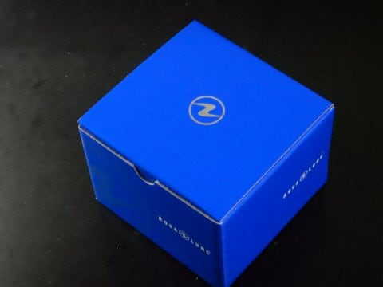

…最近．

デジカメ，ダイコンと続けて

購入していますが．

いや．

決して物欲に駆られているわけでは無く．

壊れて代わりのものを買わなくては

ならないから，やむを得ず買って

いるのです！（自分へのいいわけ）

ってなことで．

このダイコン．

ナイトロックス対応は

当然のこととして．

バックライトもついるし．

さらに，Bluetooth対応となれば．

もう，これだ！

これしかない！

ってなことで購入した，i300C．

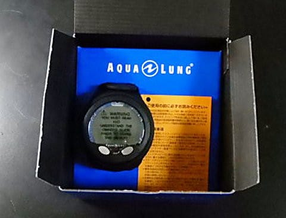

開梱してみると…

ふむ．

付属品はこれだけ．

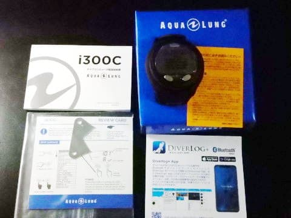

本体・マニュアルの他に，

電池交換用工具．

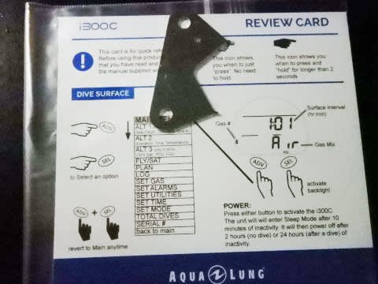

電池はボタン電池の，CR2450を

買ってくればOKのようです．

電池交換ができなかったために，

ダイコンとおさらばすることになった

私としては．

自分でちゃんと電池が換えられるのは，

素晴らしい…！

そして，スマホ用アプリのガイドが

着いてます．

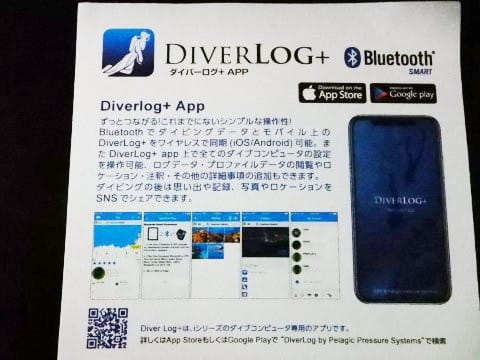

本体を取り出してみると…

大きさはこの程度．

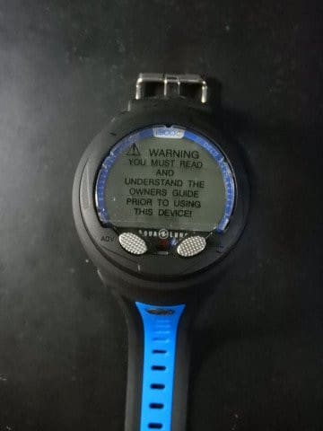

腕につけてみると…

そこそこデカいけど．

画面が見やすいし．

これまで使っていた，AIREのSQUAREに

比べれば，幅が狭い分，まだコンパクトに

感じるくらい．

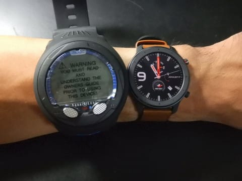

…そして．

ちゃんとバックライトもつきますね～！

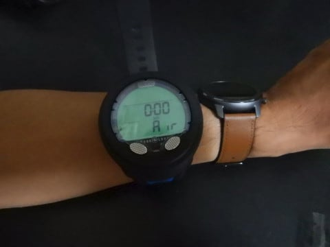

…我が家族が使っているダイコン，

これまでバックライトが着いてるやつが

無かったので，ちょっと新鮮．

そして．どうでもいいけど．

このダイコン．

バンドが異常に長いんですが…

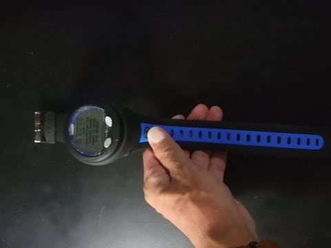

で．

他のダイコンと比べてみると．

ウォッチ型のダイコンとは，かなり

大きさが違います．

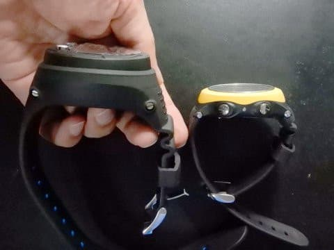

ただ，ウォッチ型ダイコンは，

画面が小さくて見にくいと

娘に不評だったので．

このくらい大きいほうが

いいかな…

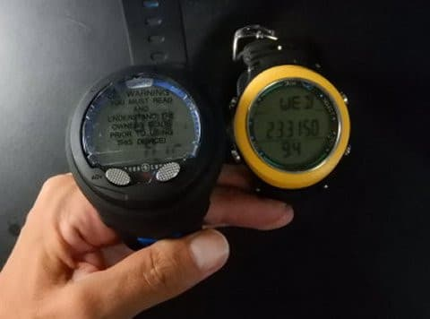

ちなみに，我が家の他のダイコンと

比べてみると．

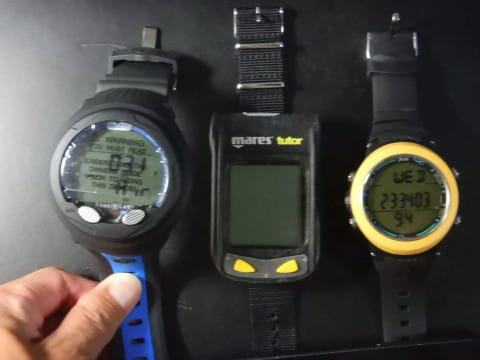

妻が使っている，MaresのTutor

（これも20年モノ…）よりは

コンパクトに感じます．

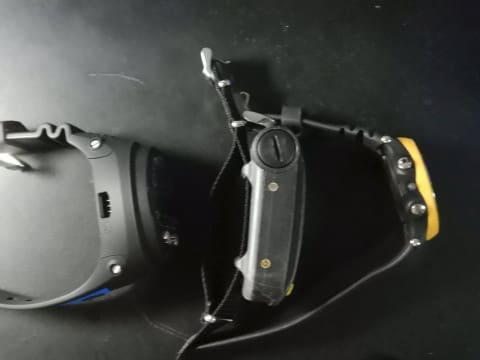

そういえば．

我が家にあるダイコン．

ウォッチ型のBismも，

MaresのTutorも，

今回のAqualung i300Cも，

これですべて，自前で電池交換

できるものになりました…

参考までに，このBismのダイコンは．

電池が切れそうになると．

電池交換表示が出るので…

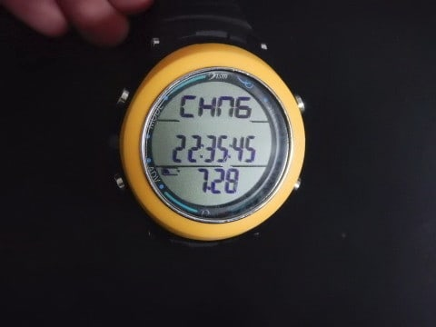

こんな電池交換ツールを使って．

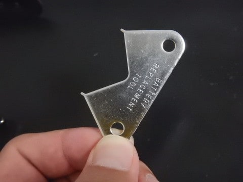

この，裏蓋．

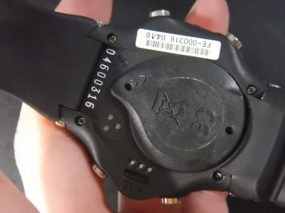

裏蓋に，電池交換ツールを

こんな風に差し込んで，

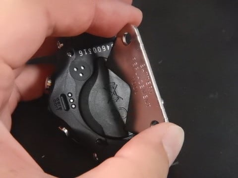

こんな感じに回してやれば，

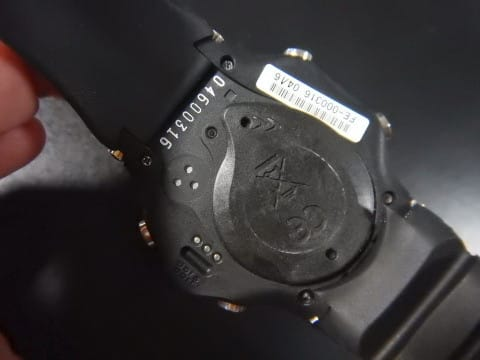

裏蓋が外れて…

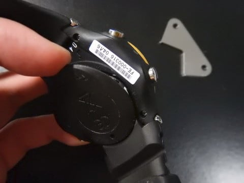

電池が簡単に交換できます！

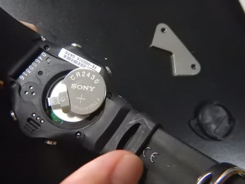

20年前は，自分で電池交換できる

ダイコンがほとんどなく．

ダイコンが電池切れになると，

ショップにもっていって，

数千円かけて電池交換してもらった

モノだけど…（遠い目）

ちなみに，妻のダイコンは．

今から20年前としては極めてレアな，

自前で電池交換できるモデル．

この矢印のふたをコインを

使って回して外せば，

単4電池が交換できます！

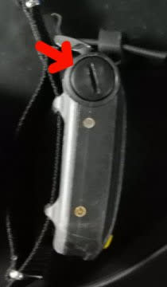

…しかし．

今じゃボタン電池があたりまえで．

単4電池ってのが，歴史を感じる…

そして．この単4電池．

一か月ほどしかもちません（涙）

いろいろ時代を感じるなぁ…

…ってなことで．

ついつい脱線してしまいましたが．

今回購入の，i300Cも．

付属の交換工具を見ると．

Bismのダイコンと，ほぼ同じ

交換手順で電池交換をする

タイプですね．

…CR2450って，普通のお店では

売ってないサイズですが．

そこそこ大きい家電量販店には

並んでました…

ということで．

脱線してしまった結果，ちょっと

記事が長くなってきたので．

Bluetoothでスマホとつないでみた

詳細報告は，また次回！

## 💬 コメント一覧

### 💬 コメント by (マルハバ)
**タイトル**: うわっ！♪
**投稿日**: 2019-09-26 05:41:40

MaresのTutorだ！

これ持ってましたよ♪

確か自前で電池交換できる初のダイコンだったはず。

私の場合50本も潜らないうちに

水没の憂き目にあいましたが・・

いまだに現役とは驚きです！♪

### 💬 コメント by (Skier_S)
**タイトル**: ＞マルハバさま
**投稿日**: 2019-09-27 01:02:48

え！

MaresのTuter使ってらしたんですね…！

私も「自分で電池を交換できるなら，電池交換費用いらないから

安上がりになる！！」

と思って買いました．

妻がこれで400本潜ってますが，未だに元気に現役です．

…妻がNitrox使うようになったら，このダイコンも引退ですが．

### 💬 コメント by (クレイグ)
**タイトル**: Unknown
**投稿日**: 2022-10-05 09:32:25

まだ30本くらい経験の初心者なのですが、同じダイコンを買ってみました。ベルトの長さに唖然としてるのですが、使い心地いかがでしようか、、？切ろうか迷っているのですが。。

### 💬 コメント by (Skier_S)
**タイトル**: ＞クレイグさま
**投稿日**: 2022-10-06 05:21:39

コメントありがとうございます～！

確かに，ベルト長いですよね…

このダイコン，娘のために買ったので私は使い心地分かりませんが，確かにベルトは長いです…

私が腕に巻いてもかなり余るので，確かに切っちゃってもいいかも？

