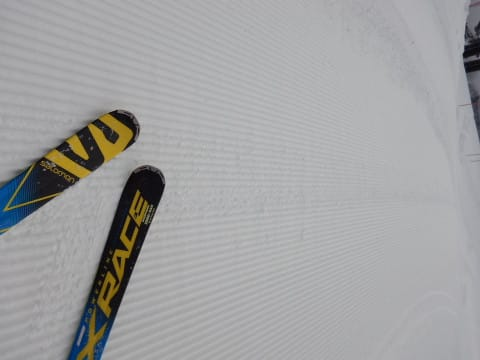
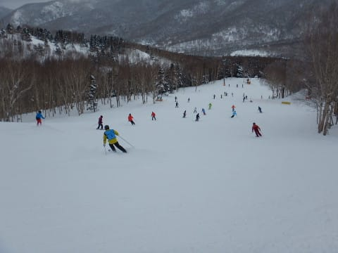

# 2019/1/13(日)の志賀高原，焼額山スキー場は…曇り時々小雪もぱらつく天気で．昨日ほどガラガラじゃなかったけど，まぁいいコンディションだったかな

📅 投稿日時: 2019-01-13 20:58:46

🏷️ カテゴリ: [2019スキー滑走日記](c3e4496fc0fb7f9c17ff21214a35b1ace.md)

ってなわけで．

3連休中日の本日も，志賀高原で滑っていたわけですが．

やはり，3連休中日なので．

ちょいと本日は混みましたね…

えー．

まず．

いつも通りの焼額第1ゴンドラからスタートするわけですが．

オープン前に並んでいる人はせいぜいこの程度で．

今日もガラガラかな…

と思わせるスタート．

んで．

山頂に出ると…

気温はマイナス9℃と，

予想の-5～6℃よりちょい低めの気温で．

そして…

天気は微妙なうす曇り（涙）

運が良ければ晴れると思ったんですが…

どうやら，今日焼額に来た，私以外の皆さんは

日頃の行いが悪かったようですね←人のせいにするんかい！

でも．

ゲレンデに出てみると…

そうです！

今日も最高級のシマシマっ！！

昨日より硬めの，しっかり締まった

スピードの出る圧雪バーン！

ふははははは！！

今日も最高のシマシマをいただくのだっ！！

…と，人のいないバーンを，気持ちよく

飛ばしていたのも30分ほど．

なんだか，一瞬ですが，ガスが出てきたり…

そして，10時ごろになると．

さすが，3連休の中日．

人気のGSコースやパノラマ・サウスコースは

すごい人口密度になってきて…

で．

…何だこれは…(涙）

第1ゴンドラ10分待ち（泣）

そして，ゴンドラを避けてリフトに

行っても，2-3分待ちの列がついてます（涙）

最大，第1ゴンドラ15分待ち，第2ゴンドラ

10分待ちまで行ったようですが…

でも，ゴンドラが混雑したのは，午前10時から

11時までのわずかな時間．

11時になったら，列はゲートの外まで

伸びず．搬器数台待てば乗れるレベルに

なりました～！

が．

コース上の人は，いつもなら人が減る

夕方まで結構多かったかな…

ただ．

コースを選べば，人が少ないところも

あったりして．

もう，混んでいて滑れない！！

って程ではなかったですね～．

天気は終日曇り空で．

時折雪がぱらつくような感じでしたが．

で．

昼前に，一瞬日が差す時もあったりして．

この日が差した瞬間の白樺コースは，

ガラガラで最高だったなぁ…

ただ．

晴れたのはわずか一瞬（涙）

この一瞬以外は，大体曇り～小雪

だったものの．

まぁ，真っ暗な曇り空じゃなかったし．

凸凹は適度に見えて．

ここ数日雪が降っておらず，コースの

雪も，結構締まり気味…というか，下の

方は硬めの雪だったので，

午後まで結構人が多かったわりには．

コース上がそれほどひどく荒れることなく．

大回りがガンガンできるコースコンディション！！

こんな感じのコンディションの中を．

今日も，日が暮れ行く16:10のリフトストップ時間まで．

たっぷり滑りつくしたのでした…

が．

ゲレンデの雪は結構良かったんですが．

私の体調があんまりよくありません（涙）

だもんで．

今日もナイターは控えています（泣）

うーん．

なんて大人なんだろう…

今日はサンバレーのそばで泊まっているので．

ホントはすごくサンバレーのナイターに

行きたくて仕方がないんですが．

たぶん今日ナイターに行ったら熱出して

倒れそうなので．

大人の私は，ぐっと我慢して．

明日の朝に万全の体調を期すのでした…←いや，咳＆鼻水ずるずるの人は，そもそも昼間にもスキーしちゃだめだから

## 💬 コメント一覧

### 💬 コメント by (なちちゃん)
**タイトル**: 私も今週、自重しています
**投稿日**: 2019-01-13 21:08:08

正月休みで気が抜けて、今週はずっと体調悪く、凡人の私は三連休も泣く泣く自宅療養中です。

サンバレーでナイター、行きたいっすね

### 💬 コメント by (しんちゃん)
**タイトル**: 明日もシマシマ参戦予定
**投稿日**: 2019-01-13 21:39:40

昨日より今日はバーンが締まっていて、夕方までいい感じでしたね。

明日も朝一シマシマに参戦予定です。

よろしくお願い致します。

### 💬 コメント by (michi)
**タイトル**: 体調大丈夫ですか？
**投稿日**: 2019-01-13 22:40:33

鼻ズルズルで辛そうでしたね。でもしっかり朝礼から終礼まで滑り倒しましたね（笑）大事にしてください。

久しぶりに子供達が居ないので皆さんと楽しませて頂きました。集団滑走（爆走？）は楽し過ぎましたね。あのペース以外では物足りない身体になりそうです（爆）

### 💬 コメント by (yama)
**タイトル**: ナイター
**投稿日**: 2019-01-14 06:48:45

ダイヤナイターに行って来ました。一度リセットされたゲレンデは最高でしたが、某20000m倶楽部の方が後ろからどんどん迫って来て抜かれました。また、もう一人の方はコンスケさんにビデオを撮ってもらっていました。風邪を治してご一緒しましょう。

### 💬 コメント by (ほっぽ)
**タイトル**: 昨日も擦れ違い
**投稿日**: 2019-01-14 23:55:52

Ｓさん

昨日も全くお会いしませんでした。

私も１０時過ぎまでヤケビ、その後奥志賀に滑りこんだら

いきなりｍａｅさんとｙａｍａさんにお会い出来ましたが、

会わないときは会わないものですね。

この２日間、会社友人の初滑りに付き合い、熊の湯、横手方面を除く

全エリアを滑って帰宅しました。

今週末は一人で志賀高原に居ますので、お会いできることを祈ってます。

http://www2.tokai.or.jp/nana_hoppo/

### 💬 コメント by (Skier_S)
**タイトル**: 恵まれた3連休でした
**投稿日**: 2019-01-15 01:53:56

＞なちちゃんさま

あら．3連休スキーできずですか．

お大事に…

サンバレーナイターは，志賀で一番面白いナイター

だと思います．

今回サンバレーナイターに行きたくてサンバレーそばの

宿をとったのですが…（涙）

＞しんちゃんさま

今日は何時ごろに帰られたのでしょうか？

きっと4時ごろまで滑ってらしたに違いありません(笑)

＞michiさま

いや…もう鼻ズルズル，咳も出ますし．

結構つらかったです…

が．なんとか3連休滑り切りました．

息子さんのいないmichiさんが，水を得た魚のように

生き生きと滑ってらしたのが印象的です(笑)

＞yamaさま

ダイヤナイターにいかれたのですね…

うらやましいです（涙）．

某20000mクラブの方には，私も先週ラップされました(笑)．

リフト乗り降りであそこまでガン漕ぎされると，

もう敵いません…

＞ほっぽさま

今回はお会いできませんでしたね…

タイミングでしょうか．

今週末は志賀に行けない可能性が高いので，

またその次の週になるかも…

とりあえず，また志賀でお会いしましょう！

