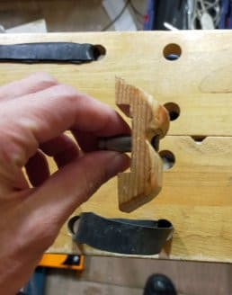
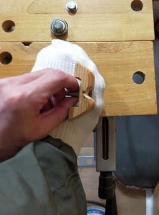
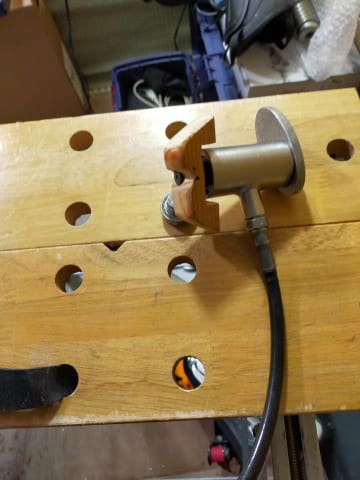
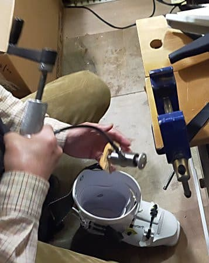
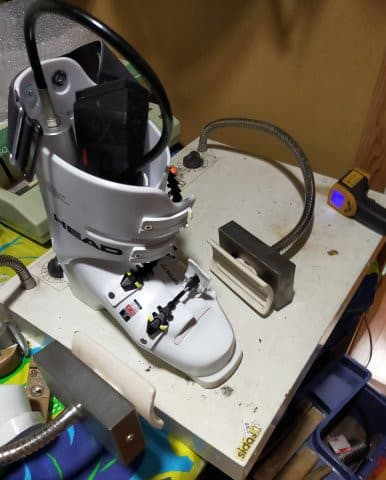
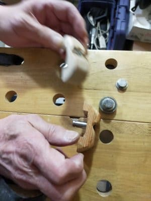

# シーズン終盤になってスキーブーツが当たるように（涙）…そこに，エキップさんの必殺兵器が！？？

📅 投稿日時: 2022-06-09 01:19:53

🏷️ カテゴリ: [スキー雑談](c1f9d2cb7478308da16419928ea3945e9.md)

ということで．

今シーズンも，[長岡のエキップさんで
作ったブーツの，HEADのRAPTOR WCR3](e236e665405cc4eef9821c1d9111c69da.md)を履いて

滑っていたわけで．

そして，これまでの人生で一番硬いブーツ

だったんだけど，

[「実は硬いブーツの方が，スピードを
出すときは楽」](e1affde1213281bc061542a4a66beee1e.md)

ということが分かり．

いつものエキップさんならではの完璧な

カント調整と，ぴったりの当たり出し，

そしてタング加工での足首のボリューム

調整などと相まって，

お気に入りブーツとして愛用していたの

ですが…

ただ，やはり元が競技用ブーツ．

インナーも薄く，ボリュームもタイト

なので．

さすがにピッタリのブーツでも，

朝から晩まで，毎週履いていると…

シーズン後半になると，押さえつけられて

いた小指の付け根とかがだんだんと

出っ張り始めてきてしまい．

その部分が当たって，痛くなり始めて

きました…（涙）

うーん．

一日8時間，

ナイターや早朝があると一日10時間以上．

それを毎週，週2日以上．

それだけ履くと，どんなブーツでも

ダメですね…（泣）

やっぱりシーズン終盤には，足が

変形して，どこかが当たってきます（激涙）←そもそもレーシング用

ブーツはそんなに長く履くこと想定してないから

だもんで．

シーズン途中に，エキップさんでまた

当たり出しをしてもらったのですが…

私「あのー．ブーツの小指の付け根

　部分，残念ながら当たるように

　なってきたんですが…」

エキップ鈴木社長「あぁ…

　やっぱりそうですか．

　Sさんの足型はあまりにも

　ひどすぎて，小指付け根部分，

　足型ピッタリにシェルが整形

　できないんですよね…」

私「そんなひどい足型なんですか（涙）」

エ「かなり特殊です．手ごわいです．

　普通じゃないです」

私（救いようがない感が半端ない…（泣））

エ「なので，Sさんスペシャルの型を

　作りました！！」

私「は？」

エ「Sさんの足型に合わせて，

　ぴったりに整形できる型を

　作ったんですよ！」

私「…は？型って…」

エ「見てください！これです！」

私「…これですか？？」

エ「そうです！

　足型に合わせて木を削って作りました！

　シェルを押しても変形しない

　硬い木で作りました！」

私「…

　　…そこまでしてもらえるとは…

　（でも，えげつない型だな…）」

ってなことで．

私の足と合わせてみると…

見事に，私の小指とその付け根の

出っ張りに合わせた形になってます！！

（美しくない足の写真でゴメンナサイ）

エ「これでブーツの小指部分を広げますね」

…と．

このSkier_Sスペシャル型をジャッキに

取り付けて…

シェルにセットして．

熱を加えて，シェルを私の足型に

ピッタリ合うように整形してくれました！！

エ「まぁ，Sさんほどではないにしろ，

　同じよう小指部分が出てる方が

　いるので．

　そういう方にはこの型を使って

　広げようかと思って作ったんですよね．

　何個か試作して，やっと完成したん

　ですよ…」

（失敗作を見せながら）

…まさか．

まさかここまでやってくれるとは…

すばらしい．

すばらしいよ，エキップさん…！！！

これまでは，小指の部分の出っ張りを

クリヤするように幅を広げると，

出っ張り以外の部分も幅が広がってしまい，

ブーツがルーズになってしまって

いたけど．

全体の幅はタイトなままなのに，

小指とその付け根の当たり部分だけ

逃がしてあるという，自分の人生では

これまでになかったブーツを手に

入れることができたすばらしさ！

こんな特殊な型まで作ってしまうとは…

エキップさんの職人としてのこだわりの

凄さに感服…

…もし．

私と同じ，小指とその付け根の

出っ張りがブーツに当たって

悩まされいている人がいたら．

このえげつない型でシェル加工して

もらえます（笑）．

悩んでいる人は[長岡のエキップさん](http://www.equipe.jp/)へ

相談してみてください．

## 💬 コメント一覧

### 💬 コメント by (northfox)
**タイトル**: Unknown
**投稿日**: 2022-06-13 12:34:06

私もRAPTORのWCR4ですが、同様にシーズン終盤で小指の付け根が出っぱってきました。💦

今までこんな事無かったので驚いてます。

やはりタイトなブーツを履くとこうなるんですかね…

それで4月で早々とシーズンアウトしました。

なかなかブーツの悩みは尽きないです。

### 💬 コメント by (Skier_S)
**タイトル**: ＞Northfoxさま
**投稿日**: 2022-06-14 05:45:18

タイトなブーツを長い時間履き続けると，やっぱりどうしても当たってきますよね…

でも，今シーズン，それで早めにシーズン終わってたんですね！！

