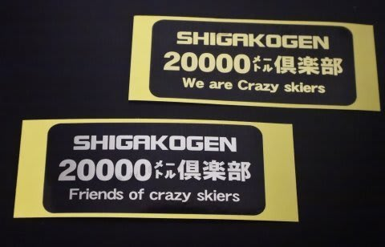
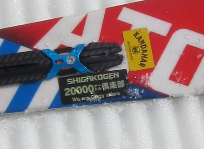

# Road to 20000m…20000mクラブ ゴールドステッカーへの道！（って，狙ってる人いるのか？）

📅 投稿日時: 2017-03-24 03:43:19

えー．

本日．

量はそれほどではないですが，

冷え冷えの雪が降ったみたいで…

そして．

金曜もぼちぼち雪が降って．

土曜の朝まで雪がちらつきそうなので…

やっぱり，土曜の朝は．

この時期としては最高雪質の圧雪で始まりそうに

思える今日この頃．

皆様いかがお過ごしでしょうか．

…今のところ．

相変わらず週末の予想が難しい状態ですが．

土曜：朝のうち曇り，朝早くは雪がぱらつくかも．

　そして午後に向かい雲が減っていき，昼ごろには

　晴れ間が出てきそう…（だけど冷え冷え）

　という感じなので．

　良さそうですね～！！

　…ただ，午後はちょっと凸凹になって，

　急斜面は下地の固いのが出てくるでしょう…

日曜：朝のうちは晴れそうで．

　放射冷却で冷えて早朝から朝イチはしっかり締まった

　エッジが効く圧雪バーンで最高かな．

　じき雲が増えていき，昼には曇り空に．

　午後遅く，どこかのタイミングで

　ちょっと湿った雪が降り始める…

という感じでしょうか…

とりあえず．

また明日，最終予想します…

ってことで．

タイトルにありますが．

…志賀高原で最近，ごくごく一部で有名になりつつある，

20000mクラブ．

そう…このゴールドステッカー．

このステッカーを貼っている人は．

一日滑走標高差20000mを達成した

いろんな意味で終わった人すごい人だと証明する，

何の役にも立たない証素晴らしい証．

ここで．

…そんな人がいるとは思えないけど．

いるとは信じられないけど．

もしかすると．

「自分も一日滑走標高差20000mを目指してやれ！」

…という，何か勘違いしている人素晴らしいチャレンジ精神をもつ人が，

ごくごく一部にいるかもしれないので．

…どうやったら一日20000mという，意味のないとてつもない標高差が達成できるのか．

そこを，検証してみましょう…

まず．

昼間の滑走だけで20000mを実現できるのは．

奥志賀高原と一の瀬ファミリースキー場だけです．

それ以外のスキー場では不可能です．

わがホームゲレンデの，焼額第1ゴンドラでは，

[どれだけ攻めても17000m台が限度](e11f16f042816441ea9289e677f988dbe.md)．20000mは無理です（涙）．

さらに．

達成できるリフトも限られていて．

　奥志賀：奥志賀ゴンドラ

　一の瀬：ファミリークワッドor第3クワッド

…この3本のリフト・ゴンドラに絞られます．

このうち，最も確実に標高差が稼げるのが，

一の瀬第3クワッドリフト．

乗車時間4分19秒，標高差315m

こいつは，

一の瀬クワッドリフト

乗車時間4分30秒，標高差312m

に比べると，

乗車時間が10秒長く．

標高差が3m少ないので．

わずかな差に感じますが，一日60本以上乗ると．

時間にして600秒，10分．

リフト1本分以上の差になりますし．

標高差にして180m．

ペアリフト2回分くらいの差になっちゃいます．

…20000mクラブの大御所の皆さんは．

「第3クワッドの方が，一の瀬クワッドより搬器2-3個分早い」

という，そのあたりを良く知っていて．

当然，第3クワッドを狙います．

とりあえず．

20000mを超えるためには，

待ち時間を含めて，リフト1本ぴったり

8分ペースでいけば，

…1時間7.5本．

8時半スタートから5時まで，8時間半．

休みなくこのペースで滑り続ければ…

一日64本．

トータル20160mとなり．

めでたく20000m達成です！←めでたいのか…？？

…だもんで．

20000mクラブの大御所たちは．

朝から夕方まで，お昼ご飯すら食べずに滑り続け．

夕方の最後の1本まで，正確に滑走時間3分台前半．

リフト1本7分台のサイクルで滑り続けるという．

サイボーグならではの機械力驚異的な体力を誇ります．

＃私には絶対無理

で．

奥志賀高原は．

ゴンドラ43本で20000m達成です．

ゴンドラ1時間ぴったり5本．

12分で1本ペース．

それを休むことなく8時間半繰り返せば達成可能！

＃朝8時からゴンドラ営業している日で，

＃午後4時半以降まで営業していないと厳しいですが…

人がおらず，ゴンドラ待ちが無ければ，

20000mクラブな方々は，奥志賀ゴンドラを約11分で

1本回します．

それを朝から夕方まで，そのペースをキープしたまま…

＃ゴンドラ待ちがわずかでもあるとアウトなので．

＃奥志賀ゴンドラ，最近は土日はかなりの待ち時間が発生するし．

＃平日じゃないと無理かな～．

ってことなので．

昼間だけで20000m達成するのは．

超人，あるいはサイボーグの領域です．

普通の人間は，20000m滑ってみようかな？

なんて危険なことは．

考えない方が身のためです…

もし．

それでもやってみようかな？

…という，ある意味危険な発想をもった方チャレンジ精神にあふれる方は．

一の瀬第3クワッドを1本8分を切るペースで滑れるかどうか．

奥志賀ゴンドラを1本12分を切るペースで滑れるかどうか．

それを全く休まず，ペースを落とすことなく

8時間半続けられるかどうか．

試してみてください…←3時間を超えたあたりから，体力の問題とは別に

「自分はいったい何をやっているんだろう…？」という意識との

争いになってきます（笑）

PS1.いきなり20000mチャレンジすることはおススメしません（^^;

　無理に滑って体を壊したり，コケたりぶつかったり

　周りに迷惑をかける危険性もありますので…

　「普段からいっぱい滑っていて，たまたま20000mを超えた

　というのが理想」 by Kon Sukeさん

PS2.昼間だけで20000m越えなくても，私のように昼間16500m＋

　ナイター3500mという「エセ20000m」の手があります．

　そっちの方が安全（健全？）かも（笑）

## 💬 コメント一覧

### 💬 コメント by (つーちゃん)
**タイトル**: Unknown
**投稿日**: 2017-03-24 13:17:34

数メートル数秒という一般人は気にも留めない所をストイックに攻めてるんですねぇ

ほんと｢トイレに行ったら負け｣ですね

Ｓさんもハードな日常をこなして週末にあれだけ滑っちゃうんですから

トータルしてみたら驚異的ですよf(^_^;

### 💬 コメント by (れお)
**タイトル**: 改めて見てもスゴい…
**投稿日**: 2017-03-24 18:20:45

先週もお世話になりました～

う～ん、検証結果を見ると、やっぱりスゴい。

とんでもないペースですね～。

やっぱり私は、ゴールドはもう少し修行してから目指します!! 笑

今週末も、コンディション良さそうですね～。

レポート楽しみにしてます!!

### 💬 コメント by (Skier_S)
**タイトル**: すごい人の集まりですから
**投稿日**: 2017-03-24 22:39:02

＞つーちゃんさま

いや～．

もう，ホントに昼間で20000m行っちゃってる方は，

いろんな意味でいっちゃってる方ですから…（笑）

すごいですよ．実際に見てみると…

＞れおさま

とんでもないペースです．

昼間20000m達成する方々には，

数本はついて行けますが，

1時間ついて行くのは不可能です…

昼間だけで22000m超えるってのは

もうおかしいレベルです（笑）

今週末は滑らないのですか？

またレポートしますので～！

### 💬 コメント by (Goku)
**タイトル**: Unknown
**投稿日**: 2017-03-24 23:47:59

エセ20000ｍ会員のGokuraku Skierです(笑)

いや、冗談抜きで昼間の20000ｍはありえません。

あの方々の凄いのは３時すぎの荒れたバーンでも、ガスッていても、人が多くても、朝から全くペースが変わらないことでしょうか。

それと、コースの途中で止まっているところを見たことがありません。

凄い方々です。

明日はどうやら最高のコンディションになりそうですね。

ではヤケビでお会いしましょう！

### 💬 コメント by (Skier_S)
**タイトル**: Gokuさま
**投稿日**: 2017-03-26 00:04:50

いやーー．

某20000mの親分な方は．

2週間前まで6日連続20000越えだった…

ことを聞いて．

やはり間違いない．サイボーグだとおもいました．

そして．

今日は娘と一緒に滑っていただいてありがとう

ございました～！

のんびりペースにお付き合いさせてすみませんでした…

うちの娘がめちゃくちゃ喜んでました．

ありがとうございました！

### 💬 コメント by (Unknown)
**タイトル**: Unknown
**投稿日**: 2017-03-27 02:15:22

聖地（？）になってしまった一の瀬第3クワッドですが、

3/26 15:00 今シーズンの営業を終了しました。

最終乗車後思わず拝んでしまいました。

一の瀬ですが、ほぼ全日・全時間減速運転しているので

（公称）乗車時間では山頂に到着しません。

営業終了間際の一回転だけ全速運転のスピードが体験できます。

奥志賀ゴンドラは減速運転ができないので、搬機の数を減らして輸送能力を調整しているというのは本当でしょうか？

また、西館山でも 20000m の達成実績があるようです。

ほとんどは西館山第1フーディクワッドなのでしょう。

### 💬 コメント by (Skier_S)
**タイトル**: Unknownさま
**投稿日**: 2017-03-27 03:53:58

あ，20000m重鎮の皆様の重要（生活？）拠点，営業終了したのですね…

今シーズンもお疲れ様でした＞聖地第3クワッドさま

一の瀬ファミリーも，今は減速運転しているのですね…（涙）．

焼額も，今日は一日トップスピードに入らずでした．

奥志賀は，どれだけ強風でも減速運転していたことがないので，減速機構はやっぱり無いんだと思います．

その代り，通常は18秒ピッチの搬器間隔が

悪天候時は30秒くらいに伸びます…

で．

西館でも20000m行けるんですね…！

西館で行けるなら，なんだか

高天ヶ原でも行けそうな気がするんですが…

### 💬 コメント by (若杉勲69)
**タイトル**: How to 奥志賀ゴン48本
**投稿日**: 2017-04-21 18:48:32

奥志賀ゴンドラ一本11分を貫くと8時～16時45分で48本行けるとの計算で、22896mを達成しました。Sさんの記述にあるように、途中で何度も嫌になったんですが、折角ここまでやったんだからということと、ゴンドラでお会いした極楽スキーヤーさんに狙うと言ってしまったことが勝因です。パンをゴンドラで食べ、杉山渋滞の時にトイレに行き、何より最初に係員に「記録を狙う」と断っておいたら、「あと一人乗れますよ」と融通を図ってくれたのが大きかった。トイレは11分ペースを上回って数分の貯金ができるまで我慢しました。スタートは8時03分。最初はその気はなかったのですが、アイスバーンなのでメラメラと。16時過ぎると斜面が全く見えず、二壁の雪玉が怖くてう回路を通ったら、ウエーブが全く見えずさらに怖かった。69歳にもなって本当にアホだなと何度思ったことか。でもすごい満足感です。刺激を与えて下さった皆様に感謝です。ありがとう。来年は若杉勲70で登録しますが、やってもmax43本ですね。

### 💬 コメント by (Skier_S)
**タイトル**: 若杉さま20000m達成おめでとうございます
**投稿日**: 2017-04-21 22:39:37

20000m達成おめでとうございました！

というか…

これまでの私の知っている限りの奥志賀の

最高は45本だったのですが，3本も上回りましたね…！

まさか48本も行くとは．

私のナイター込みの今シーズン最高滑走量を

昼間だけで超えてしまうとは…

感動です．

4月1日にお会いできなかったのが残念ですが，

来シーズンにお会いしたらゴールドステッカーお渡しします～！

また来シーズン，お会いしましょう！

### 💬 コメント by (若杉勲69)
**タイトル**: ありがとう
**投稿日**: 2017-04-22 00:40:02

ありがとうございます。ゴールド、楽しみです。

はじめはクラウチングで直滑降をしていたのですが、これでは体力が持たないので、いつも最高に速くて美しい、浅く長い孤を描く堀口さんをイメージしたら、下手な私でもとても楽に滑れました。疲れるのはそのあとの作業です。

昼間だけでのover48は、スキー以外の要素の方が大きいので、うまい人でも難しいのではないかと勝手に思っています。どなたかのチャレンジが楽しみです。

昨年夫婦揃って333333mと一日15000mを達成された、コンスケさんファンのyumirinさんご夫妻のお話。私の奥志賀15000mもyumirinさんの計算のおかげです。スキーラインはいろいろなかたに楽しみを与えてくれますね。彼女はこのブログの愛読者でもあるんですよ。

またあさってから山菜採りで山にこもります。お元気で。ありがとうございました。

### 💬 コメント by (Skier_S)
**タイトル**: 若杉さま
**投稿日**: 2017-04-23 00:42:59

ずーっとクローチング直滑降ですか！

それは疲れます…

というか，それを一日やろうとおもっていたのがすごいです．

普通の人は考えないかと…

私もSkilineを通じていろんな人と知り合いになれました．

そもそも若杉さんに初めてお会いした時も，

「あ，Skilineで私の上にいる方だ…」

という縁で，いろいろお話が膨らみましたし．

また来シーズンお会いできることを楽しみにしていますので～！

### 💬 コメント by (若杉勲69)
**タイトル**: 追記
**投稿日**: 2017-04-23 00:52:44

補足です。ゴンドラの乗り降りは全て走りました。下手糞なのでここでしか時間を貯金できる時がないからです。あほですよね。

### 💬 コメント by (Skier_S)
**タイトル**: 若杉さま
**投稿日**: 2017-04-24 02:40:45

走りましたか…

凄すぎます．

あらゆることが，すごすぎます．

…近々，Blogネタにさせてください…

