# 2月27日の志賀高原は…アイスバーンはあったものの，結構よかったよ

📅 投稿日時: 2016-02-28 00:43:41

えー．

本日の志賀高原ですが．

降れ降れ踊りの効果むなしく．

全く積雪がない状況で始まりました…（涙）

まず，とても2月の志賀高原の道路と思えない，

路面に積雪がない状況でスタートした朝．

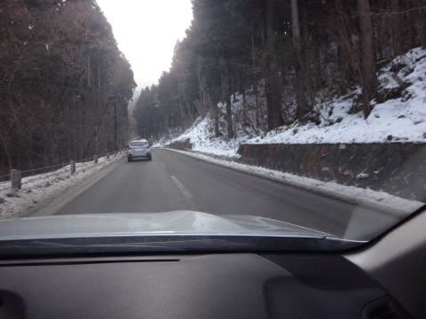

＃一の瀬エリア以降は積雪があるので，注意！

うーーーーむ．

昨晩からの積雪はなかったか…（残念）．

ちょっとガックリしながら，

山頂に上がってみると…

ふむ．気温は‐10度と，大体予想通り．

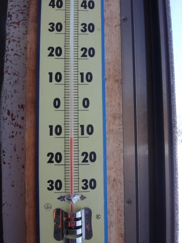

冷え冷えですな…

＃なぜ，なぜ，冷え冷えの日に限って降らないのだ…

そして，天気は晴天っ！！！！

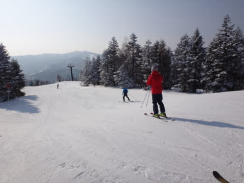

晴天ぴかぴかな中…

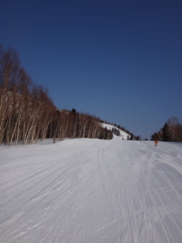

圧雪かけたてのシマシマを，滑るのだっ！！

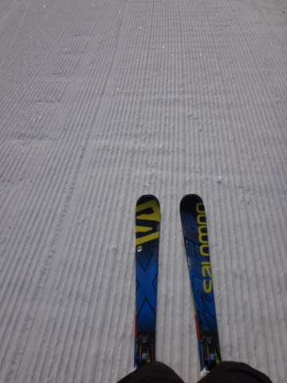

うはははは！

きれいに締まった，いい感じのスピードが出る

楽しい圧雪だぁ！

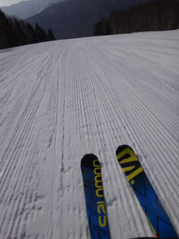

久しぶりの，冷えた雪の圧雪だぁ！←2月なら，これが毎週ってのが普通なんだけど…

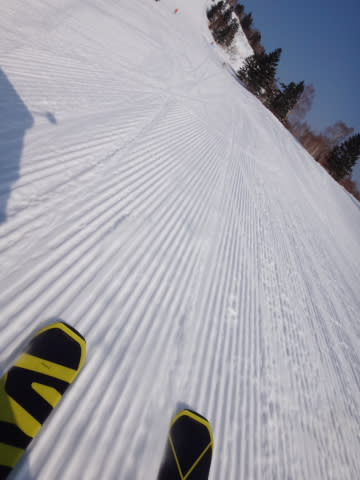

…って感じで，圧雪かけたての朝イチ焼額GSコースは，

下地の硬いのも隠れて結構いい感じ！

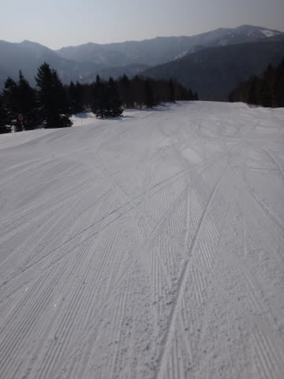

いやー！

いい感じだね！

…じゃ，オリンピックコース行ってみますか…

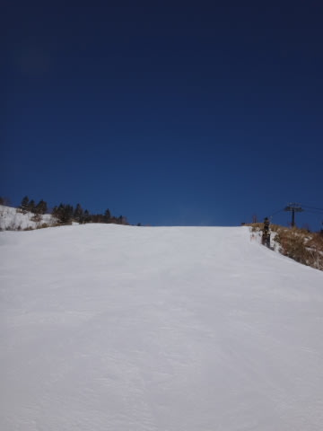

と，やってきたオリンピックコース．

…あれ？なに？これ…

なんかバッテン印が作ってあるけど…

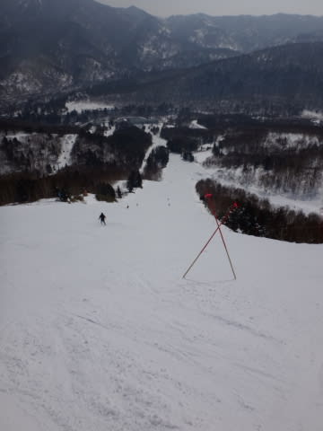

え？なに？？

ブッシュ？？

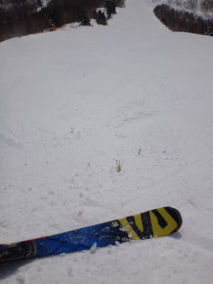

がががーーん．

やっぱり，今週，積雪があんまりなかったようで…

先週の雨で出てきたブッシュ，隠れきってません…（涙）

バーンは，ツルツルアイスバーンでないけど，

ザラザラした感じにがっちり固まった，ハイスピード

カチカチバーン！

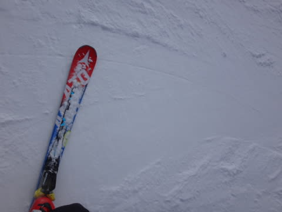

まぁ…これはこれで，硬いのが嫌いじゃなければ

意外と楽しめるかも…

＃硬いのが嫌いな人はダメだと思う．

そして．しばらくたつと，

GSコースも…

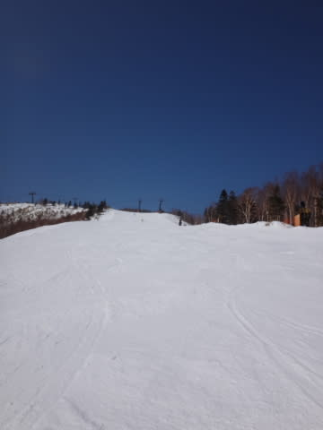

あれ…？

なんだか，下地の硬いのが…（涙）

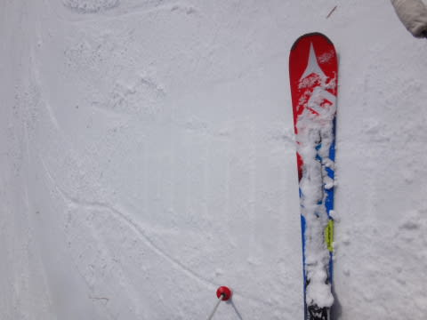

昼前に，一部アイスバーンさんがコンニチハしてきて．

午後に向かって，アイスバーンエリアが広がっていきました…

とはいえ．

アイスバーンエリア以外は，気温は冷え冷えで雪は

結構いいですし．

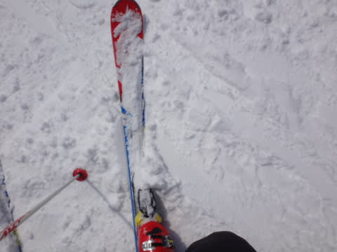

まぁ，意外と楽しめるかな，と思っていたら．

…なんと．

さすが2月の週末…

ゲレンデの人が，増えてきましたよ…

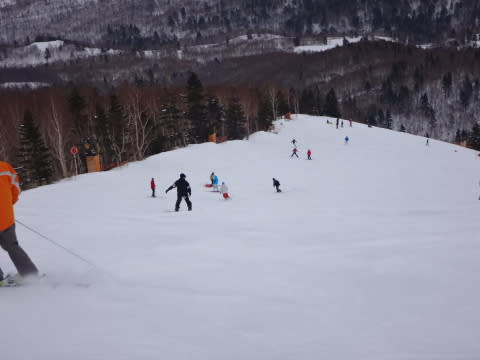

そして．

今日はなぜか，午後のほうが人が多く…

あり？

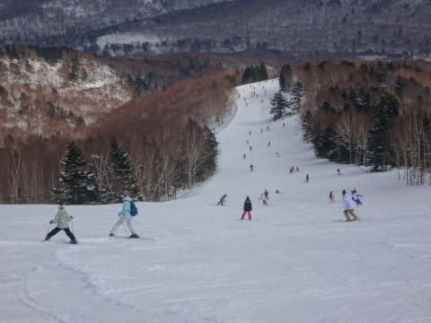

あれれれれ？？

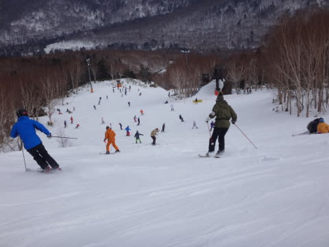

午前はせいぜい最長1分ちょっと待ちだったゴンドラが…

…なぜか，午後のほうがゴンドラ待ちが長く．

午後2時半～3時半くらいまで，最大5分待ち…（涙）

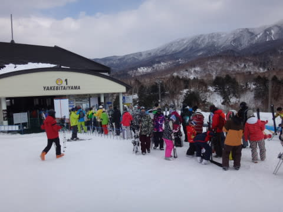

で．

当然，午後になると…

コース上のアイスバーンエリアも

結構広がっていきます…

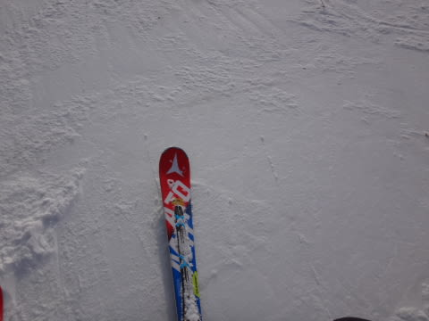

まぁ，ツルツルアイスバーンではなく，

ちょっとエッジの引っ掛かりもある，ザラっとした

氷で．

さらに，ゲレンデ全面アイスバーン化ではなく，

コース上数10m程度，ところどころアイスバーン

エリアがあった感じで．

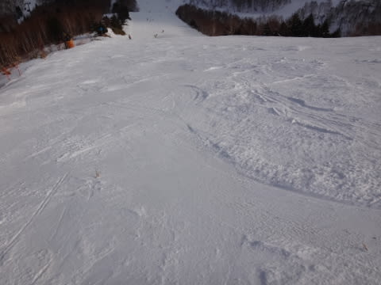

まぁ，先週の雨を考えれば．

良くここまで回復したなぁ…

という感じでしょうか．

…とはいえ，部分的にこんな氷が顔を出しているような，

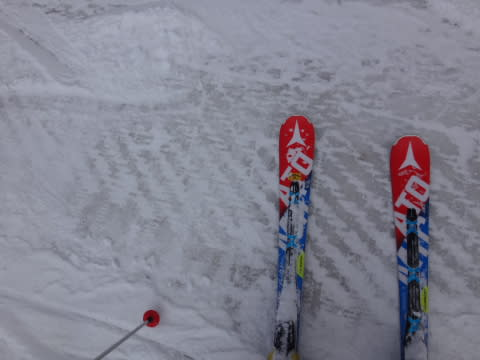

先週に比べればマシだけど，2月の週末と

考えると，ちと悲しいかも…

というゲレンデを，リフトストップまで滑り続けたのでした…

…

…

で．

はいはいはい．

その通りです．

まだ，終わりませんよ～

当然ナイターに行くわけですが．

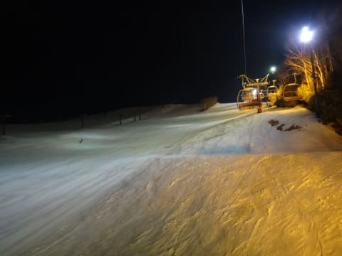

先週は，雨で中止になった一の瀬ナイター．

…今日は…

うほう！！

シマシマっ！！

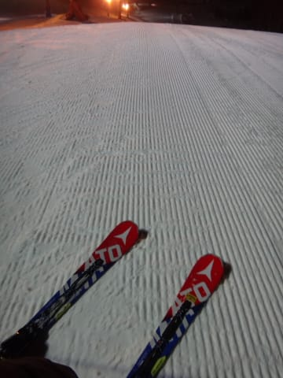

そして，人が少ない！！

ってことで．

人が少なくて，最後まで結構フラットで楽しめた，

ダイヤモンドナイター．

先週すべれなかった恨み，ここで思いっきり晴らしてやるっ！！！

…とばかり，

最後までひたすらグルグルし続けたのでした…

…って感じで．

今日は気温も冷えて，天気も夕方曇ったものの．

ほぼ終日晴れで．

久しぶりに「冬の志賀高原って，普通はこうだよね～」

という感じのゲレンデを，気持ちよい日差しの中

滑れたのでした…

…でも．

ところどころ，無差別アイスバーンテロが行われたのが，

おしいっ！

明日までに，もうちょっと積もってくれないかなぁ…

軽く，50cmくらい←それ，軽くないから

## 💬 コメント一覧

### 💬 コメント by (Goku)
**タイトル**: 八方尾根
**投稿日**: 2016-02-28 09:24:29

おはようございます。

昨日は１日お世話になりました♪

今日は結局、八方尾根に来ました。

硬いバーンの朝イチリーゼンを期待してたんですが、雪柔らかすぎでスピードに乗れずちょっと残念な感じです。

では、今日もヤケビを存分に楽しんでください！

### 💬 コメント by (いか)
**タイトル**: Unknown
**投稿日**: 2016-02-28 23:41:48

私は今週末も八方へ…2日とも朝イチリーゼンにいた(土曜日2本、日曜日1本)のでGokuさんには目撃されているかもしれませんね。今日は雪が柔らかすぎて難しかったです、土曜日の朝イチは完璧でしたヽ(* 'ー')ノ

ちなみに16SXに土曜日の朝の3時間だけ乗ってみました！まったく振動が伝わってこず、ああこれだ…、という感じになりました(笑) すこし引っかかるところがあるので、慣れていこうと思います(^^)

### 💬 コメント by (Skier_S)
**タイトル**: 晴天はいいから，降ってほしい…
**投稿日**: 2016-02-29 00:41:19

＞Gokuさま

あら？

八方は雪が柔らかかったんですか…

志賀は南斜面は昼頃に柔らかくなったものの，

朝イチはいい感じでしたよ！

GSコースは昼頃からアイスバーンでした…（涙）．

八方，雪の量はいかがでした？

＞いかさま

八方に行った方が二人，コメント欄に揃いましたが…

そうなんですか．

今朝は冷えなかったんですね…

で．

私も16SXに乗ったとき，「あぁ，振動がないっ！！」

と思いました…

そして，エッジグリップが強い，と．

如何に自分の14SXがヘタっていたか，

よくわかりました（笑）

