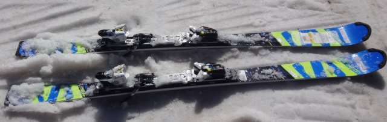
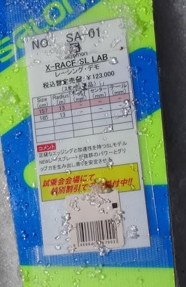
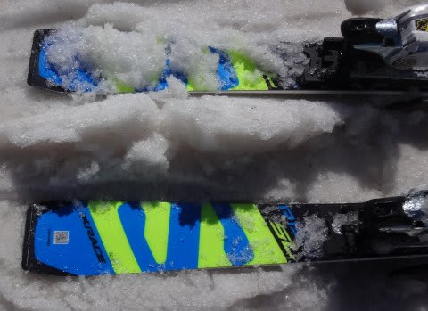
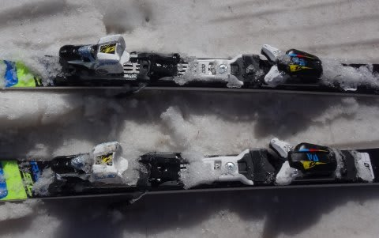
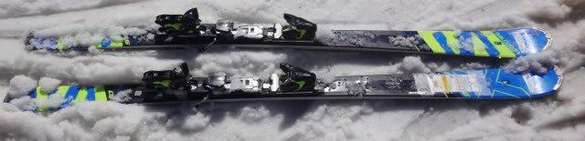
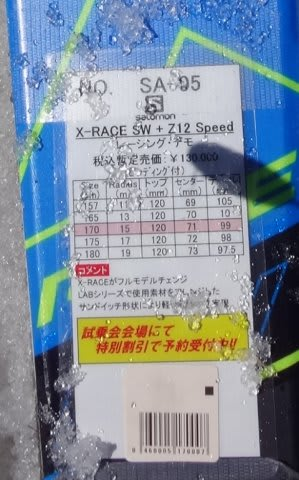
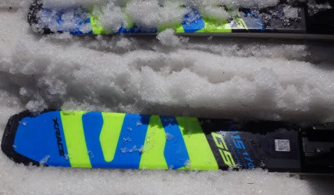
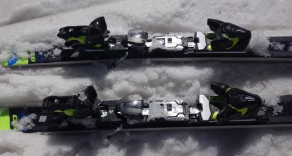

# 2017シーズンモデル，スキー試乗レポートその1…SALOMON編

📅 投稿日時: 2016-05-13 02:38:06

ということで．

全国2億8000万人のSkier_S試乗レポートファンの皆さま．

お待たせしました．←だから，日本人口より多いってば

5月中旬になって．

「え？今更？」

って感じがあふれる，

2016/2017シーズンモデルのスキー板，

試乗レポートの始まりです～．

まずは，サロモン編．

レースモデル2種類です…が．

…しかし．

この試乗は．

非常に悲しい状況の一の瀬ファミリースキー場での試乗だったので．

イマイチ特性がつかみきれてない感じです…

あと．

この試乗レポートを書いているのは，

テククラも指導員資格も一切持っていない，

単なるお気楽レジャースキーヤーですので，

そのあたり，ご理解のほどを…（笑）．

私が「これ，いい！」とホメた板でも，他の人には

「なぜ，この板を誉める…」ってのもあるでしょうし．

その逆に，私が気に入らなかった板でも，他の人には

すごくいい板もあると思いますので．

あくまで，素人スキーヤーの個人的感想ということで，

ご理解ください…

ちなみに，私は

・体格的には，中肉中背の部類（？）

・比較的滑走スピードは高い方だと思う…結構張りの強い

　板をたわませて滑るのが好き

・だもんで，グリップが強め，すっとたわむけど，

　比較的強い返りがある，ばね感の強い板が好み

・どちらかというと，小回りの板をメインで使っている

という感じなので，ご参考までに．

では，今シーズン第1回目の試乗レポート，どうぞ～！

○SALOMON　X-RACE SL LAB 157cm

SL競技用．

スラローム競技用の，Race Plate + Xビンディングを付けた，

サンドイッチ板です．

165cmがなかったので，157cmという，

私にとってはちょっと短すぎる板を履いてみました…

私が普段履いている，キャップ構造のX-RACEとは

打って変わって，サンドイッチ構造のこの板ですが．

サンドイッチ板の「面で捉える」感じより，

今履いているX-RACEに近い，しっかりエッジが

線で効いていく感じが強いです．

あまりサンドイッチっぽくないなぁ…

結構重さのある板ですが，

165cmのX-RACEを履いている自分にとっては，

X-RACEよりも軽いなぁ…という感じ．

また，157cmという長さもあるのか，

普段履いているX-RACEより，板のトップとテールが

どうしようもなく頑張ってグリップする感じがちょっと

弱まって，簡単に回せて．

コントロール性は高くなっているかも．

あ，でも．

普通のゲレンデ板と考えれば，エッジがしっかり線で効いて，

エッジグリップが強烈な板です．

板の返りはそれほど早くなく，板のばね感で切り替わっていくというより

しっかり板が回っていって切り替わる感じ．

サンドイッチ構造になった効果なのか，乗り味は

今シーズンのビンビンしたX-RACEに比べると，

ちょっと滑らかになったように感じます．

でも，かなりカービングマシーンなので，

しっかりグリップさせた中での傾きの大きさで

旋回半径をコントロールする板です．

とりあえず．

しっかりした重量感，張りの強さ，グリップの強さなど

今シーズンまでのX-RACEの正当後継となる板は，

X-RACE SWではなく，X-RACE LABなんじゃないかなぁ…

＃すいません．現行X-RACEを履いたことのない人には

＃ちょっとわかりにくい試乗レポートだったかも…

○SALOMON X-RACE SW 170cm

基礎大回り，GS競技用（FIS非対応）

SALOMONが，今シーズンのX-RACEの後継機と言っているのは

このモデルなんですが．

RACE PLATEがなくなり，さらにビンディングも，

板の張りが強くなるXビンディングは選べず，

優し目のZビンディングのみしか選べなくなってます…

だもんで．

今シーズンまでのX-RACEに比べて．

かなり軽く感じ，簡単にたわむようになっています．

ただ，サンドイッチ構造の割にトーションは強めなのか，

グリップの強さは相変わらずです．

基本的に，ここ数年のSALOMONらしく，

かなりテール荷重でコントロールする板です．

荷重ポイントはくるぶしより後ろ，明確にかかと側です．

特に，ターンの仕上げはかかとより後ろ側をたわませるように

乗っていくと，すっと切換えができます．

結構楽にたわませることができるので，170cmのこの板は

R15ということですが．R15というよりももう少し

小さい半径で回せる感じでした．

強めのグリップを活かして，縦目に落とせば大回り，

しっかりたわませればミドルターンで，

気持ちよくエッジに乗ったターンが続けられます．

しかし．

今年までのX-RACEのように．

どこまでもスピードを上げてもフレックスが窒息することなく

グリップし続けるような，限界を感じさせない高速耐性と，

ガチガチのアイスバーンであろうが何であろうが，

横Gをガンガン強めていっても，板が全くぶれたりする

ことなく，滑り手の体力の限界まで横Gが強まっていくような，

そういう強烈さは，弱まってますね～…

今シーズンモデルから，エッジグリップが強めの

キャラクターは引き継いだものの．

ゲレンデでのスピード域でも比較的たわませやすくして，

かつどうしようもなく重い今シーズンモデルから

かなり軽量化して，マイルドに扱いやすくした…

という感じを受けました．

うーむ．

普通のゲレンデモデルと考えれば，エッジグリップが

しっかりしていて．

固めにしまった整地で，比較的高めのスピードで

大回り～ミドルターンで滑りたい…

と感じさせる板ですが．

X-RACEという板に，[他の板にない過激さ](e587111dcba9e3b9e9174d9bd849610e6.md)を求める私としては

ちょっと優しくなりすぎたかな…

と感じました…

うーむ．

この板．

RACE PLATEつけて，Xビンディング選べないのかな～
