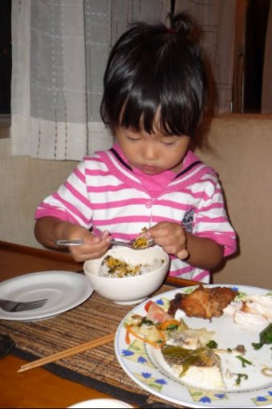

# コドモとコモド！子連れダイブクルーズ10　クルーズ初日終了

📅 投稿日時: 2011-07-13 01:46:24

って感じで．

無事，ニューカメラの浸水式…

もとい．

進水式を兼ねた，コモド1本目を終了し．

エグジットして船に戻ると，もう夕方です．

娘は，ママと遊んでもらって，マグネットスレートでお絵かきしてました…

しかし．

もう夕方というのに．

まだ，ダイブクルーズの一日は終わらない．

日が暮れるころを狙って，今度はサンセットダイブへGo!

サンセットダイブのポイントは，さっきと同じ「Tatawa Besar」

5時半エントリーのサンセットダイブ．

ブリーフィング時には，すでに夕日が射しています

んで，エントリーすると…

このポイント，一昨年は，すごい魚の群れが見れたんだけど…

今回は魚影が薄め(涙)．

薄暗かったのであまりいい写真も撮れなかったし．

うーーん．

ちょいと平凡な1本だったかな～．

でも，海の中のカラフルさは，さすがコモド．

日が沈んでいく中，海がゆっくりと暗くなってきます．

水面を眺めると，海面越しに薄暮の空が…

うーん．きれいだ…

子供が生まれても，こんなふうにダイビングがたのしめるとは．

夫婦の趣味が一致していて良かったなぁ…

5m3分の安全停止の後，浮上すると

夕暮れの空が目の前に広がります．

きれいだなあ…

ああ．

子供を連れて，コモドの夕暮れをみられるとは思って無かったよ…

幸せを感じつつ．

船に戻ると，夕食タ～イム．

夕食も，鶏肉や魚であれば，比較的子供が食べられる味付けで

一安心．

でも，一番の武器は

ご飯とふりかけ．

ふりかけが常備されているので，これだけでもなんとか

子供は乗り切れます．

日本人向けのクルーズ船のありがたさ…

で．

この日は朝5時前にピックアップというのもあって，夕食後は

早々に撃沈でした．

ああ…クルーズ初日から，幸せな一日だった．

明日はどんな一日になるのか…

おやすみなさーい．
