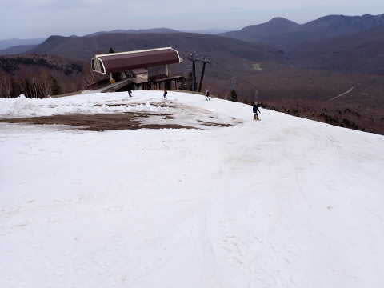

# 2023/5/3(水・祝)の奥志賀高原スキー場は…晴れのちうす曇り，あさイチは良かったけど，気温は高くそんなに滑りが良くない雪に…(涙)

📅 投稿日時: 2023-05-04 04:45:30

🏷️ カテゴリ: [2023スキー滑走日記](cd943df30cfcc3d0896469e2ff98720cd.md)

ってなことで．

今日も志賀高原で滑ってましたが…

…さっき帰宅しました～！

GWの残りの日程は滑らないのかって

お思いでしょうが…

5連休前半は混むし，家でやっつけなきゃ

いけない仕事が溜まってるので…（涙）

一旦家に戻ってきましたが．

…本来なら，混雑が収まる6，7日あたりに

仕事が終わってたらまた滑りに行きたいところ．

でも，6，7日は天気が悪いのと，雪がすごい

ことになってそうなので…

うーん．滑りに行かないかも…

ってなことで．

昨晩の飲み会の疲れか，今日は帰り道の

途中で熟睡をかましてしまい帰宅が遅く，

すごい時間になってしまったので…

帰宅日恒例，速報モードにて！

えー．

まず．

今日は5連休で混みそうな横手の混雑を

避けるのと，2日連続で横手グルグルして

飽きてきたのもあり，奥志賀に滑りに

来ました～！！

奥志賀は早朝営業無しの8時から営業スタートなので．

通常営業から参戦する場合は，

6時から早朝営業（早朝料金3000円！）をやって

いて，通常営業開始が8:30からの横手より

30分早くから滑れるうえ，通常営業開始時に

既に早朝営業でバーンが荒れている心配も

ないのがいいですね！

奥志賀で営業しているのは，

・ゴンドラ（ゲレンデ連絡用，滑って降りられない）

・第3高速ペア

・第4ペア

の3本．

滑れるのは第3，第4ゲレンデですが．

なんと．

途中で板を脱がなきゃならない箇所があるらしいけど，

まだ第2沿いの林間コースが滑って降りられるみたいです！！

驚き…！！

…でも，第2リフトが動いてないのが惜しい…

下りたらバスでゴンドラに移動するしかないです．

で．

今日は朝から山頂の気温は+13℃と

強烈に暖かい一日で．

朝イチのしばらくはバーンがまだ締まり気味

だったけど…

すぐに緩んだ柔らかい雪になっていきました（泣）

第3ゲレンデは，雪はところどころ薄い

ところがあるものの，まだほとんど

幅いっぱい滑ることができます！

…が．

第3ペアリフト乗り場に向かうところが

一部ヤバいところがあって…

幅がかなり狭くなってます（涙）

リフト乗り場前も，雪が減りましたね…（泣）

でも，今日はリフト待ちは最大この程度．

タイミングによっては搬器2-3台の待ちしか

なかったので，GW5連休と考えればかなり

人は少ないですね…

そして，第4リフトにも行ってみますが…

こっちはコース幅，雪の量ともに第3より

いい感じ！

そして，コブ道場もまだ健在！！

自分が滑った時はまだコブは浅かったけど，

コブが深くなっても底が抜けないから，

コブ道場をつづけられてるんでしょうね…

第4は積雪はまだ結構あるのかな？？

でも…

朝9時前にはもうユルユルで滑りが悪い

雪になっていて．

緩斜面というのもあり，あんまり

楽しくない…（泣）

だもんで．

第3側をメインに滑りますが…

まだある程度斜度がある第3の方が

第4よりマシとはいえ．

+10℃を大きく超える気温で，10時ごろには

あんまり板が滑らない雪になってしまい，

そして，バーンの薄いところに所々

ブッシュさんが顔を出し始めて来ました…（泣）

うーん．

残念…

ってなことで．

この日はラストまで滑らず，ちょいと早めに

切り上げましたが．

下りもゴンドラ乗車で下りなくてはならず．

奥志賀ゴンドラの下りに乗車したの，初めて

じゃないかな？？

という感じで．

GWとすれば混まなかったものの．

激烈高温で雪はすぐ緩んで，板が滑らない

雪になっていったし．

第3，第4の変化の無い2コースだけだと

飽きるうえ．

トイレが山麓にしかなく，トイレに行くために

毎度ゴンドラで下らないといけない…

というのがちときつかった奥志賀高原でした…

うーん．

横手より混まないのはいいんだけどな…
