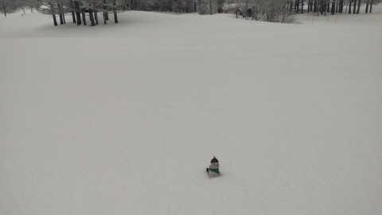

# 3月2日の志賀高原スキー場は…積雪は朝は5cmほど．終日雪降りで寒く感じた一日

📅 投稿日時: 2023-03-03 01:54:31

🏷️ カテゴリ: [日記](cc4b5682fb7b8b144980957a978653fb0.md)

えー．

しばらく前に．

このくそ忙しい中，

健康診断で胃の内視鏡検査を受けてきたの

ですが…

内視鏡で胃を見た時に，お医者さんが一言．

「きれいな胃してますね～！」

…え？

このストレスフルで過酷な仕事状況で，

さらにかなりの無理をしてスキーにも行って

いるのに…

きれいな胃なの？？

こんなにストレスいっぱいで，

胃に穴が開くんじゃないか

と心配していましたが．

どうやらそんな心配はなさそうと

安心しましたが…

…しかし…

どうしてだろう．

なんだか，ご無体サラリーマンとしては．

何かに負けた感があるのは，なんでなんだろう…

ってなことで，本題へ．

本日も特派員が志賀高原で滑っていたようなので．

いつもの志賀高原特派員からの情報をば…

朝は予想より積もっておらず，積雪は

駐車場でせいぜい5cmほど（涙）

もっとドサドサ積もると思ったんだけどな～（泣）

ゲレンデは，かなりカチカチの硬めバーンの

上にうっすら5cm弱の新雪が乗っているという

感じらしく…

そして，ガスっていて視界も悪く．

かなり滑りにくかったみたいですね…

で．

あさイチの気温は-2℃と高めだったけど．

だんだん気温が下がっていき，午後は

-4℃くらいだったみたいですが．

体感的にはそれより寒く．

午後はうっすらと日も射すタイミングも

あったみたいですが…

カチカチバーンの上に新雪と，難しい

コンディションというのもあり，

滑っている人は少なく，すごいガラガラ

だったそうです…

うーん．

志賀高原は今日の夜，リフト営業が終わった後

にもちょっと積もったみたいなので…

明日はコンデションが今日よりはちょっと

改善してくれてるかな？

そして，晴れそうなので…

意外といいコンディションになるかも…！

明日以降はしばらく雪は降りそうにないので．

今週末，そこそこいいコンディションで

滑れるかどうかは．

今日から明日にかけての積雪にかかって

いるので…

ぜひ，明日の朝は10cm以上積もって，

下地の硬いのが隠れてくれることを期待…！

## 💬 コメント一覧

### 💬 コメント by (レインボー75)
**タイトル**: Unknown
**投稿日**: 2023-03-03 16:49:00

金曜日の志賀高原情報

朝の湯田中は車に12cmベタ雪。蓮池-10℃、晴れてる。

昨日の雪が圧雪されてふかふか柔らかバーン。朝圧雪のオリンピックだけは新雪15cm。

やけびを堪能したあとは奥志賀へ。

ダウンヒルはガタガタしていて楽しくない。第三はいつもの快適さはないもののまずまず。

「朝一のエキスパ良かったよ」と聞いていたけど、昼前に行ったらもこもこ。

「何事も賞味期限内よ」おこみん特派員に言われました。

こんな柔らかい雪の午後は、やっぱり荒れて膝に悪いので、レインボー(２時)まで持たずに終了。

明日の午前は唐松で試乗会です。今夜も呑みすぎないようにします。

### 💬 コメント by (アリス)
**タイトル**: Unknown
**投稿日**: 2023-03-03 19:33:36

S様

朝一朝食時間、車の積雪対応で出遅れました😅

結局は、二高8時30分スタート❗️

唐松はファーストその後奥志賀、ヤケビぐるぐる廻し✨

雲一つないヤケビブルー幸せ一杯です🎵

明日は、1ゴンのファーストトラックが楽しみです🎵

二高でヤケビ常連さんと思われる方から声がけ✨板のYASステッカーを見てとの事で☺️

リフト一緒で話をするとSさんブログの愛読者で、GOKUさん動画のファンで志賀高原にリターンの方でした（私と同じです）

短いリフト乗車での話で、2月の選挙で山ノ内町長に長野オリンピックのアルペン選手の平沢岳さんが当選し、観光事業にも改革するとの事🎵

志賀高原のお客様志向にも政治の力が入る事は素晴らしいと感じました🎵

先ずは、Sさんの職場の改革も必要かなと勝手に思っております。土、日、祭は無条件に休め金、月は年次有給休暇取り放題🎵

他社の人間の勝手な意見ですか😅

### 💬 コメント by (Skier_S)
**タイトル**: 今週末は良さそう！
**投稿日**: 2023-03-04 00:24:16

＞レインボー75さま

今日はふかふか柔らかで良かったみたいですね…

でも，逆に午後は荒れてもこもこになりましたか．

明日もいいコンディションのはずなので，楽しみ！

＞アリスさま

そうなんですよ．

山之内町長，平沢岳さんが当選されたんですよ…

これからの山ノ内がどうなるか期待！

そして，私の職場は…

あえて何も言うまい…

