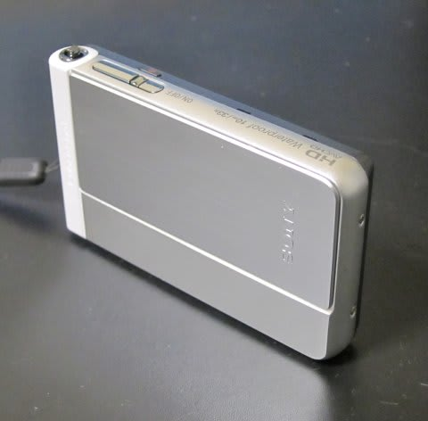
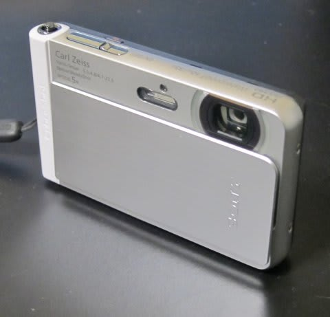
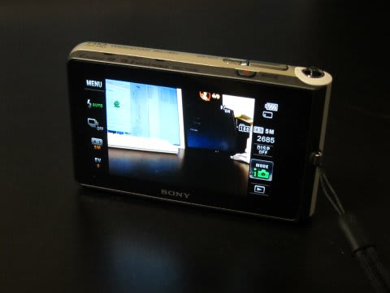

# 新しいデジカメ，SONY Cybershot TX30買ったよ

📅 投稿日時: 2014-01-17 02:55:16

🏷️ カテゴリ: [PC,カメラ&小物](c0d8caed13e597efe97b661a8ae56bed0.md)

あー．

スキーシーズンになると．

このBlogの読者数が，夏の間の3倍近くに増える今日この頃．

みなさまいかがおすごしでしょうか．

…って挨拶がおわったところで．

実は，この夏．

いろいろ悲しいことがあり，

また，[昨年度購入したデジカメ，TX20](ecf2754342d380ea1db09caa20d935657.md)が．

なんと，早くもお亡くなりになってしまったんですね～(涙)．

…まぁ，25000枚くらい撮影してたから．

1万枚が寿命と言う，コンパクトデジカメとしては

酷使されて天寿を全うしたともいえるのですが．

…でも，1年半で水没(泣）．

…お亡くなりになった状況は，またおいおい書くとして，だ．

とりあえず，後継機を買わねばならんっ！

…と．

次の機種を探すわけですが．

私としては，写真を撮影するより，すべりの解析の動画を

とることも多いので．

まぁ，カメラを雪まみれにしてしまうようなスキー場での撮影には，

防水は必須．

かつ，そこそこの手ぶれ補正能力があり，フルHDの動画が撮れて．

撮影中のズームもそこそこ速い…

という機種を探すと．

やはり，TX20の後継機，TX30しか残らなかったわけですね～．

この，TX30．

光学ズームは5倍ですが．

動画撮影時はデジタルズームとあわせると15倍．

んで，動画撮影のズームも速く，[この程度](http://blog.goo.ne.jp/suma_shikao/e/8a6794c975c911a3435da936ed88aef1)や[この程度](http://blog.goo.ne.jp/suma_shikao/e/28af0a07cee068c3cfebc3154db74f47)の動画が撮れちゃいます．

…スキーの滑りの解析に十分なレベルですね．

＃たむらぱんさんのBlogを勝手にリンク

デジタルズームって，解像度が落ちそうな感じがするけど．

なんだかTX30のデジタルズーム，TX20よりずっときれいになったなぁ…

スキーの動き解析にはこれで十分！

さらに，TX20の光学4倍に比べ，光学5倍になり．

動画デジタルズームも16倍から20倍になり．

TX20より，スキー解析にはいい感じ…

とりあえず．

今シーズンのスキー報告の写真は，すべてTX30で撮ってますが．

静止画の画質も十分．

滑りの解析用ビデオ＆カメラとして，これが1台あれば事足りますね～．

なんにしろ，吹雪の中でも安心して撮影できるし．

雪にまみれても安心．

まー，スキー用デジカメとしては，これでOkだな！

＃欠点は，マイナス15度とかの志賀高原では，動画を4，5本撮ると

＃電池切れマークが…

＃寒さに弱いリチウムイオン電池の欠点が…

＃内ポケットとかに入れてあっためておけばいいんですけどね～．
