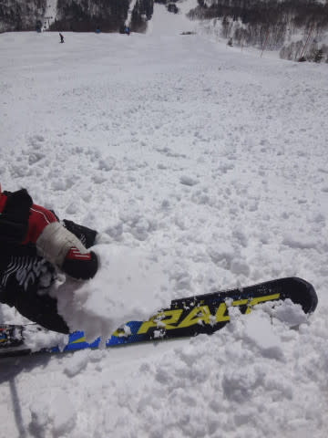

# 3連休最終日，3月20日の志賀高原，速報モード…晴天ポカポカ春スキー．雪はこの時期にしては良かったよ

📅 投稿日時: 2017-03-21 01:42:22

焼額第1ゴンドラを生息地とするらしい

と言われている，この私．←だから，住んでないから．ゴンドラで暮らしてないから

この3連休．

ちょっと奥志賀へ足を延ばすことが多く．

…焼額の第1ゴンドラ乗り場に2時間ほど

現れなかったとき．

第1ゴンドラ係員さん「あれ…？どこかに行ってらしたんですか？」

私（うぐっ．しばらくいないと気づかれるのか…（汗））

　　「はい…ちょ，ちょっと…奥志賀まで」

…浮気がばれた時って，こんな気分なのかなぁ…

と思った，Skier_Sです．

しかし．

しばらくいないとゴンドラ係員さんに気づかれるってのは．

もはや，私は第1ゴンドラの一部とみなされているのかもしれません（笑）

…って余談のあとは．

本日の志賀高原レポートですが．

今日も帰宅がかなり遅く．

いろいろ片づけだとか板の手入れだとか

していたら，またこんな時間（涙）．

だもんで．

いつもの速報モードにて…←こんな前フリ書いてる暇があるなら，詳細モードで書けばいいのに

えー．

ってことで．

本日も，焼額をホームゲレンデと自称している私が．

春の時期には，焼額より30分早い朝8時に

通常営業を開始する，奥志賀からスタート！

今日は朝から晴天ですね～．

そして…

朝イチの山頂の雪質は…

ええんか？

この時期で，こんなにいい雪質でええんか？？？

という，かなり冷え冷えのグッドコンディション！

ただ，今日は予想通り．

そう，予想通り←ここ大事だから強調しておくところ

晴天で，気温が0℃を超えるくらいまで上がったので…

午前中から，日差しが当たる東～南斜面は

固まったような雪質に…（涙）．

さらに，昼ごろには．

斜面の向きに関わらず．

標高の低いところは，全面的にちょいと緩み気味の

雪に…

でも．

この時期で晴天なら．

ザブザブザラメになっても不思議じゃないところ．

この程度で済んだのは，まだ恵まれてるかな～．

そして，

今日は一日すっきり晴天だったのに．

焼額はゴンドラ待ちが全く無くて…

夕方には多少ゲレンデは荒れたものの．

そんなにひどくゲレンデが

荒れることなく．

この時期としては，かーーーーなり恵まれた

一日を楽しめたのでした…

ってことで．

明日詳細レポートしますので，

お楽しみに～

＃これでも結構詳細な気もするが

## 💬 コメント一覧

### 💬 コメント by (Reader)
**タイトル**: Close Encounter?
**投稿日**: 2017-03-21 02:52:24

読者です．

何年間か，どのような滑りをするのか，「見てみたい」と思っていました．20日，11時半ごろ，１ゴンのところで，あっという間に，一つ前のゴンドラに乗った方が・・・板とその脱ぎ方，その他の要素から，そうではないかな？？？　当然，声をかける前にいらっしゃらなくなりました．20日が今年の志賀，最後ですので，滑る姿は来シーズンまで，お預けです．

### 💬 コメント by (yama)
**タイトル**: ３日間ありがとうございました
**投稿日**: 2017-03-21 08:25:52

３月の中旬とは思えないゲレンデでしたね。来週行けないのでその分まで滑り倒しました。ブログが無事更新されていたので安心しました。ありがとうございました。

### 💬 コメント by (かず)
**タイトル**: お疲れ様でした
**投稿日**: 2017-03-21 11:17:46

朝一南側荒れてるような気がしました　一本でやめて北側急行きましたがそちらも…　FTみたいのあるのでしょうか？

### 💬 コメント by (Goku)
**タイトル**: Unknown
**投稿日**: 2017-03-21 20:10:26

３連休お疲れでした～

毎年こんなグッドコンディションな３連休であってほしいですね。

長野は今日一日雨でしたが、蓮池から上は雪だったようです。

今週末もコンディション良さそうですね♪

では、週末お会いしましょう。

### 💬 コメント by (Skier_S)
**タイトル**: 3連休は楽しみました
**投稿日**: 2017-03-22 04:15:33

＞Readerさま

初コメントありがとうございます～．

そして，ご愛読ありがとうございます～！！

…私なんか見ても，何も面白いことは無いのですが…（＾＾;

しかし，板の脱ぎ方とゴンドラの乗り方で分かりましたか（笑）

ゴンドラ乗車を繰り返しすぎた結果，「無駄のない板の脱ぎ方」が身に着いたので…←なんのこっちゃ

来シーズンと言わず，また今シーズンのうちに

ぜひ志賀高原へ…！！

次回は声をかけてください！

＞yamaさま

3日間，むちゃくちゃお世話になりました．

っていうか，3日間トータル6万m越えってすごすぎます…

＞かずさま

奥志賀ですよね？

ゴンドラ，第2，第3高速ペアで6:30から早朝営業

してますよ～！

1600円ですので，早起きできれば早朝に

参加してみてはいかが？？

＞Gokuさま

そうなんですよ．ぎりぎり雪で良かったです…

今晩から結構積もりそうなので，

今週末もかなりいいコンディションだと思いますよ～！

