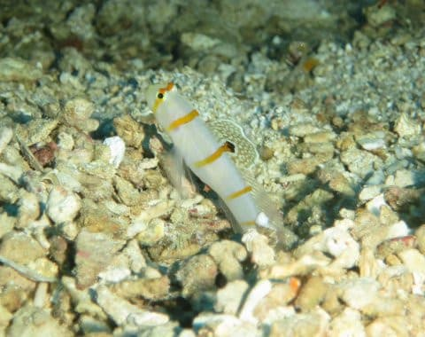

# 2019年8月，4度目のモアルボアル・小6の娘Cカード取得1周年！その19…ダイビング3日目の1本目，

📅 投稿日時: 2020-08-27 01:52:08

ということで．

LEVORGネタや，2日間休載などを

挟み，久々のダイビング日記です！

…あまり人気のないダイビング

旅行記ですから．

読む方は，

「またダイビング日記か…」

と思ってしまうでしょうが．

前回，ダイビング日記を書いたのが

21日夜中の更新．

中4日あけると，書く方は

久しぶりにダイビング旅行記を書く気分

なんです．

ってなことで．

LEVORG記事の1/20ほどしか読者が来ない

ダイビング旅行記へ，Go！

ーーー

という感じで，本日の1本目，

定番のぺスカドール島へエントリー

したわけですが…

さすがぺスカドール島．

朝から魚がいっぱい！

ドロップオフの壁を覆う

メラネシアンアンティアスや…

パープルビューティーなんかに

癒されながらのダイビング．

ドロップオフ沿いを進んで行くと…

ガイドの小見山さん，何かを

指し示してますね…

ん？？

パンダ顔？？

…確かに，パンダ顔と

言えなくない…かな？

他にもいろいろ指してくれますが．

今度は…クマドリカエルアンコウですね…

さらには，フィリピンならどこにもいる

ニチリンダテハゼに…

これは，エレガントモレイって

名前だそうです…

さらには，浅瀬でツユベラの幼魚なんかを

見たりしていると…

早くもダイビングも終盤…

浅瀬で安全停止を兼ねて，

ボート下でフリータイム！

…だけど，娘よ．

なんだ，そのポーズは…

娘も何か写真を撮ってますね…

深度浅いから，カメラの液晶画面

ばっかり見てると浮き上がっちゃうよ！

その一方で，私はいつも通り，

ハマクマノミを撮ったりしていると…

安全停止も終わりなので，

浮上！

本日の1本目が終わったのでした…

## 💬 コメント一覧

### 💬 コメント by (AK)
**タイトル**: Unknown
**投稿日**: 2020-08-27 22:25:23

ダイビングブログ楽しみにしてますよ！

１つ質問なんですが水深によって浮力って変わるんですか？

深さによってウエイトを変えるって話を耳にしたもので。素人の疑問ですみません。

### 💬 コメント by (Skier_S)
**タイトル**: ＞AKさま
**投稿日**: 2020-08-28 00:33:34

数少ない（？）ダイビング日記応援，ありがとうございます．

水深によって浮力，変わるんですよ…

深くなると，空気が押しつぶされるので浮力は小さくなり，

水面付近では大きくなります．

厚いウエットスーツとかだと，浅いところではむちゃくちゃ浮きますが，

深いところでは水圧でつぶれて浮力がすごい減ります．

その浮力を調整するため，水中でタンクからの空気を出し入れできる

浮袋のような浮力調整ベスト(BC)を着てダイビングします．

深いところでBCに空気を入れて，浅いところではこの空気を抜くんですが．

初心者のうちは，空気を抜き忘れて深度を上げて，

一気に浮力が増えて急浮上してしまう…

という失敗をやる人が結構います．

