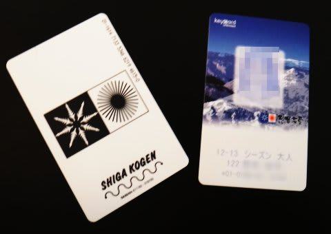
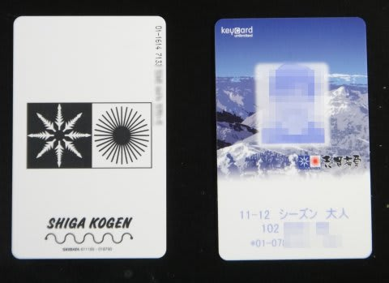

# 志賀高原のシーズン券は…去年と変わんないなぁ．．．

📅 投稿日時: 2012-11-27 01:20:44

🏷️ カテゴリ: [日記](cc4b5682fb7b8b144980957a978653fb0.md)

あー．

しつこいようですが，この週末はスキーに行ってないので．

スキーねたが無いのだ．

…でも．このBlog.

あくまで徒然スキーヤー日記で，徒然ダイバー日記ではないので．

スキーシーズンにダイビング日記ばっかり書いてると．

スキーヤーの読者がいなくなるのだ．

だから，今日はスキーねたを書くのだ．

で．

本題．

…数週間前に．届いたんですよ．

我が家にとって，スキーシーズンの必須アイテム．

じゃじゃーん！

そうです．

志賀高原のシーズン券っ！！

…でも，なんだか．今年のシーズン券．

去年のシーズン券と全く見た目が同じで，見分けがつかないんですが．

これが去年のシーズン券．

顔写真の下の，11-12シーズンという表記以外，差がない…

これは，自動改札ゲートならではですかね．

人間の目で見るゲートだと，去年のシーズン券でゲートくぐれちゃいそう…(笑)

あー．

どーでもいいけど，志賀高原のシーズン券は．

申し込みは郵送のみ，購入は代金引換の配達のみ…という，

かなり前時代的かつ限定された購入方法で．

リフト券代のほかに，郵送代金と代金引換手数料がかかるという

かなり痛いシステムだったりする．

現地受け取りができればいいのだけど…送料と代引手数料が痛い！

＃我が家は夫婦二人分の申し込みなので，手数料や郵送料が半分で

＃すむので，ちょっとはましだったりしますが…

まぁ，とりあえず．

シーズンの必須アイテムもGetしたことだし．

今週末からは，がんがん志賀へ出没するのだ！！

## 💬 コメント一覧

### 💬 コメント by (Mary)
**タイトル**: Unknown
**投稿日**: 2012-12-11 10:38:18

初めまして。

スキーヤーでダイバーのMaryと申します。

いつも楽しく拝見させていただいています。

志賀高原のシーズン券ですが、現地受け取りできますよ。

申込書の「郵送希望先」に、「○月○日、現地に受け取りに行きます」と記入すれば、大丈夫です。

私も今週末、初滑りがてら、98会館に引き取りに行く予定です。

ヤケビメインなので、もしかしたら、お会いできるかもしれませんね。

その時は、宜しくお願いします。

### 💬 コメント by (Skier_S)
**タイトル**: ようこそ！
**投稿日**: 2012-12-12 00:53:14

ええええっ！

そうなんですか！！！

現地受け取り可能なんですか…

これで800円以上浮くじゃないですか…．

うーん．

志賀のシーズン券を購入して5シーズンになりますが．

知りませんでした…

来年は現地引取りにチャレンジしてみます．

私はこれからGWまで，ほぼ全週末ヤケビに

出没します．

それも，第1ゴンドラをひたすらぐるぐるしています…

週末にヤケビ第１ゴンドラをひたすらぐるぐるしている

人間を見たら，私の可能性が高いです（笑）．

