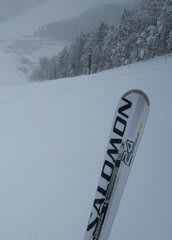
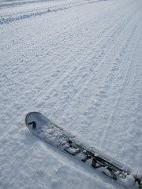

# SALOMON 24hours LMをいろんな人に履いてもらった

📅 投稿日時: 2011-01-18 00:55:41

えーっと．

1月14日のレポートで．

[いろんな板を履いたって報告](d20110114.md)しましたが．

私が一緒に行った人のいろんな板を履いたってことは，

逆に言うと，私と一緒に行ったみんなが，

私の板を履いたってことで．

で，そのときに，SALOMON 24hours LMを履いてもらった人

から聞いたインプレッションが意外だった，と．

有資格者で，マスターズ技術選にもチャレンジしている

[スマシカオさん](http://blog.goo.ne.jp/suma_shikao)がこの板を履いて好感触を得るのは納得だったんですが…

なんと．

一緒に行った，1級もまだもっていない女性陣が二人とも

この板を絶賛したという！！

意外～！

だって，この板．

重いし，硬いし．

決して中級者向けではないと思うんで，

絶対手こずるだろうなぁ，と思いながら履いてもらったん

ですけどね～．

予想外．

曰く，

「どっしりしていて安定感があって，新雪が溜まって

でこぼこになった斜面でも板がたたかれないから

安心してスピードが出せる」

「硬い斜面にやわらかい雪が乗って，雪面の硬さが

急に変わるような斜面でも，エッジグリップが一定なので

スピードを出しても怖くない」

「動かしやすい．いきなりエッジが効いて予想外の方向に

板だけ動くことがない」

…などなど．

全般的に，安定感の高さから，難しい斜面でスピードを

出しても怖くない，って思うみたいです…

その上で，板を動かす自由度もあると．

一人は，明らかに私の板を履いてから滑りが良くなりました．

「安定してて怖くないから～（はあと）」

と，新雪が蹴散らされ20cmくらいの浅いでこぼこが

続く斜面で，かなりアグレッシブな滑りをしてましたね～．

明らかに，'09 SALOMON DEMO X3よりも，ATOMIC D2 DEMO TYPE-A

よりもずっと硬くて重い板だというのに，

1級ももっていない小柄な女性陣が絶賛するとは予想外…

…別にSALOMONの回し者ではないんですが．

SALOMON 24hours LM，結構いいみたいです．
