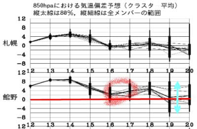

# 2022/3/13(日)の志賀高原スキー場速報レポート！…朝からプラス気温．雪はところどころストップ雪に．あぁ…春だねぇ(涙)

📅 投稿日時: 2022-03-14 01:56:33

🏷️ カテゴリ: [2022スキー滑走日記](cc9cb73e4320f6a97af6fccc37587a61a.md)

ってなことで．

今日もラストリフトまでしっかり滑り．

帰宅したらいつも通り深夜になってるわけですが．

取り急ぎ，今後の天気の予想をしておくと…

月曜に滑る方，ちょっとだけ喜んでください．

雨の予想だった月曜日．

雨が降るのは未明～早朝にかけてで，

リフト営業開始時には降り終わりそうです！

さらに，未明に降る雨も，それほどひどい

降りにはならなさそうです…！

月曜昼間は曇ったり日が射したりと，

天気はひどくならなさそうですが．

…でも．朝から気温が高いので，

雨の水を吸ったずっしり重い，4月の

雪になってそうです…(涙)

そして，火曜朝にまた雨がぱらつきそう…

月曜，火曜は気温も高くて，雨を吸った

重い雪です．

覚悟してください．

で．

それ以降，16日の水曜から冷えそう…と，

以前予告しましたが．

…どうやら，予想は悪いほうにずれて．

16，17日は下図の赤丸で示したように，

平年並みよりちょっと高い気温に

なりそうです(涙)

ヘタすると，また雨かも…

今週は一週間，パラパラ雨が降る日が

続くのか…（激涙）

で．

肝心な週末．3連休ですが．

19日以降，まだ予想が不正確でどうなるか

全く分かりません．

上の図の水色矢印で示したように，

19日には平年比-5℃から+8℃まで，

13度もの予想幅の広がりがあるので…

端的に言って，

19日の気温は全くどうなるか分からない

ということですね．

とりあえず．

平年比-5℃の方になるように，

ひたすら寒気の歌を歌い，

冷え冷え踊りを踊り続けないと

雨でやられたあとの高温で，

今日って4月下旬だっけ？？

という雪になりそう…(激涙)

というわけなので．

3連休にスキーをしようと思っている

皆さんには，全身全霊で歌い，踊り続ける

ことを義務とします←なぜあなたに命令されないといけないの？

…ってなことで，本題へ．

本日の志賀高原スキー場の，速報レポートです！

えー．

まず．

曇り空で始まった本日…

あさイチから気温がプラスという

悲しい状況でしたが…

一応，朝イチはまだちょい硬めに

締まっていながらもエッジが効く雪で，

うむ．

思ったよりいいんじゃない？？

と，喜びつつ滑っていたら…

朝9時過ぎには日が射し始め…

そのせいか．

一気に雪が緩み始めちゃいました(涙)

もう，朝10時過ぎには標高が低いバーンは

ところどころ，板にねばりつく感じの

ストップ雪になっちゃいました…(泣)

…でも，そのせいか．

午前11時近くまでは結構混んでいた

焼額ゴンドラですが．

昼ごろには，滑りの悪い雪にくじけた

スキーヤーが多かったようで．

午後は待って搬器数台程度のガラガラに

なり．

ゲレンデも人がいなくなっていきました…

で．

午後2時半ごろにはちょっと日が陰り，

そのせいで，雪の滑りもちょっと良く

なってきたので…

夕方のバーンはちょい荒れ気味ながらも，

昼間よりマシな感じでしたね…

結局今日は，標高が高い寺小屋も

一部ストップ雪になったほどで．

志賀のどこに行ってもところどころ

板に雪が張り付く感じになっているという，

悲しい状態でした…

ってなことで．

一気に春になってしまった感じの

志賀高原でしたが．

また明日，詳細レポートやります～！！

## 💬 コメント一覧

### 💬 コメント by (大阪のK)
**タイトル**: Unknown
**投稿日**: 2022-03-14 07:14:18

貼り付く雪の対策として、1ゴンを降りたらGALLIUM D-CONTROLを生塗りしていました。

パノラマから白樺、2高で1ゴンに帰る回遊ルートの最後まで持たないけど、サウスまではストレスフリーでしたよ。

### 💬 コメント by (レインボー74)
**タイトル**: Unknown
**投稿日**: 2022-03-14 16:38:00

月曜日の志賀高原情報

昨夜は西ほっぽ温泉ホテル泊なので、宿から滑ってスタート。なんかリッチな気分！

雪は柔らかいものの、妖怪が出ないので、西舘だけで結構楽しめました。昼前に温泉入って終了。

昨日の妖怪はなんだったの？今日はお会いできなかったですわ。

### 💬 コメント by (副院長)
**タイトル**: Unknown
**投稿日**: 2022-03-14 17:13:26

S様、申し訳ありません。晴れ男の私のパワー炸裂し、朝には、雨降ったの？状態で、昼前には快晴。雨のおかげ？妖怪もでず、快適な春スキーでした。明日も昼間は快晴で、後ろ髪引かれながら、今シーズンを締めくくりたいと思います。

来シーズンも、物欲に負けてるかもしれませんが、よろしくお願いします。

### 💬 コメント by (ももた)
**タイトル**: Unknown
**投稿日**: 2022-03-14 20:44:52

今日は天気が良かったです。雨なんて降っていなかったかのようなコンディションで、一日気持ちのよい快晴でしたよ。晴れ男さんのおかげかな。感謝、感謝です。今回は明日までとなりますが、明日も良い天気だといいな。

### 💬 コメント by (ダウンヒル)
**タイトル**: Unknown
**投稿日**: 2022-03-14 21:07:18

S様.

いつもブログ更新して頂き、感謝感激です。妖怪に取り付かれた数も半端なく、暑さでTシャツ姿になる強者さんもいたり...な、日曜でしたね...

ご命令の”冷え冷え踊り”...自分の次回参戦のためでもあるので、踊り狂ってみます！

### 💬 コメント by (ももも)
**タイトル**: Unknown
**投稿日**: 2022-03-14 21:24:37

S様

毎日楽しいブログをありがとうございます！

今年は一度もお会いできなくて残念でした。

＞副院長様

今日は雨のはずなのに晴れてるのは何故？と思っていたら……素晴らしい晴れ男っぷりです！！

妖怪退治までしていただいたようで感謝感謝です。

この調子で明日も宜しくお願い致します。

### 💬 コメント by (takaaturyou)
**タイトル**: Unknown
**投稿日**: 2022-03-14 23:00:06

お会い出来て良かったです。

お連れの分のステッカーありがとうございました♪

より一層、布教活動に精進します。

### 💬 コメント by (Skier_S)
**タイトル**: 週末3連休は冷えるかな？
**投稿日**: 2022-03-15 04:19:20

＞大阪のKさま

貼りつき雪，何か根本的な解決策は無いものか…

一日もつ貼りつき雪用ワックスが欲しいです（涙）

＞レインボー74さま

月曜は意外と良かったみたいですね…

日曜が一番悪かったのかも（泣）

＞副院長さま

日曜の帰りに話していた，「月曜晴れたりして！」

ってのがホントになりましたね…

さすが晴れ男！？

シーズンラスト楽しんでください！

＞ダウンヒルさま

日曜は悲惨でしたね（泣）

今週3連休がいい雪で滑れるよう，踊り狂ってください！！

＞もももさま

今シーズンお会いしてないですね…

もう今シーズンは終わりですか？

まだまだGWまで滑れますよ～！！

＞takaaturyouさま

午後にまたお会いできるかと思ったら，お会いできませんでしたね…

また，布教活動に務めてください～！！

