# 12月23日の朝の志賀高原の積雪は10cmほど…そして今晩から24日の朝にかけて，クリスマスプレゼントの雪が積もる！？が，その後の26日の危機（涙）

📅 投稿日時: 2019-12-24 02:32:52

🏷️ カテゴリ: [日記](cc4b5682fb7b8b144980957a978653fb0.md)

えー．

本来は，今日．

昨日速報した，22日の志賀高原の詳細レポートを

やろうかと思ったのですが…

やっぱり気になる，これからの天気．

だもんで．

詳細レポートの枕として，今週末に

かけての天気予想を書いていたら．

それだけで長くなったので，

詳細レポートは明日にします…

ってなことで，これからの天気を見る前に．

[昨日の記事](ef9e428fee75b34fec53000a1f9ff3446.md)で．

この年末休みまでの雪が降りそうなチャンスは，

22日夜～23日朝

23日夜～24日朝

27日

の3回．

と書きましたが…

その予想通り．

22日夜～23日朝にかけて，雪がちょっとだけ

積もってくれたようです！！

焼額は，10～15cmですか…

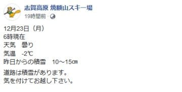

（[焼額山Facebook](https://ja-jp.facebook.com/yakebitaiyama/posts/2598911246870872?__xts__[0]=68.ARAirtq9hPVXRBZfkUXtYmDPs_sur_6OG5-xGjIx7dxM_6Dm3lQiDcSsL13iuBIr0-TZ7n4y6kyRpScfsVyR4VhsCNPWvnnVZj3pwlylbo3DfVORzbgoGEs9W0qdPf8139WHMDMmnDK6gxl2n-7VfDx9ofJ6yreIoKlwCs2Wx_f3d-MwXgte2FokJj3Z0y7meuLx9p2Gcr_pBPp5W0v7hxMP7ZdvfiWtTTfD90TJeekdUKZfd2ZEOvWzg7oqwnVLNc5P3AcDPi9WQNWKZkHTgUliRpnOdKk0Cxs2uuliyD550erYJOZYKHRTa28Fs9V0w5U1ffjiAbMZxveBD3GOBA&__tn__=-R)より）

そのおかげか，

明日…というか．

この記事を読んでいる皆さんにとっては

本日だと思うのですが．

24日（火）から，一の瀬ファミリー正面バーンが

オープンするようですっ！！

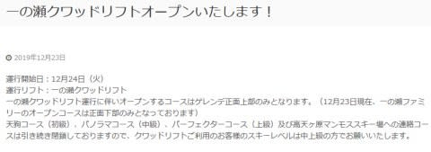

（[志賀高原中央エリアHP](http://shigakogen.co.jp/archives/5242)より）

…しかし．

一の瀬ファミリーの天狗コースより先に

正面バーンがオープンすることは，

めったに無いのですが…

人工降雪の無い他のコースは壊滅的だけど．

必死に人工雪を付けている正面バーンが，

ようやくなんとかオープンしてくれる

ようですね…

そして．

2回目に雪が降ると予想していた，

23日～24日朝にあたる現在ですが…

降ってます！

志賀高原では，積もってます！

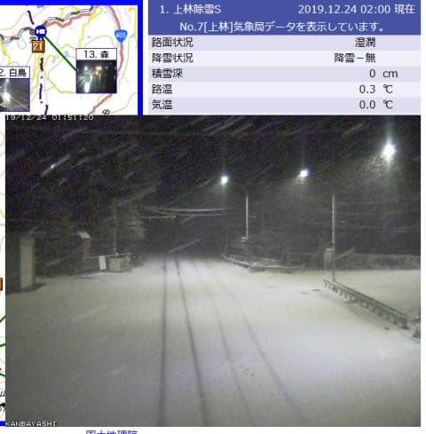

（[北信建設事務所道路気象情報ページ](http://hokushin-camera.org/)より）

そして．

24日の朝の500hpa気温図を見ると．

ををを！

赤く印した真冬の寒気，-30℃の線が

志賀高原に近づいてます！

500hpaの-30℃の寒気は，そこそこの雪が

降る目安っ！！

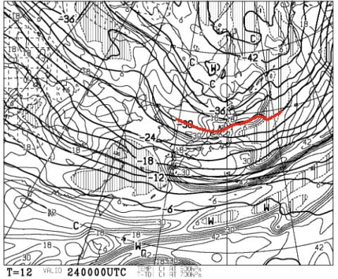

…残念ながら，-30℃の寒気は停滞してくれず．

一瞬で通り過ぎますが．

それでも，クリスマスイブの24日の

午前中いっぱいくらいまで，

雪が降り続けそう！！

…そして．

24日の朝までに，20cmくらい積もるかな？？

…思わぬクリスマスプレゼントになって

くれると嬉しいんだけど…

いや～．

積もってくれそうでよかった…

…

…

…

って．

え？

えええ！？？

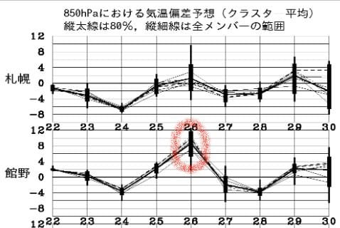

なんだこりゃ～っ！！？

[先週木曜日深夜の記事](ea5ca1df991238d5c12adb43ff97dfde7.md)で，

予想ばらつきが大きいと書いていた

26日の気温…

最も高いほうに振れちゃって

るんですけどっ！？？？

どういうことっ！？？

と，恐る恐る，26日木曜の850hpa気温図を

見てみると…

…

ふぎゃーーーーーっ！！！！

なんじゃこりゃーーーーっ！

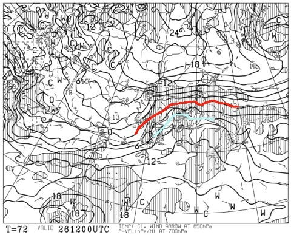

ヤバい．

やばいよ．

赤い0℃線は東北まで北上して，

志賀高原には水色の+6℃線が

かかってるじゃないですか…っ！！

これは…

これだと，志賀高原で降ったら．

それは，固体ではなく，液体なんですがっ！？

…まさか．

気温が低い時には降らずに．

高い時に限って降るなんて言う

ひどいことは無いよね…

とりあえず，26日の地上天気図を

見てみると…

…

………

…（屍）

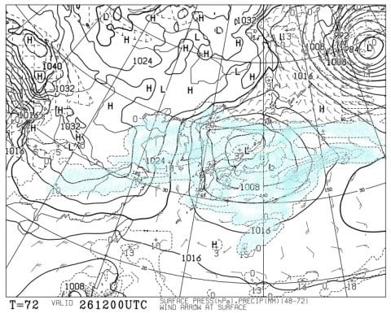

見事だ…

見事に日本を覆う降水域…

なぜ…

なぜ，冷えている時は降らないのに．

気温が上がった時に限って，

狙ったように降るのか…

…と，涙で曇る目で必死に

天気図の詳細を読み込むと…

うむ？？

かすかな救いの光がっ！！

志賀高原の周りだけ，

大海に浮かぶ小島のように，

降水が無いエリアが！！

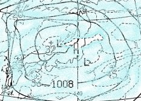

…実は，西風の時と同じく．

南風だと，横手山や岩菅の北側になる

志賀高原．

これらの山にブロックされて，意外と

雨雲が流れてこない…

という経験則があるのですが．

今回もそのパターンで，

南風で志賀は降らないパターン

が，予想天気図に出ているのか…！！

が．

今の予想図では，わずかに志賀高原より北に

低気圧があるので．

低気圧に向かって，志賀高原では南から

風が吹く予想になってるわけですが．

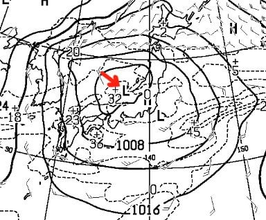

…わずかにでも，この低気圧が志賀高原より

南を通ると…

…

…

…その先は，予想したくないです…（激泣）

とりあえず．

今は，低気圧が志賀より北を通ることを

祈るばかり…

ただ．

今の希望としては．

26日の翌日．

正月休み前の27日（金）には…

ををを！！

志賀高原に水色の-6℃線がかかる，

いい感じの冷え方！

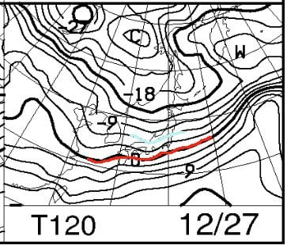

そして…

地上天気図を見ると，志賀高原にも

網掛けの降水域がかかってます！！

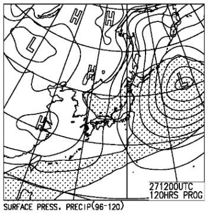

かなりしっかりした縦縞の

等圧線の天気図なので．

これは，積もる．

27日は，積もるっ！！

雪が，積もる！

年末年始休みの直前に，

雪が積もるのだ！！

…これだけを頼りに，

年末休みを迎えましょう…

なぜなら．

そのあとは．

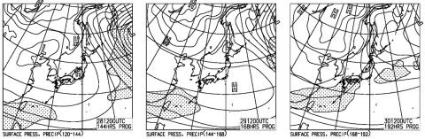

…28，29，30日と

降水域がほとんど日本海側に

かかっておらず．

雪が降らなさそうだからです…（涙）

（30日の予想はまだぶれが大きいので，

　もしかしたら積もる可能性もあり）

あぁ…

神様は一体何を求めているのか．

何が足りないのか．

我々の必死の踊りも届かず．

寒いギャグも，寒気の歌も

効かないとあれば．

何でもするから．

どんなことでもするから，雪を降らせてっ！！

…あ，でも．

これから一生スキーしないと誓えってのは無理．

…うーん．

今シーズンずっと志賀高原断ちをするってのも無理．

そうそう，これからスキー板を買うのをやめるってのも

ちょっと勘弁願いたいところ…

あ，それと…←それはすでに「何でもする」とは言えないから

## 💬 コメント一覧

### 💬 コメント by (North fox)
**タイトル**: Unknown
**投稿日**: 2019-12-24 08:59:00

私は悩んだ末に28、29日の志賀高原行きは諦めました（涙）。昨夜に宿のキャンセルをしてスッキリした気持ちです…

その資金、体力は1月以後に温存しておきます。

まずは1月の11日からの3連休に満を持して臨みます。（宿は確保しました）

雪よ降れ‼️

それと、＂何でもやります＂、なら＂毎年スキー板を買います＂の方がよろしいかと（笑）

### 💬 コメント by (626)
**タイトル**: 雄姿
**投稿日**: 2019-12-24 10:14:47

大阪よりシルバーメンバーとして通ってます(笑)

初コメントさせて頂きたく。

いつも楽しく拝見＆ゲレンデで遠くから観察させていただいています。

あのお方のお姿をニュースで拝見したので情報まで。

今週末からは本来の生息域にお戻りになられるかと思いますが

https://news.tv-asahi.co.jp/news_society/articles/000172339.html

### 💬 コメント by (musi)
**タイトル**: Unknown
**投稿日**: 2019-12-24 19:04:05

いや〜失敗した二週連続夏油にすれば良かったか。だから29日とかも志賀の宿空いてたのか。

そもそも色んな天気予報に騙されてSさんのブログ読む様になった事を忘れて都合良く天気予報理解して、予約してしまった！

でも、奇跡の降雪で、笑いの止まらない年末に……,

キャンセルフィーも発生するから、もう踊って待つしかない。

### 💬 コメント by (カンタロス)
**タイトル**: Unknown
**投稿日**: 2019-12-24 20:45:19

本日(24日)のかぐらの状況です。

端的にいきますね。

パウダー &リフト待ちゼロ

以上です(笑)

むしろパウダーすぎて板を外に踏んでいくと板のフレックスが雪面に勝ってしまう、感じ。

傾きたい放題できませんね。と贅沢な不満もあげておきます。(殴られそうですが(笑))

### 💬 コメント by (Skier_S)
**タイトル**: 27日は，降るっ！！
**投稿日**: 2019-12-25 03:43:21

＞NorthFoxさま

あぁ…28，29日はキャンセルされたのですね．

27日に降りそうではありますが，全面可能にまではならないだろうから．

ひとつの選択肢かと…

＞626さま

遠くから志賀高原へお越しくださいましてありがとうございます～

（別に私は志賀高原の代表でも何でもないけど…）

URLありがとうございました．

20000mメンバーに知らせました（笑）．

…しかし，ゲレンデでさりげなく発見されているのですね（汗）

今度見かけたら，声をかけてみてください．

シルバーステッカーお渡しします！

＞musiさま

27日の積雪で，何とかなるかもしれません！

期待して，ひたすら踊り続けてください！

＞カンタロスさま

…24日，良かったんですね…

そして，リフト待ち0ですか…

あぁ…人工雪じゃないゲレンデを滑りたい…

