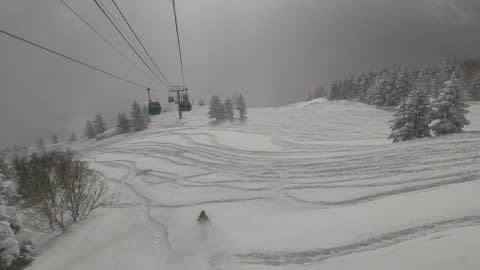

# 2月26，27日の週末の志賀高原の天気は…土曜は晴れそうだけど，気温が上がるかな．日曜は微妙…晴れ～曇りかな

📅 投稿日時: 2022-02-24 04:14:40

🏷️ カテゴリ: [日記](cc4b5682fb7b8b144980957a978653fb0.md)

今日は祭日なのに，滑りに行けなかった

Skier_Sです．

なんだか，

大雪によるリフト下の除雪のために

横手・渋のリフトが運休するみたいですが…

いや．今シーズン，ホントに積もりましたね～！！

([志賀高原索道協会ホームページ](https://shigakogen-ski.or.jp/news/2022/02/post-13.html)より）

で．

今日の志賀高原．

どうせ天気悪いだろうから，いいんだ．

滑れなくてもいいんだ…

と，思っていたら．

特派員からの写真を見ると…

なんだ，これは～！！

すっきり晴れてるじゃないですか！！

昨日の段階で，

　昼間も雪が降り続けます…

　時折弱まったり，うっすら日が射したり

　するかもしれないけど

と，「うっすら日が射すかな？」と

予想したけど．

うっすら日が射すどころか，

すっきり晴れるとは…！！

あさイチの気温は-13℃ほど．

午前中は大体予想通り，曇ったり晴れたり，

時折雪が降ったりという感じだった

ようですが．

あさイチは圧雪コースもうっすら軽い

雪が乗っていて．

そして，朝イチの非圧雪コースは

かなり軽い膝パフ．

オリンピックコースはブーツパフ

だったようで…

さらに，午前から日が射すタイミングも

あり．

何だか，すごい良さそうじゃないですか！！

週の半ばの祭日だったので，

ゲレンデもそんなに混んでないようで．

バーンも荒れてないし…

そして，午後になるとすっきり晴れた

みたいで…

今日，めちゃくちゃ良かったみたいじゃ

ないですか！！

…行きたかった…

滑りに行きたかった…

くっそーーー！！

こんなことなら…

一度でいいから，有給休暇というものを

使って．

天気がよくなりそうなトップシーズンの

平日に，スキーに行ってみたい…っ！！

リフレッシュ休暇とかあこがれるっ！！

…って．

飛び石連休やGWの谷間とか，年末年始休の

前後の「有給取得推奨日」ってのに

休めてるだけ，まだマシなんだろうな…

ってな感じの前フリのあとは．

今日の本題．

定例水曜の週末天気予想ですが…

今日は祭日も休めないほど忙しかったので．

天気図の解説をするほどの時間が

取れず．←その割にはかなり長い前フリを書いていたけど？？

天気図から読み取った予想部分のみ

書いておきます～！！

24日(木)：たぶん晴れ．

　時折雲が飛んできて曇るかも

　しれないけど，基本的に晴れ．

　朝は-15℃くらい．

　あさイチは柔らかめながら冷えた

　トップシーズンシマシマバーン！！

　終日Goodコンディションのスキー日和

25日(金)：うす曇り～晴れ．

　朝は-10℃程度．

　朝は冷えて締まり気味の

　シマシマバーン！

　この日も終日冷えてるのに晴れて，

　コンディションは良さそう…

26日(土)：終日晴れそう．

　朝は-6℃と暖かめ．

　あさイチは締まったスピードが出る

　最高シマシマバーン！！

　昼間は晴れて気温が0℃近くまで

　上がるので，日当たりがいい

　バーンはちょっと雪が重めになりそう．

27日(日)：微妙．

　うーん．今の予想図のままなら，

　リフト営業中は降らなさそう．

　朝は晴れてるか，曇ってるか…

　まだわからない．

　あさイチの気温は-5℃くらい．

　午後に向かって天気が崩れていく．

　リフト営業中は晴れてくれるか，

　営業中に降り始めるか微妙．

　運がよければ，今日みたいに

　終日そこそこいい天気だし，

　運が悪いと曇り，夕方は雪．

　

…って感じでしょうか．

土曜日は気温は上がるものの，

良い天気に27日日曜は，まだよくわかりません．

また明日以降，詳細予想します…

しかし．

そろそろ，祭日どころか．

土日にスキーに行けるかどうかも

微妙な仕事の状況になってきた…（涙）

## 💬 コメント一覧

### 💬 コメント by (レインボー74)
**タイトル**: Unknown
**投稿日**: 2022-02-24 12:47:17

木曜日の志賀高原情報

湯田中では車に霜のみ。上林-8℃　蓮池-11℃。今日はGS板です。

歩く距離が短いからお気に入りの、ニゴンからしらかばへ。新雪が3cmほど乗って最高の気分。しらかばのファーストを美味しくいただきました。

ついでオリンピック。これも5cmほど乗って滑りやすい。と喜んでいたら、足をとられて転倒。なかなか止まりません。ヘルメットに猫耳の指導員さんに、板を届けていただきました。ありがとうございました。私も常日頃から心掛けているんですが、ありがたいもんですね。

所用で10時終了。昨日は残業したのに、仕方ないっす。明日も絶好ですよね。冷えそうだし。

### 💬 コメント by (かず)
**タイトル**: Unknown
**投稿日**: 2022-02-24 19:32:29

昨日初ゲレンデギックリ腰！朝だとショックですよね…一応13時までは滑れました  昨日の夜は何回も激痛で目が覚めました…

### 💬 コメント by (Skier_S)
**タイトル**: 明日もいい天気
**投稿日**: 2022-02-25 02:26:37

＞レインボー74さま

あら！転倒ですか！？？大丈夫でした？？

無理はなさらずに…

＞かずさま

えええ！こちらはぎっくり腰ですか…

それでも滑ったのがすごい…！！！

お大事に…

