# 2019/1/14(月)，3連休最終日の志賀高原速報モード！…雪は締まり気味なもののいいコンディション．曇り～小雪が舞う天気だったけど，ガラガラで楽しめたよ！

📅 投稿日時: 2019-01-15 01:48:02

ということで．

本日もお約束通り，かっちり営業終了まで滑り．

帰宅したのは深夜12時過ぎ…（涙）

帰宅後，洗車やらいろいろしてたら

遅くなりました．

だもんで．

今日も定番の，速報モードです！

えー．

本日．

ところどころ青空も覗き，

うっすら日も射す，微妙な

曇り空で始まりましたが．

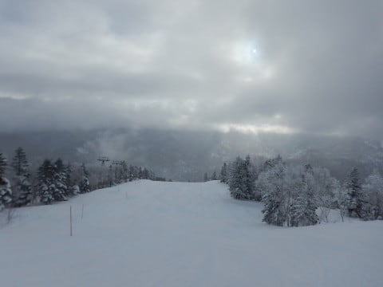

朝の気温は冷え冷えで，今日も朝イチは

最高級の締まったシマシマバーンが

お出迎え！

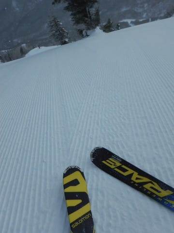

いやーー．

この3連休．

3日とも，朝イチは最高のシマシマバーンに

恵まれて．

良かったなぁ…

天気は時折日が射したり…

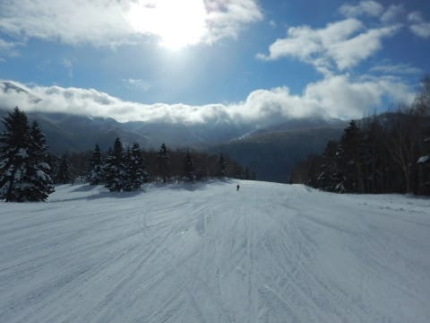

山頂付近は時折ガスに覆われる

こともあったり，小雪が舞ったりと．

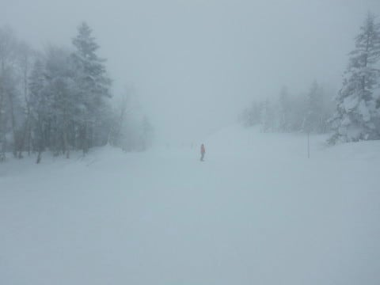

結構目まぐるしく変わる

天気だったけど．

まぁ，全体的にそんなに真っ暗には

ならない，うっすら日も射す

うす曇りの一日だったかな～．

で．

今日は3連休というのに．

激烈に人が少なく．

朝10時の焼額第1ゴンドラが

ほぼ飛び乗りなんですが！？？

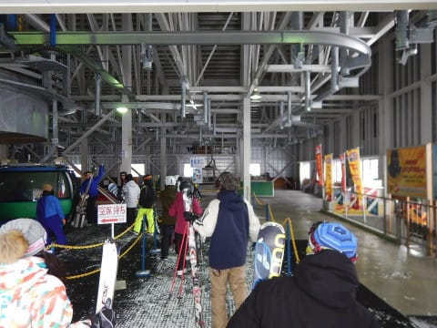

そして．

珍しく焼額の呪いから逃れて．

遠征した奥志賀もガラガラで…

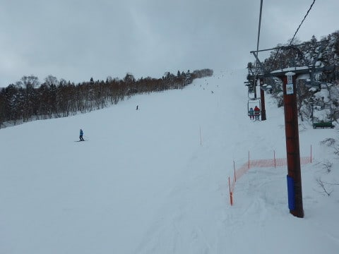

リフトもゴンドラも，ほぼ待ちなし！

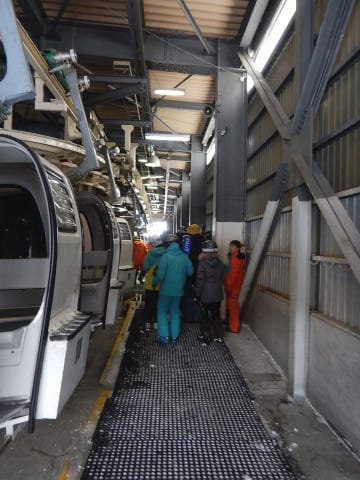

昼ごろになると，一の瀬正面バーンも

滑ってる人は少ないし…

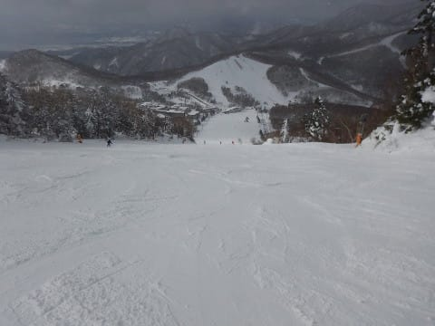

寺子屋も人がいないし．

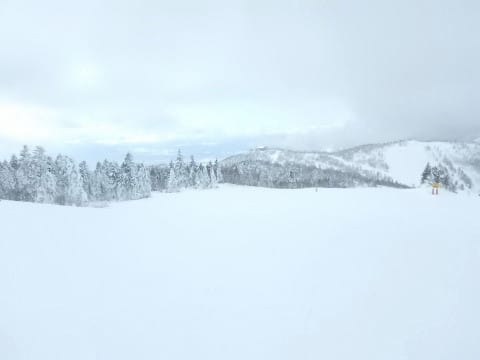

ブナ平も貸し切りだし．

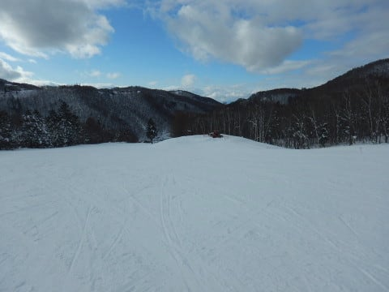

西館も…

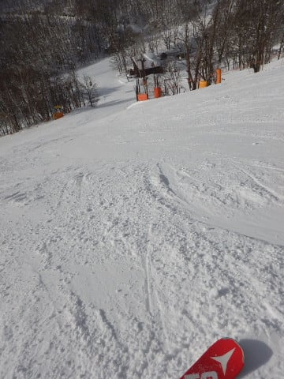

どこで写真を撮っても，

他のスキーヤーが写らないほどの

ガラガラなんですが…！？？

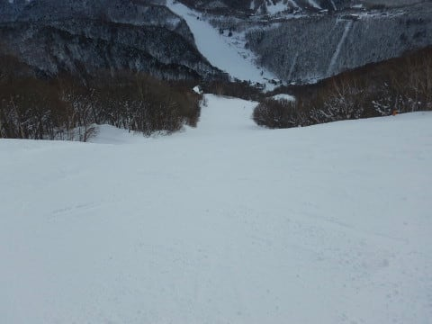

雪質は全体的に，しっかり締まり気味ながらも，

トップシーズンの最高雪質だし．

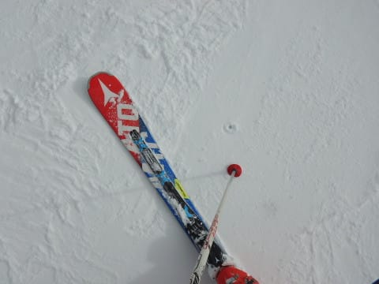

なぜこれで，こんな好き放題

飛ばし放題貸し切りバーンなの？？

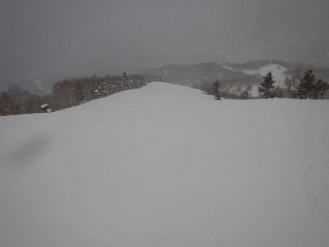

…ってな感じで．

すいている方が好きに滑れていいのですが．

もう，

「志賀高原，経営大丈夫か～！？？」

と聞きたくなるレベルのガラガラさでした…

ってな感じで．

天気も穏やかで，雪は最高で．

結構恵まれた，この3連休でした…

また明日，詳細レポートやります～！

## 💬 コメント一覧

### 💬 コメント by (はなげ親分)
**タイトル**: やっぱり❗️
**投稿日**: 2019-01-15 15:07:14

S様のが帰宅後にスキーの手入れをされているのは以前の記事で知っていましたが、うっすらと洗車もしているのでは・・・と想像していましたが、されていたんですねぇ～

わたしにはとても真似出来ません❗️

さすが金のお札の会長ですね(笑)

参りました～

### 💬 コメント by (なるなる)
**タイトル**: Unknown
**投稿日**: 2019-01-15 19:56:40

遠征されるかもとのコメントをいただいたので、中央エリアで少し気にして見ていたのですが、お見かけ出来ずでした。

しかし、この3連休は好き勝手に飛ばしたい放題で良かったです。

### 💬 コメント by (しんちゃん)
**タイトル**: お世話になりました
**投稿日**: 2019-01-15 23:12:05

最終日は予定通りお昼過ぎにあがらせていただきました。連休中は大変お世話になりました。お友達の方々にもよろしくお伝えください。とても楽し宿泊でした。機会が合えばまた一緒に朝一暴走してみたいです。

例のＳ様ファンと思われるハートのお札は発見できたのでしょうか？どこかで教えて欲しいです。(笑)

お体の具合はいかがでしょうか。全快されることをお祈り申し上げます。

### 💬 コメント by (Skier_S)
**タイトル**: 3連休，良かったです
**投稿日**: 2019-01-16 06:47:18

＞はなげ親分さま

洗車と言っても，ガソリンスタンドで洗車機くぐらせる

だけですが…

でも，そのあとの拭き上げとかに時間はかかりますけど（涙）

やっぱり，凍結防止剤がべっとりつくので，洗いたいですよね…

＞なるなるさま

あら．

中央エリアにいらっしゃったのですね．

どこかですれ違っているかもしれませんが…

ウェアが変わったので気づかないかも？？

とりあえず，恵まれた3連休でしたね～！！

＞しんちゃんさま

3連休，お疲れ様でした．

例のお札は発見できました．

お返事もしておきました(笑)．

風邪は…まだ完治してないけど，

ちょっと良くなってきた感じです．

