# 2013年9月　子連れタイ・タオ島ダイビング旅行記　その12…2日目，スタート

📅 投稿日時: 2013-10-22 00:22:42

🏷️ カテゴリ: [ダイビング日記](ce3a7a8d424d112fce83ee85c81a0e344.md)

…

「徒然スキーヤー日記」

という名のBlogに求められているのは，

当然，スキーのレポートらしく．

Yetiレポート投稿後，一気にアクセス数が上がった今日この頃．

皆様いかがお過ごしでしょうか．

でも．

スキーレポートが始まったというのに，

ダイビング日記，まだ続くんですね～．

冬モード→夏モードは，比較的すっきり切り替わりますが．

夏モード→冬モードは，どうもすっきり切り替わりませんね～…

ってことで．

スキー日記の後だけど．

タイの子連れダイビング旅行記へ，Go!

--

そして，タイ2日目の朝．

昨日は午後から天気は回復してきたので．

今朝は朝から，いい天気のはずっ！

…と，起きたところ．

…強風だよ．今朝も…(涙)

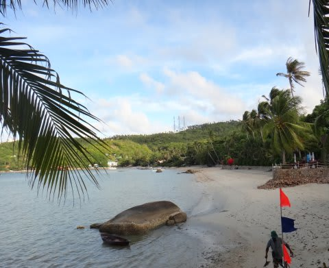

ヤシの葉っぱが，風でバサバサはためいてます…(泣）．

朝食後，ダイビングの桟橋へ．

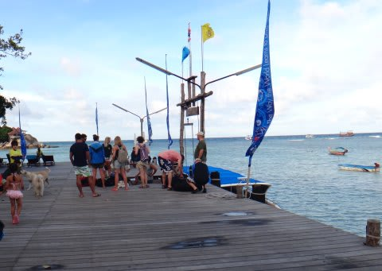

昨日は揺れ＆退屈さのために，午後から「船に乗りたくない～」と言った娘．

今日は「朝から船に乗らない」って言い出すんじゃないか…

って心配をしたけど．

とりあえず，朝は船に乗ってくれるようで，一安心．

いつも通り，桟橋から水上タクシーで本船へ向かうわけですが．

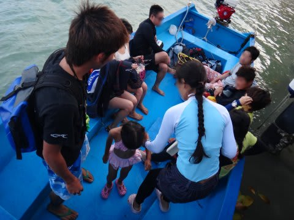

…なんだか．

…

今日も海は荒れ荒れなんですけど～っ！？？

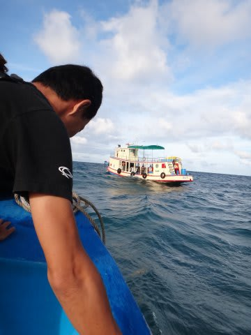

…海には，白波が立ってますけど～っ！？

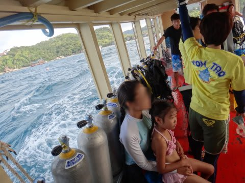

ざっぷんざっぷん揺れてるんですけど～っ！？

ガイド「すいません！今日も外洋には出られませ～ん！」

…やっぱり…(がっくし）

まさか2日連続で，外洋に出られないとは…(泣）．

…また，内海か～っ！！！

とりあえず．

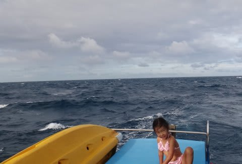

こんな鉛色の空の下の，荒れた海を船は進んで行き…

港からそれほど遠くなく，

波が入り込まないような，湾内のポイントで

ダイビングになるわけですが．

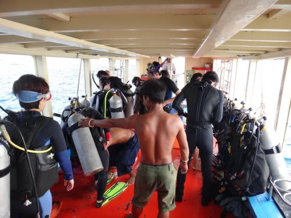

今日の1本目は，昨日1本も潜っていない妻が行くことに．

ってことで．

「いってらっしゃーい！」

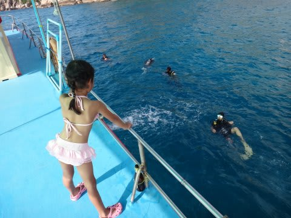

娘が見送る中，妻は潜りに行っちゃいました…

…1本目のダイビング中，娘はお昼寝したり…

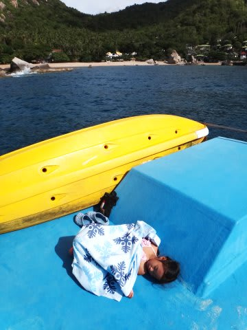

ダイバー用に準備してあるパイナップルとかクッキーとかを…

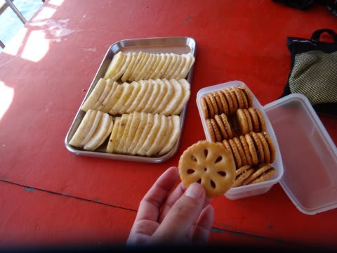

食べながら，のんびり景色を眺めたり…

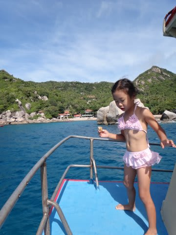

って感じで，ゆっくり過ごしていると．

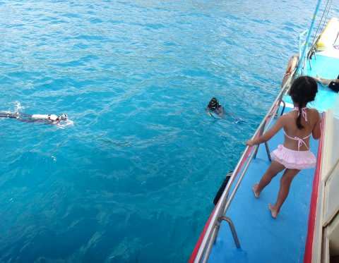

「浮かんできた～！」

ってことで．

1本目のダイビングが終了した妻に感想を聞くと．

妻「…内湾だから…まぁ…仕方ないかなぁ，って感じ…」

というビミョーなコメント．

そして，船は1本目のポイントを離れて2本目のポイントへ移動．

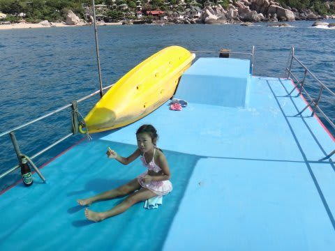

で．

今度は私が潜る番ですが…

…なんだか．

1本目からの船の移動距離，数100mってところかな…

まぁ，内湾のポイントということで．

次の1本も，あまり期待はできなさそうですね…(涙)．
