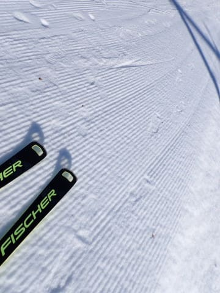

# いまさらながら，2023/11/18(土)のイエティの追加レポート…コース幅は十分広がったし，冷えてコンディションいいよ！あとはリフトさえ動けば…（涙）

📅 投稿日時: 2023-11-21 02:22:47

えー．

土曜の速報で書いたように，

イエティでも土曜夜から日曜にかけて，

アイスクラッシュでなく，人工降雪機が

動かせたようですが…

人工降雪はBゲレンデに打ったようで，

Aゲレンデ側は相変わらずアイスクラッシュの

雪のみのようですね…

そして．

志賀高原は予想通り，日曜から月曜に

かけて，10～20cmくらい積もったようで…

月曜深夜現在，道路もかなりの積雪です！

（[北信建設事務所道路気象情報カメラ](http://hokushin.pref-nagano-roadcamera.jp/)より)

…ただ．

何度も書いてるように，明日火曜以降は

気温が上がってしまい，21～23日は

志賀高原でも人工降雪機が動かせない

プラス気温になっちゃいます(涙)

が．

そのあとの24，25日は期待できる！！

降る！！

積もるはずなのだ…っ！！！

と，期待を高めたところで，今日の本題へ．

いまさらですが，土曜のイエティの詳細

レポートです…！

まず．

いつも通り，朝9時からの営業開始に間に合う

ようにゲートに行きますが…

なんだか，9時より前にゲートが開けられて，

中に入れるようになってますよ…？

でも．

中に入っても，

「リフトが強風のためしばらく営業見合わせ」

とのことで．

ゲレンデはクローズされたまま(涙)

…せっかく睡眠不足をおして

やってきたのに…(激泣)

いつリフト営業できるかわからない

ということで，朝9時を過ぎても

ゲレンデ前で待っている人は皆無．

…果たして，いつリフトが動き出すのか…

10分後か10時間後か…全くわかりません（涙）

寝不足だったので，無料休憩所で

寝ながら待ちましたが．

昼を過ぎても全く動く気配なし（涙）

帰ろうかと思ったけど，今帰ると睡眠不足で

朝早くやってきたのが無駄になる…

と，待つことしばし．

1時過ぎに，リフト試運転が始まり…

そろそろ営業開始っぽい雰囲気に

なってきたので．

わずかにゲレンデ前に人が待ち始めて

来ましたよ…！

そろそろオープンか…

と待っていたところ．

午後1時半になると，ゲレンデに圧雪車が

入り始めました…

…これ，コース整備が終わるまで，

まだまだ滑れないってことですね…（泣）

ただ，この時間にコース整備が入るって

ことは，

午後4時からのコース整備中断なく

営業し続けるということなので．

午後2時スタートでも，7時まで

休みなく滑れれば，滑走時間5時間．

朝9時から16時の整備前までと

同じ時間滑れるってことだな！！

だとすると…何とか2時ごろには

オープンしてほしいところ…

ただ，コース整備が終わった午後2時に

なっても，まだ風が強いらしく…

なかなか営業開始せず（泣）

オープン直後のクリアな1本を逃したく

ないので，午後1時過ぎから

ひたすらゲレンデ前で待ち続ける，

我慢づよい人たちが数人…（自分含む）

そんな中，待ちに待つこと5時間半．

14時半に，ようやっとゲレンデオープン！！

やったー！！

整備したてのシマシマ，ようやっといただきます！

コースは幅も結構広がり，気温が冷えてるので

日差しの中でもしっかり締まった，かなり

いいコンディションのバーン！！

これは待ったかいがあった…！！

そして，オープン直後はガラガラ！！

いい感じのクリアラップ！！

今日はもうみんな待ちくたびれて帰ってる

はずだから，そんなに混まないはず…！！

ふはははは．

我慢して待っていた人が，今日はガラガラ

バーンを楽しめるのだ！！！

…と思っていたら．

営業開始から30分，15時には…

なんだか人口密度がいつもと変わらない

くらいなってきましたよ…？？？

あれ…？

今日は朝に来た人はみんな待ちくたびれて

帰ってるし，昼頃に来ようと思った人も

リフト休止の案内を見て来ないと

思ってたのに…

なんでこんなに人がいるの？？？（涙）

ってなことで．

気持ちよかったクリアラップも，

せいぜい2-3本．

あとは，

「今日はガラガラだろうから，待ってでも

　滑ろう…！」

と思っていたのがむなしく感じるくらい，

普通のイエティの混雑になってしまいました…（泣）

そして．

今日もクワッド1本のみの運転で，

ペアリフトが動かず．

強風でクワッドも減速運転というのもあり，

リフト待ちはかなり長く…

15時半には，10分待ちに（泣）

でも，コース幅が広がってるし．

リフトが1本のみ，それも減速運転なので，

コース上の混雑はいつもよりちょっとだけ

少ないのが救いか…

あと，コース上にアイテムが一つ，

パイプだけ置かれてました…

ってなことで．

リフト休止だったのでガラガラになるはず…

という，甘い見積もりが見事に外れ．

ひたすら減速運転の遅いリフトの

10分待ちに耐える感じになってしまい…

昼間の営業から，コース整備無しで

突入したナイタータイムも．

コース上の人は全く減ることはなく．

それどころか，増えていく一方で…

17時ごろにはリフト待ち10分越え（泣）

コース上の人口密度も高く．

あまり楽しめない感じになってきたし…

2日間で5時間ほどしか寝てない睡眠不足

もあり．

（リフト開始まで，イエティの休憩所で3時間ほど

　寝たのを含めても2日で睡眠8時間（涙））

せっかく5時間半待ったというのに．

滑走4時間弱の18時過ぎに，退散したのでした…

で．

午後6時半ごろというのに．

リフト券売り場に結構な人が待って

いたのが，イエティらしい…

という感じで．

かなり残念な感じのイエティでしたが．

23日も，イエティと軽井沢，

そしてぎりぎり横手山．

あとはアイスクラッシュで18日に

オープンしたホワイトピアが滑れる

程度だろうなぁ…

うーん．

早くもっといろんなスキー場が

オープンしてほしいところ．

24 日からの雪に期待…！
