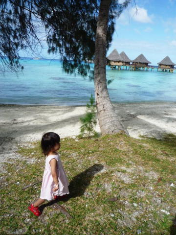

# 2009年　初の海外子連れダイビング旅行記　23　Beautiful island

📅 投稿日時: 2012-09-22 00:20:42

🏷️ カテゴリ: [ダイビング日記](ce3a7a8d424d112fce83ee85c81a0e344.md)

って感じで．

母親においていかれた瞬間は泣いていた娘ですが．

落ち着いたところでプールに漬けてやると，

今度は喜んで泳ぎ始めました．

…ほっ．これで手がかからず，しばらく放置しておいても大丈夫だ…

プールに浮かべられた娘は，まるでスキー場での誰かさんのように，

ひたすら休む間もなく行ったり来たりを延々繰り返しています．

…よくまぁ，飽きないもんだなぁ…

と思いましたが，

「お前がそんなこと言えるかぁっ！！！」

というツッコミどころですかね．

…って感じで1時間．

延々プールを往復している娘を見ていると．

ダイビングに行った妻が戻って来ました．

…妻．

なんと．

このダイビングでもまたイルカを見たようです．

そんなに近くないけど，ぐるぐる回ってくれたそうな…

ううううううーむ！

お，恐るべしランギロアっ！

うちの妻，3本潜って2本イルカを見ています．

一緒に潜った人は，4本潜って3本イルカと遭遇したらしい…

…しかし．私は3本潜ってイルカを見たのは1本のみ．

…

…日ごろの行いはいいはずなんだけど…

なぜ，私だけイルカ遭遇率が低いのかっ？？

…次こそっ！

と，悔しい思いを洗い流すべく，部屋でざーっとシャワーを浴びて

一息ついた後は，お昼ごはん．

ああ．ダイビングショップと部屋が近くで，ダイビング後に

部屋でくつろげる幸せ…

お昼ごはんは，ホテルのバーで軽く済ませます．

バーはプールの隣のオープンデッキ．

ここから海を眺めながらの食事は，この世のさまざまなことを

全て忘れさせてくれます…（まだあの世には行きたくないけど）

食後は，軽くホテルの敷地内を散歩して…

椰子の木の木陰で波の音を聞きながらハンモックで昼寝．

ああ…すばらしい…とてもこの世とは思えない…

（まだあの世には行ったことないけど）

さて．午後のダイビングは3時半から．

1時間ほど昼寝しても，まだ時間が1時間ほどあります．

…これは，あれだ．

かねてから計画していた，「アレ」を実行しよう…

と，いそいそと道具を準備して，海に向かったのでした．
