# コドモとコモド！子連れダイブクルーズ11　クルーズ2日目の朝

📅 投稿日時: 2011-07-14 01:26:18

あけてクルーズ船２日目．

この日の朝は朝食前からダイビング1本目です．

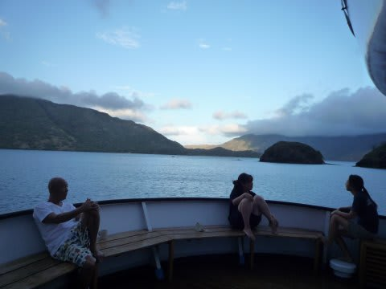

まだ，朝日が昇りきっていないうちにダイビングの準備を

はじめます．

寝起きの悪い娘は，朝起きたときにママがいないと

泣いて仕方がないので，

しかたなく，朝の1本目は私が潜りに行きます．

ホントは昨日，私が2本潜っているので，今日の1本目は妻が

潜りに行く番なんだけどな～

仕方ない．あー仕方ない（喜）．

で，娘が寝ている横をこそっと出かけてダイビング準備．

一本目のポイントはカーニバルロックという名前のポイントです．

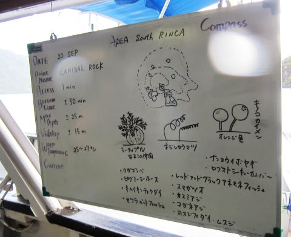

リンチャ島の南側エリア．

船は，昨日の夜のうちに，クルーズエリアの最も最南端に

近いところまで移動してきています．

南側エリア…それは，

透明度が悪いが，栄養分いっぱいの水が南側から

流れ込み，大量のプランクトンが発生，魚の密度が

高いエリア．

さらに，ソフトコーラルいっぱい．

ただ，水が冷たく普段は水温が25度前後…

ボートに乗ってポイントへ向かい…エントリー．

水があったかい！

水温27度くらい？

南エリアではありえない水温だなぁ．

でも，透明度はやっぱり悪い…

12m～15mってところか．

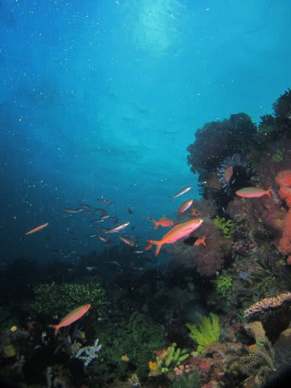

しかし，キノコカイメンや…

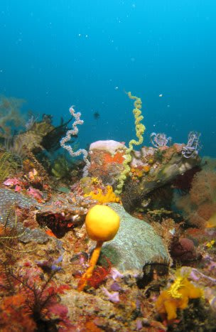

シーアップルなど，

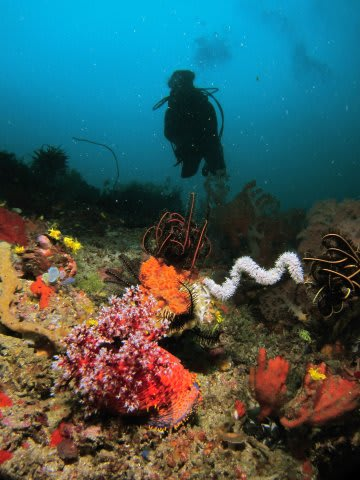

珍しいソフトコーラルがいっぱいいて，カラフルで面白い海です．

さらに．

最近，コモドはポイント開発進んでますね～

このポイントでもピグミーが見られるようになってました．

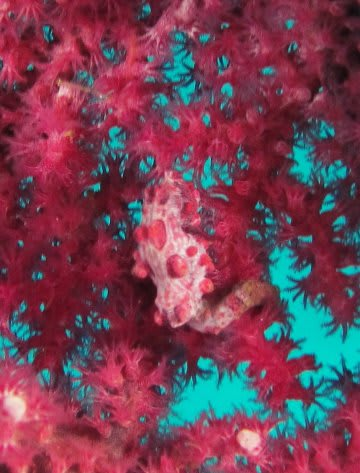

ちょっとむこう向いてて，こっち向いてくれなかったけど．

あとは，いろいろカラフルなソフトコーラルを見てすごします．

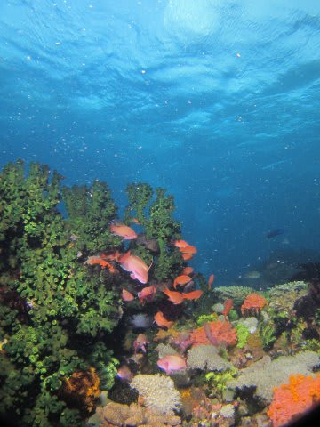

うーーん．でも，いつもより魚影が薄めだなぁ…

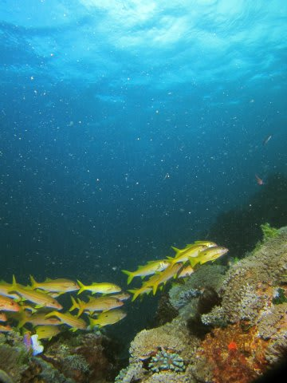

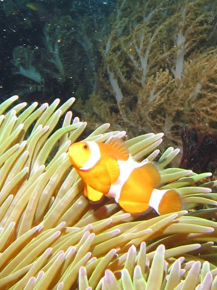

まぁ，でもやっぱりきれいな海だよな～

のんびり系ダイビング．

エグジットすると朝食タイム．

おなか減った～！

今日の朝ごはんは…トマトにベーコン…

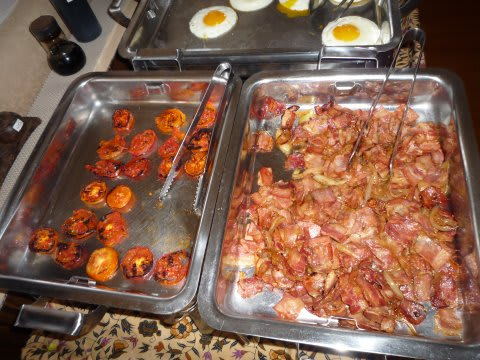

フォト

んで，卵と…

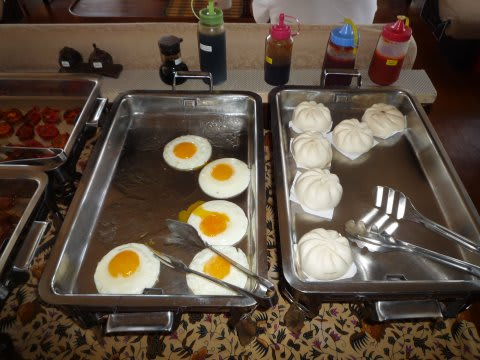

にくまんかとおもったこれは…アンまん？？

朝ごはんにあんまんとは…

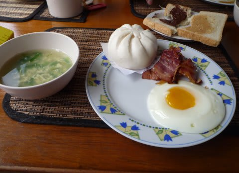

娘が喜んで食べてますね…

しかし，ダイビング後の朝ごはんのおいしいこと！

まだまだ2日目は始まったばかりです．

（続く)
