# 2018年8月，モアルボアルで小5の娘をダイバー化！その2…

📅 投稿日時: 2019-07-05 02:49:19

というわけで．

実に，8か月ぶりのダイビング

日記なので．

…私もどこまで書いたか，すっかり

忘れてました（笑）．

とりあえず．

過去の旅行記をひっくり返してみると…

ふむ．

昨年の8月に行ったモアルボアルの

旅行記が書きかけのまま，冬モードに

突入してしまったのか…

…って．

それも，第1回を書いただけで

中断してるじゃないか！！！

…このモアルボアルに行ってから，

もう1年近く経ってるのに，

まだ第1回しか書いてないのか…（愕然）．

このモアルボアル旅行の次に行った

座間味旅行記も書かねばならないし．

さらに今年も8月になれば，また

ダイビング遠征に行くわけなので．

…今年の夏モード中に．

去年の旅行記が書ききれるのか！？？？

という危機感…

とりあえず．

淡々と書いていくしかないよな…

ということで，

…もう1年前で忘れかけてますが．

昨年のモアルボアル旅行記，

[プロローグ](ee1fcfea3a126c58c966c4cd7355477e8.md)，[第1回](ec959ccef6e54ecfd0505637ee8a810f2.md)の続き．

セブ空港に到着したところからです！

----

ってな感じで．

成田から約5時間のフライトで，

やってきましたセブ空港！

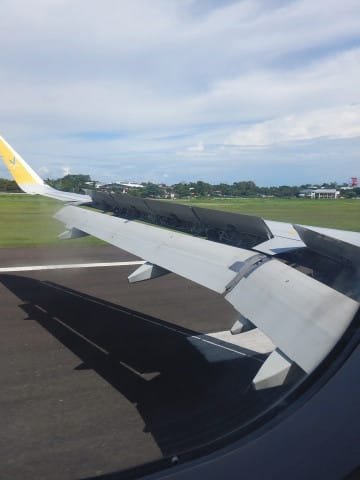

…マニラ乗り換えが無い，

直行便は楽だなぁ…

ってなことで．

セブ空港で飛行機を降りたのですが…

あれ？？？

セブ空港って…ボーディングブリッジ

あったっけ？

…ってか…

セブ空港，こんなにきれいだったっけ？

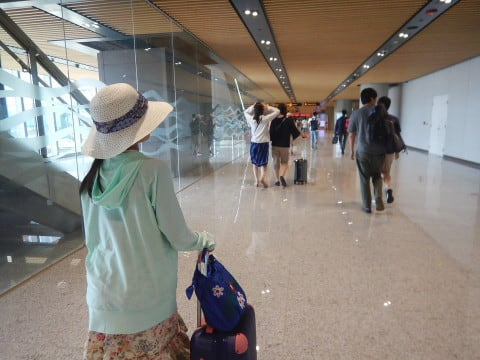

なんだか，めっちゃきれいになってない？？

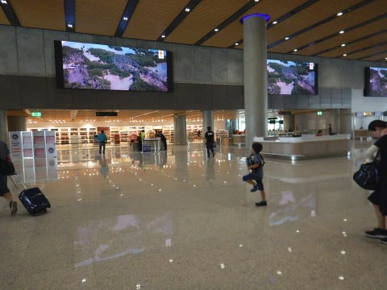

…どうやら．

昨年から，セブ空港の改築が進んでいるようで．

一部工事中のところも残ってましたが，

一昨年に来たときとは比較にならない，

出来たてピカピカの建物になっちゃってました…

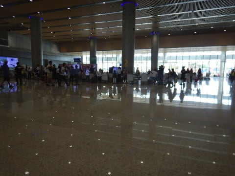

ということで．

フィリピン入国の入国審査で止められて

[いつも通りの別室に連れて行かれての
特別インタビュー](e3f297dded27f560b2aa0917a23a321a0.md)という，罰ゲームを

受けてから…

他の人がとっくの昔に荷物ピックアップが

終わったあと．

チェックインバゲージコンベアの上に．

寂しく最後にぽつんと回っている荷物を

回収し，ホテルの送迎車に乗り込みます…

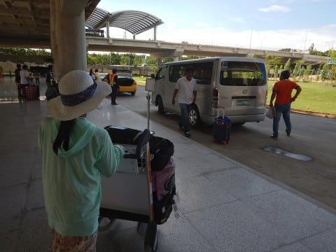

うーん．

フィリピンは嫌いじゃないんだけど．

毎回入国審査で引っかかるのは

悲しすぎる…（涙）

そして．

マクタン島の空港を出発しますが．

うーん．

マクタンの中心部は，かなり交通量が

多くて渋滞してますね…

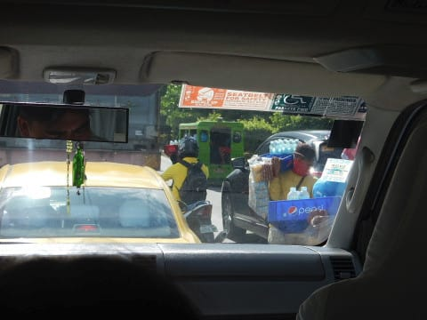

その渋滞の中．

水やらいろんなものを売る人が

通り過ぎていくのが，日本にはない

風景ですね…

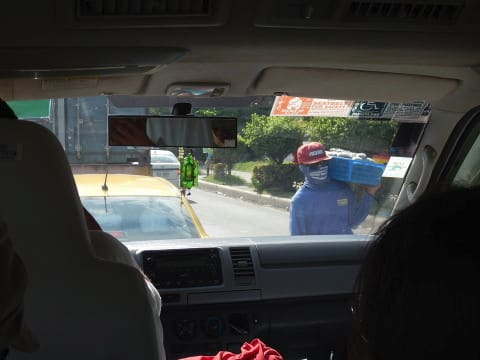

と，しばらく走っていた道沿いの

ガソリンスタンドを見ると…

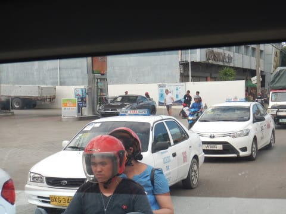

ん？？

え？？

なに？？あれ？

R35 GT-R！？？？

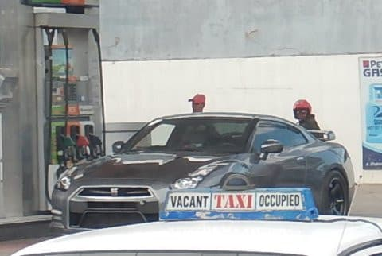

なぜ．

こんな日本でもめったに見ない車が，

フィリピン，それもセブ島なんかに

いるんだ！？？

フィリピンの生活水準，ここ10年で

すごい上がった気がするけど…

まさかGT-Rがセブ島で走ってると

思わなかったよ…

…しかし．

街中以外は狭くて荒れた道のセブ島．

GT-Rの実力を発揮できる道があるのかな～…

ってなことに驚いたりしながら．

1時間ほど走ると，郊外に入り，交通量が

減ってきます…

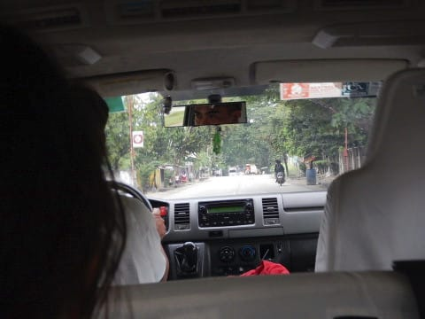

…そして．

気づいたら車の中で熟睡してて．

車で揺られること，3時間半…

日も暮れた夜7時過ぎに，

ようやくホテルに到着！

今回の宿も，前の2回と同じ，

カバナビーチリゾートです！

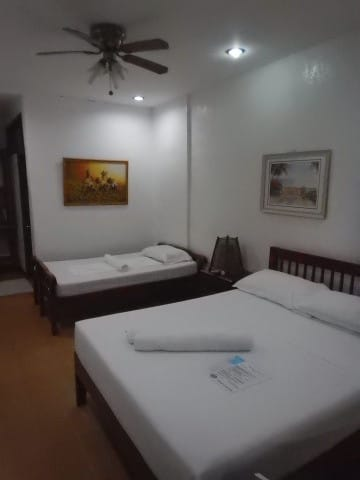

今回，娘がジュニアオープンウォーターの

実習を受けるわけですが．

そのプール講習をこのホテルのプールで

やるし．

以前泊まって，ホテルの中のレストランも

そこそこおいしいし．

設備も割ときれいだし．

Wifiも十分高速で，サクサクつながるし．

場所も便利だし．

結構気に入ったので．

このホテルをリピートしました…

ホテルに着いた時間も遅めだし．

これから荷物をばらしたり，

翌日からのダイビングの準備を

したりしなくてはならないので．

夕食は，ホテルそばのお店で売っている

軽食で済ませて…

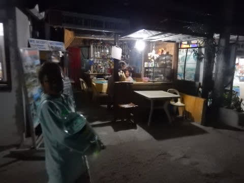

ダイビング器材やらカメラの準備をしたら，

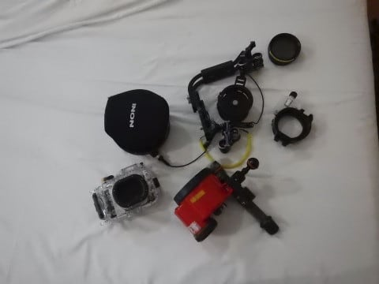

もう夜10時…

今日は朝早くに家を出てきたので．

娘はもう爆睡中．

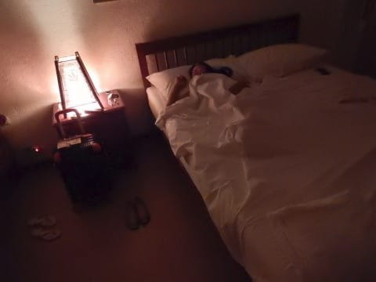

私も明日からのダイビングに備え，

眠りについたのでした…
