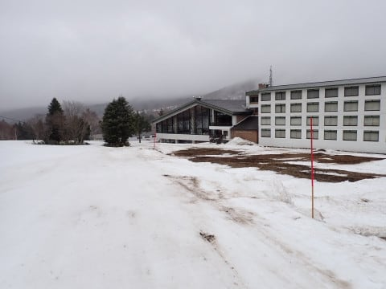

# 2023/4/8(土)の志賀高原スキー場は…予想外して朝は気温高めのユルユル雪．昼は雪が降って気温が冷えて夕方はカリカリに…

📅 投稿日時: 2023-04-09 00:23:25

ってなことで．今日も志賀高原に来ていますが…

天気予想，外しました

ええ，外しましたよ（開き直り）

午前中は気温が高く，路面も凍ってなければ

ゲレンデも朝は緩めの雪で，カリカリバーンでは

無かったですよ．ええ(涙）

うーん．

もう少し早くに気温が冷え始めると思ったんだけどな～…

でも．

曇り時々雪という天気は当たっていたし．

だんだん冷えていくというのは当たったし．

昼過ぎにはバーンが冷えて固まってきたし…

完全外れじゃなかった！！

…と，言いたいんだけど．

結果的には，

あんまりいいコンディションじゃなかった

ということですね(涙）

とりあえず，今日も早朝6時から営業していた

焼額ですが．

朝6時に志賀につくように家を深夜1時過ぎに出ると，

私が睡眠不足で死ぬので，

通常営業開始の8時から参戦！！

8時の1番ゴンドラに乗って山頂に行くと…

…山頂でも気温は0度を超えてますね…（涙）

雨の後に冷えたカリカリバーンではなく，

雨で融けて，汚れが浮いた湿った重い雪ですね…

（板は私の板ではなく，エキップさんから

　悪魔の誘いを受けている貸してもらっている板です）

そして，天気は曇り…

というか，ガスですね（涙）

でも，雪はしっかり重みがある雪で，

エッジが噛むし，ボロボロ崩れていくような

足場が緩み切った雪ではなく…

意外と滑りいいよ！！

ところどころガスで視界が悪いのは怖いけど…

ガリガリの電動マッサージバーンよりましで，

これ，結構楽しいよ！！

…ただ…

昨日の雨で，かなり雪がやられちゃった感じが（泣）

第2ゴンドラ側から第1ゴンドラ側への連絡コースも，

コース幅が狭くなってきてるし…

1ゴン乗り場付近，プリンス東館前も雪だし

されて，早くも最終形態だし…

GSコースも，いつも一番最初に雪がなくなる

急斜面部分．

早くもコース幅半分に規制されていて．

この写真の左側はブッシュだらけです…(泣)

やばい…

もう，例年のGW並みに雪が減ってるかも…

ただ．

このコンディションというのもあり，

ゲレンデもゴンドラもガラガラ！！！

朝のうちの雪があれるまでは，2ゴン側の

パノラマコース，意外と楽しめました～！

で．

今日は午前10時くらいに一ノ瀬方面へ

移動しましたが…

先週で山の神リフトが営業終了しているので，

車でワープ！！

朝10時の時点では，一ノ瀬の山頂にガスがかかっていて…

全く山頂が見えませんね(泣)

当然，ゲレンデも視界最悪．

数m先も見えないガスで怖かったけど…

すぐにガスが晴れて，すっきり見えるように

なりました！！

…ただ．見えるようにはなったものの…

午前10時時点で，一ノ瀬正面バーンはすでに

荒れていて，コブになりかけている感じの

ボコボコバーン(泣)

ボコボコバーンが1本ごとにさらに

ボコボコが深くなっていくのを，

悲しみつつ滑っていると…

12時ごろには，予想通り雪がぱらついて

来ました！！

ってか，ぱらつくというよりもっと激しく

降っている感じが！？？

30分くらい，結構な勢いで降ったので…

ゲレンデの上にも数㎝積盛りました！！

…ただ．

ボコボコの上に重い雪が乗って，

さらに滑りにくくなっただけですが（涙）

さらに，本日はコースの真ん中が大会準備で

閉鎖されていたので，メインバーン下部は

両脇しか滑れないという状況だったというのも

あり．

うーん．

あんまり楽しくない…（涙）

まぁ，そのおかげでリフトはガラガラだったので，

良かったんですけど…

さらに午後に向かって，予想通り気温がぐんぐん

落ちていき．

午後2時ごろの一ノ瀬正面バーンは，かなりの

コブコブになったままバーンの下地が

固まってきましたよ…！？？

そして，重いザラメがカリカリコブコブの

上に乗って，ところどころさっき積もった

新雪でブレーキがかかるという，

地獄のようなコンディションになって

来ました…（涙）

ダメだ…

全然楽しくない…

何の嫌がらせだ…（激泣）

一ノ瀬ダイヤモンドにも行ってみましたが．

かなり雪が減っていて…

ダメだ．

コースの真ん中にも，穴が開き始めてる…

ダメだ…

だもんで．

いったん車で焼額に戻ってみますが…

午後2時半で，焼額山頂の温度計は‐3℃と

朝より冷え込んでいて．

そして，山頂付近は新雪でいい感じじゃ

ないですか！！

これは意外といい感じっぽいじゃないですか！！

…と，思ったけど．

急斜面に入ってくると…

下地が凸凹になったまま固まって，

コロコロが散らばった上に新雪が乗った

かなりエキサイティングなコンディション（涙）

これは…修行ですか？？

そして．

GSコースの真ん中にも土が出始めているし…（泣）

もう，なんだかダメな感じ…（激涙）

という感じで．

なぜ，こんな過酷な状況で滑っているのだろう？？

と，根源的な問いを自らに発しながらも，

今日も焼額の営業終了の15:30まで，

しっかり滑り倒してきたのでした…

…

…ダメだ．

楽しくなかった…

今日は楽しくなかったよ…

…

…

でも

15:30で焼額の営業は終わったけど．

16:20まで一ノ瀬のリフトは動いてるよね？？

と．

何を考えているのか，再び一ノ瀬へ舞い戻る

Skier_S．←ホントに何を考えているかわからん…

一ノ瀬を後にしたタイミングよりも，

もっとバーン状況は悪化しており．

下地はほんとにカリカリになってるし…（泣）

正面バーンも，もう穴が開きかけてるし…（涙）

ザクザクでボコボコで，下地はガリガリな

最悪のバーン状態だったにもかかわらず．

結局，誰もいなくなる最終リフトストップまで

滑り続けた，Skier_Sだったのでした…

…しかし．

かなりツラい一日だった…

雪はめちゃくちゃ減ったし，

朝はガスで見えないし，

バーンはすぐに荒れるし，

板に引っかかって滑りが悪い雪は積もるし，

荒れたバーンが冷えてそのままガチガチに

固まっていくし…

なぜ…

なぜ，週末の楽しみのスキーなのに，

こんな修行バーンで滑らなくてはならない

のか…（涙）←それでも最後まで滑ったよね…

明日こそ，最高の冷え冷えバーンになりますように！！

神様，…明日の朝までに，最高冷え冷えパウダー

50㎝くらい，プリーズ！！

## 💬 コメント一覧

### 💬 コメント by (モイストシルバー)
**タイトル**: Unknown
**投稿日**: 2023-04-09 21:49:31

久しぶりに日曜参戦しましたが、思わぬ新雪と氷点下の冷え込みで、4月とは思えないグッドコンディションでしたね。今日で今シーズン最後と思いつつ、下旬の冷え込みに期待します

### 💬 コメント by (Skier_S)
**タイトル**: ＞モイストシルバーさま
**投稿日**: 2023-04-10 00:54:30

いやーーー．

良かった．

今日は良かったです…！！

来週も再来週も，こんな天気だったら嬉しいんですけどね…

でも，次の週末はダメっぽいです．

下旬冷え込んでもどうしようもないくらい，この1週間でゲレンデがやられそう…（涙）

