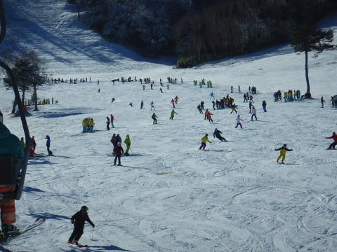

# 11月25日(日)，オープン3日後，3連休最終日の熊の湯スキー場の速報モード…晴天！結構混んだよ

📅 投稿日時: 2018-11-26 02:42:59

🏷️ カテゴリ: [2019スキー滑走日記](c3e4496fc0fb7f9c17ff21214a35b1ace.md)

ということで．

予告通り，本日．

3連休初日にオープンした熊の湯に，

日帰りで行ってきました…

朝4時に出発して．

いろいろ巡って帰宅したら，深夜2時近く（涙）

もう3時近い…

今日は23時間ほど，寝ずに活動してます（泣）．

いや．

帰り道の途中に．

ホームセンターによって，引っ越しで必要に

なった小物をいろいろ買い込んだりしてたのが

敗因ですね←スキー場帰りじゃないと，買い物の暇がない

だもんで．

今日は日曜夜定番，速報モードにて…

えー．

本日の熊の湯は．

終日すっきり晴天の，絶好のスキー日和でした～！

滑れたのは，第2ペアリフトの下半分，

緩斜面だけです…

雪質は，ここ数日冷え込んでいたので．

予想よりいい感じ！

…少なくとも，Yetiよりはいいです(笑)．

で．

ゲレンデは幅広そうに見えるけど…

でも．

人工降雪エリアを外れると，雪に隠れたブッシュが

出ている状態で．

実際に滑れる幅は，30mくらいかな？

とはいえ，Yetiなんかよりはずっと広いコース幅

で，大回りができるよ！

ただ，午前中はSAJの研修会があったので，

リフト待ちも結構長く…（泣）

ゲレンデの人口密度も高かったので…

結構ゲレンデは荒れ気味でした（ちょい涙）

でも．

午後になるとリフト待ちは短くなったし．

天気がいい中，これだけ滑れれば上出来かな！

…ってなことで．

明日詳細レポートやります…

おやすみなさい…

## 💬 コメント一覧

### 💬 コメント by (はっち)
**タイトル**: やはり志賀ですよね
**投稿日**: 2018-11-26 21:52:40

流石に志賀、人工雪でも質が違いますね。

（片方は、雪でなくてかき氷ですが。。。）

ウェアーが変わってないとするとそれらしき方がライブカメラに映ってような？

近々、スキー場でお会いしましょう！

### 💬 コメント by (Skier_S)
**タイトル**: はっちさま
**投稿日**: 2018-11-27 02:14:07

いや～．

予想より雪は良かったですよ！

…ただ，人が多かったので結構荒れましたが…

ライブカメラ，しっかり見てらしたのですね．

ウェアはいつものを着ていたので，おそらく映っていたかと思います…

志賀高原でまたお会いしましょう！

