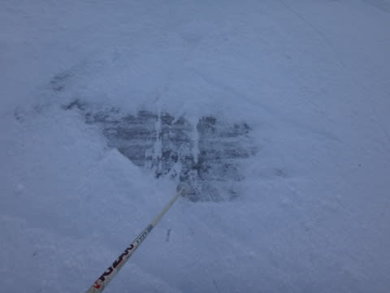

# 3月8日は志賀高原とお思いでしょうが…曇り時々晴れ時々雪のアイスバーンの白馬五竜

📅 投稿日時: 2014-03-08 22:04:44

🏷️ カテゴリ: [2014スキー滑走日記](c992167609b6415052179ee69ea1ea7d8.md)

えー．

皆さんが．

Skier_Sは今週も志賀高原に行っているはず…

と，思ってるかもしれませんが．

私もたまに違うスキー場に行ってしまうこともあり．

…本日は，五竜とおみ…って，今は言わないのか．白馬五竜に

行ってきました．

朝イチは，気温も低く．

冷えひえで．

積雪もそこそこあったらしく．

朝はやわらかい圧雪のシマシマバーンだっ！

冷えひえのいい雪っ！

エッジが潜るような，超やわらかい，トップシーズンの雪ですっ！

朝のうちは，快適快感トップスピードバーンだぁっ！

うほほほ～！！

ところどころ，圧雪してないところには，10cmほどの

新雪があり…

いい感じ！

天気は，薄曇ってところかな…

時々日が射したり，雪がちらついたりもしたけど．

基本的に，一日こんな感じの天気で．

雪も緩まずいい感じ！

いやー．今日の五竜は，いいかも…

…と，思っていたところ．

風が強くて朝のうちゴンドラ動かず．

午前10時ごろ，運転開始してましたが…

なんてことだっ！

アルプス平，クローズ(涙)

ゴンドラは，ゴンドラ山頂駅からの下山のみか…っ！（涙)

…その結果．

下半分の遠見ゲレンデは，すごいことに…

むちゃくちゃ混んでるよ…（泣）

いいもりゲレンデは人が少なし，雪も悪くなさそうだから，

いいもりゲレンデに行こう…

と，思ったところ．

うむ？

うむむ？

うはー（涙）

…そして．

がちがちのアイスバーンがところどころにいるかと思えば…

氷のごろごろが追い討ちをかけます（涙）

やはり，いいもりゲレンデは標高が低いので，先週の

高気温で雪がとけ，さらに斜面も急なので，遠見ゲレンデと違って

柔らかい雪が全部はがされてしまい…

か，硬いです…

でもまぁ．

時折日も射し

まぁ，ぼちぼち楽しめたかな．

そして．

五竜で4時過ぎまで滑ったあとは．

ナイターです．

…志賀高原は一の瀬ダイヤモンドのナイターです(爆）．

今日は志賀高原泊まりで，明日はいつもどおりの焼額です．

いやー．

志賀は，冷えひえの柔らかい雪で，最高でしたっ！！

やーっぱり私は志賀高原がいいや．

…しかし．

志賀高原に舞い戻ってくるなら．

なぜ，今日は五竜に行ったのか？

…

…そう．

カンのいい人は，もうわかってると思いますが．

はい．

そういうことです．

…後日のレポート，お楽しみにっ！

## 💬 コメント一覧

### 💬 コメント by (マルハバ)
**タイトル**: いいもりゲレンデ・・・
**投稿日**: 2014-03-09 00:25:17

今を遡る○十数年前の学生時代に

合宿を張っていたゲレンデです。

先月の「関東大雪第1弾」の時に

ここでOB会をやってました。

そして来週の週末、

もう一つの合宿地だった志賀高原の

寺子屋でOB会第2戦があります。

2年ぶりの志賀高原です。

前回は初めて滑った焼額に感銘をうけましたが、

今回は「一枚バーン？」になった？？という

ジャイアントをぜひ滑ってみたいと思っています。

全面急斜のコブコブ時代しか知らないもので・・・（汗）

どこかでSさんに遭遇することも期待しております（笑）

### 💬 コメント by (ベベ)
**タイトル**: Unknown
**投稿日**: 2014-03-09 22:08:34

初めまして。

いつも天気予想を参考にさせていただいてますm(_ _)m

志賀（焼額・奥志賀）も良かったですよ！

特に奥志賀・林間コース脇は、フカフカのパウダーで最高でした！

（コース脇に行き過ぎて、監視員に注意されましたが・・・笑）

今週末も良くなってくれることを願いたいですね。

### 💬 コメント by (Skier_S)
**タイトル**: 今週末の志賀は良かった…
**投稿日**: 2014-03-10 00:55:38

＞マルハバさま

いいもりゲレンデ，わたしも15年くらいぶりに行きました…

五竜に来ても，ふつうはアルプス平に上がっちゃうので．

志賀高原，2年ぶりなんですかっ！？

ジャイアントのリフト，高速トリプルが撤去されて

低速ペアリフトになったのでびっくりするかと思います…

焼額にいらっしゃれば，私と出くわす可能性は

極めて高いかと思います…

＞べべさま

はじめまして！

ブログ愛読ありがとうございます…

土曜，志賀は良かったみたいですね．

ほぼ，天気予想通りだったみたいで．

今日，いろんな人から「土曜は良かったよ～」

って話を聞きました．

…志賀が最高だった日に，コンディションが最低の

いいもりゲレンデで試乗会とは…（涙）

ちょっとツキがなかったかな～．

でも，日曜は良かったので．

楽しんできました！

