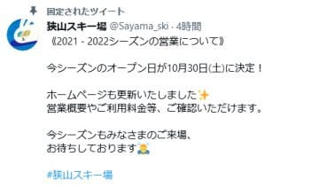
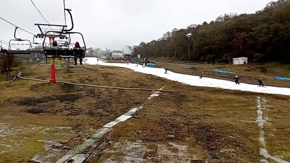
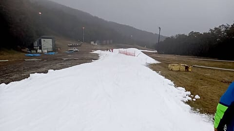
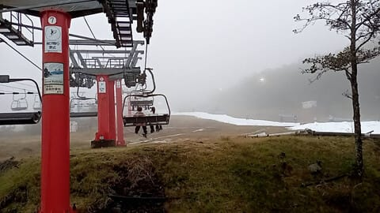

# 明日，ついにイエティで2021・2022シーズン初滑りしますよ～！

📅 投稿日時: 2021-10-23 00:57:47

🏷️ カテゴリ: [日記](cc4b5682fb7b8b144980957a978653fb0.md)

えー．

狭山のオープン予定がやっと出ましたね…

狭山スキー場，今シーズンは

10月30日オープンです！

（[狭山スキー場Twitter](https://twitter.com/Sayama_ski?ref_src=twsrc%5Etfw%7Ctwcamp%5Eembeddedtimeline%7Ctwterm%5Eprofile%3ASayama_ski%7Ctwgr%5EeyJ0ZndfZXhwZXJpbWVudHNfY29va2llX2V4cGlyYXRpb24iOnsiYnVja2V0IjoxMjA5NjAwLCJ2ZXJzaW9uIjpudWxsfSwidGZ3X2hvcml6b25fdHdlZXRfZW1iZWRfOTU1NSI6eyJidWNrZXQiOiJodGUiLCJ2ZXJzaW9uIjpudWxsfSwidGZ3X3NwYWNlX2NhcmQiOnsiYnVja2V0Ijoib2ZmIiwidmVyc2lvbiI6bnVsbH19&ref_url=https%3A%2F%2Fwww.seibu-leisure.co.jp%2Fski_web%2Findex.html)より）

シーズンパス購入者には，

29日プレオープンとのことで．

Yetiは見事に，例年通りの狭山

オープン前一週間に滑りこみましたね…

ってことで．

本日無事にイエティがオープンしましたが．

Yetiからの特派員情報によると．

天気はくもり時折雨が降る，あいにくの

天気だったようで…

でも，雨のおかげか．

硫安が効いていたのもあって，板が

滑る雪だったようです！

でも，やっぱり幅はかなり狭かったようで…

うーん．

明日，混むのかなぁ…

ということで．

私も明日，ついに待ちに待った初滑りに

Yetiへ行ってきます～！

明日のYetiの天気は，朝のうちは雲が残る

かもしれないけど，基本的に晴れの一日！

そして，気温は結構低めなので，真冬の

格好をしていったほうがいいです…

帰ってきたらどんなだったかレポートします～！

## 💬 コメント一覧

### 💬 コメント by (かず)
**タイトル**: Unknown
**投稿日**: 2021-10-23 02:05:00

ありがとうございます  調べても読みたくなくなるような内容で………笑 一番高額コースが無難かな  イエテイ怪我のないように！僕にはよける自信がありません笑

### 💬 コメント by (ikkun)
**タイトル**: Unknown
**投稿日**: 2021-10-23 13:22:13

遂におめでとうございますん(笑)  動画?ニュース見れました 改めて時間とあれが掛かるスポーツと今更ながら 楽しんで来てくださいね

### 💬 コメント by (Skier_S)
**タイトル**: 初滑りしてきたよ！
**投稿日**: 2021-10-24 01:47:35

＞かずさま

今日は人が少なかったです…

でもやっぱり幅が狭いので，やっぱり人を避けるのが難しい…

この時期のYetiは，禁断症状がどうしようもない人しか耐えられないと思います．

禁断症状に苦しむ人には天国なんですが(笑)

＞ikkunさま

初滑り無事終了しました~！

楽しんできました．

2022シーズン，スタートです！

