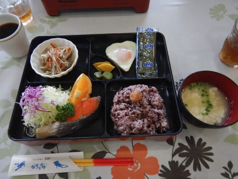

# 2017年8月，小学生の子連れで座間味でダイビングその8…ダイビング2日目スタート！

📅 投稿日時: 2018-07-07 00:47:15

ということで．

無事レヴォーグの納車日も決まったところで．

明日，片道250km走って．

BRレガシィ君最後の長距離ドライブに

出かける予定です…

今回がBRレガシィ君の最後の給油になるので．

ディーラーに引き渡す最後に，

ガソリン残量がほぼ0になるように

ぴったり計算して入れないと…！

ってなわけで．

本日も本題．

人気のない（ひとけのない，ではない）ダイビング旅行記へ，Go!

---

ということで．

明けて，ダイビング2日目の朝…

朝7時に起きて，朝食タイム！

朝からボリュームたっぷりの，星砂さんの

朝ごはん．

今日は和食ですね…

本日は，ダイビングの集合時間が9:20と

遅めなので．

朝食後，ちょっとのんびりしてから，

集合場所の港へ出かけます…

うーむ．

昨日の晴天とは違って．

今日はちょっと曇り空…

そして．

港でティンガーラ号に乗り込んだら…

すぐに出航！

ボートは今日も子供がいっぱいです…

まぁ，このザマミセーリングさん．

子供連れでも楽しめて安心なので，子連れが

集まるのも良く分かる…

15分ほど走ると，今日の最初のポイントに到着！

ガイドの雄大さんに連れられて．

シュノーケリング組の大人と，

わが娘も含む子供たちが，海に入って

いきますが…

え！？？

なんだか君たち，えらく遠くまで行ってないかい！？？

…なんだか．

すごい遠くまで泳いで行っちゃったんですけど…

うーむ．

この船に乗る子供たち．

多分世間一般の水準に比べると，

かなり海に慣れてますね…

子供たちが泳ぎに行ったあとは，ダイビング組は

ブリーフィング開始！

本日1本目のポイントは…

「ウフタマ」とかいうポイント．

さて．

エントリーしますか…！

というところで，

うぎゃーー！

トラブル発生っ！！

バンドが…

ダイビングコンピュータのバンドが…

ぶっつり切れてしまったんですがっ！！？？

うーむ．

たしか，このダイコン．←ノンダイバーの人によく誤解されるけど，大根のことではない

ダイビングを始めたころに購入したものなので．

そろそろ壊れてもおかしくないかな～…

と，思っていたけど．

まさか旅先で，バンドがこんなにぷっつり

切れてしまうとは…！

…とりあえず．

この場は急場しのぎ．

娘の髪の毛ゴムを借りて，

カメラのアームにぶら下げて使いますか…

そろそろダイビングを本格的に始めてから，18年．

ダイビングを始めたころから使い続けていた

道具が次々死に絶えていくなぁ…

ダイビングを始めた時に買った道具で．

残るは，フィンだけか…

## 💬 コメント一覧

### 💬 コメント by (おおすぎ)
**タイトル**: Unknown
**投稿日**: 2018-07-07 10:32:46

ダイビングシリーズも毎回楽しみにしていますよ。

「子徒然ダイビング日記」とサブタイトルを付けると、わたしみたいに、これから子どもと海に潜りたい！！1という読者が増えますよ♪

### 💬 コメント by (KENKEN)
**タイトル**: 夏モード始まりましたね。
**投稿日**: 2018-07-07 11:21:29

冬モード同様に夏モード楽しみにしてるので腐らず&無理せずブログ続けて下さい。

自分も10年超使ったダイビング器材が去年から次から次へと死に絶えてます。

ダイコンも高いのでヤフオクで買った中古のダイコンを自分で電池変えたり(自己責任)、バンド交換して10年位使ってます。

月末に西表島予定ですが今年は海水温度が高く台風が多そうですね(泣)。

### 💬 コメント by (Skier_S)
**タイトル**: 今日は娘とハワイアンズへ行ってきた
**投稿日**: 2018-07-08 03:51:50

＞おおすぎさま

ダイビング記事も楽しみにしていただけてるとのこと，

大変うれしいです…

サブタイトルを「子徒然ダイビング日記」ですか！

夏はメインタイトルを変えてみましょうか（笑）

一応，ブログタイトルの下には

「夏は子連れダイビング」と書いているんですが…

あと，旅行記のタイトルも「子連れ」というキーワードを

入れて，子連れ＆ダイビングで検索する人を

引っ掛けようとしているんですが…

＞KENKENさま

いや，夏はホントに読者数が減るんですよ．

冬の半分くらいに…

でも，ダイビング器材，10年過ぎるといろいろ

死に絶えていきますよね．

今回のダイコンは，私もバンドを取り換え

ました．

15年以上使ってますが，まだ現役続行です．

今年は，例年なら台風が来なくてねらい目のはずの

6月から台風が連続で沖縄を襲っていて，

なんだかヤバそうな感じですね…

