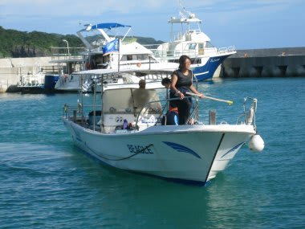
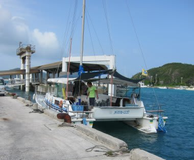
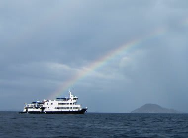

# 座間味旅行記番外編　娘の言う「本物の船」って…？

📅 投稿日時: 2012-08-17 00:00:09

🏷️ カテゴリ: [ダイビング日記](ce3a7a8d424d112fce83ee85c81a0e344.md)

今回の座間味旅行のとき．

ダイビング1日目は，去年乗った大型カタマランヨットではなく…

こんな感じの小さな和船タイプの船だったのは，レポートに書いたとおりなんですけど．

でね．

船に乗ったあと，娘がね，

言ったんですよ．

娘「…ホンモノのおっきいお船，いつのるの？」

ああ，去年3日間乗ったとはいえ，1年前の3歳のころの記憶，良く残ってるな～．

去年乗った大型カタマランヨットには，2日目から乗船予定だったので．

私「ごめんねー．今日は小さいお船なんだ～．明日はおっきいお船に乗るからね～」

と，そのときは答えておいたんですが．

その次の日，ザマミセーリングのカタマランヨットに乗ったとき．

娘「あ，前に乗った船だ～」

そうそう，これが本来乗りたかった，大きな船なんだよね～

しかし，ホントによく覚えてるなぁ…

と思っていたら．

しばらく後．

娘「ホンモノの船は，いつ乗るの？」

え？

これが，お前の言うホンモノの船じゃないの？？

…あー．

もしかすると，座間味ー那覇間のフェリーのことを言ってるのかな？

あれなら，確かに大きいが…

私「ホンモノの船って，昨日の朝に乗った，大きいフェリーのこと？」

娘「違う．上でご飯食べる船～っ！」

えーっと．

えーっと．

上でご飯食べる船って…

この船でも船の上でお昼ご飯食べるけど？？

一体なんのこと…

…も，もしかして．

私「あのー．もしかすると，お前のいうホンモノの船って…

　2段ベッドのお部屋があって，何日か泊まる船？」

娘「そう！2階でご飯食べる船！いつ乗るの？？」

…む，娘よ．

お前にとって「ホンモノの船」ってのは．

ダイビングクルーズ船のことだったのかっ！！！！！！

残念ながら．そんな船には，次は何年後に乗れるか分からんよ…

ダイビングクルーズ船を「ホンモノの船」って言うなんて．

どうやら，娘の育て方を間違えたらしい…
