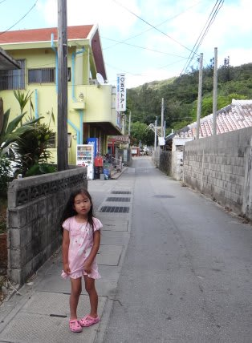

# 2013年7月　子連れ座間味ダイビング旅行記その8…ダイビング後，座間味に戻って娘がショックを受けたこと

📅 投稿日時: 2013-07-31 01:24:26

えー．

相変わらずの深夜更新．

ダイビング日記って，スキー記事より書く時間がかかるんですよね～

それなのに，スキー記事より人気が低いという(笑）．

…でも．

続けて書く．

継続は力なり！

（なんの？）

ってことで．

今日もダイビング日記，続きます～

--------------

今日は，座間味到着が朝10時で，乗船が11時と，スタートが遅めだったので．

本日の2本目(私にとっての1本目)が終了したら，もう午後3時すぎ．

なので，本日のダイビングは2本のみ．

っつーことで，船は港に戻ります…．

港に戻る間も，娘はアシスタントの雄大さんとべったり．

我が娘のハートを短時間でがっちりキャッチしていることよ…

ザマミセーリングさん，やっぱり安心して子連れで来れますね～．

ボートは30分ほどで港へ到着．

歩いて宿へ戻ります…

宿に戻ったらシャワーを浴びて…

夕食まで，まだ1時間以上ありますね～．

実は娘が，座間味に来るにあたって．

すごーーーーーく楽しみにしていたことがあったんです．

それは…

去年，おととしと通った，マンゴーカキ氷屋さん．

(去年の写真)

どうやら，このカキ氷の印象が強かったらしく…

(これも去年の写真)

座間味に行くと言った時から，

「お船に乗って，海で泳いで，マンゴーカキ氷食べる！」

と，それはそれは楽しみにしていたカキ氷．

＃海で泳ぐのとマンゴーカキ氷が，楽しみとして同レベルかい！って突っ込みを入れたい

ってことで．

座間味に行くと決めてからかれこれ2ヶ月，ことあるたびに

娘がいきたいと言い続けていたカキ氷屋さんに行ってみますか…

娘は，待ちに待ったカキ氷屋さんに行けると超大喜び！！

…

だったのですが．

…あれ？

ここだよなぁ…

…

…これは．

…もしかして．

今年は，営業していない？？？

…この事実を知った娘．

ぎゃん泣き！！！！

ええええ～っ！

こ，これは…

どうしよう…

とりあえず，泣いていた娘を別のお店へ連れて行き．

普通のカキ氷で機嫌を直してもらったのでした．

うーん．でも．

実は私もちょっと楽しみにしていたマンゴーカキ氷．

ちょっと残念．

カキ氷の後は．

ちょっとお散歩して．

宿に戻って，晩御飯です．

相変わらず，星砂さんの料理は，ボリュームもあって

沖縄料理も楽しめて．いい感じですね～．

娘も満足．

夕食の後は．

娘と一緒に，9時ごろには寝ちゃいました…

## 💬 コメント一覧

### 💬 コメント by (miya)
**タイトル**: Unknown
**投稿日**: 2013-08-01 23:21:41

夏モードも読んでますよー。

うちも家族で沖縄に行っていました。

夫婦は体験ダイビングを7，8回したことがあるだけで

ライセンスは持っていません。

娘は年長さんからシュノーケルをさせてます。

今回も真栄田岬の青の洞窟に行ってきました。

海ではそれくらいで、あとは水深2.7ｍのプールを

何度も下まで潜って遊んでいました…。

また行きたいなー。

### 💬 コメント by (Skier_S)
**タイトル**: miyaさま
**投稿日**: 2013-08-02 01:57:56

夏モードもご愛読ありがとうございます…

真栄田岬，懐かしいですね～．

体験ダイビングを7，8回って…

それだけやるなら，ぜひCカードを取って

本格的にダイビングを始めては…

おもしろいですよ！

でも，娘さん．

2.7mのプールをがんがん潜れるって

なかなかすごいですね…

うちの娘も鍛えないと！

