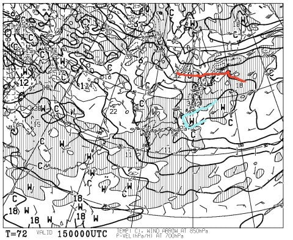
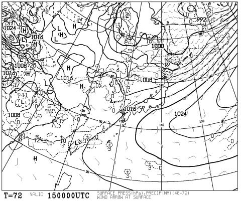
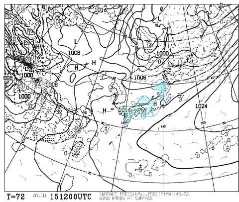
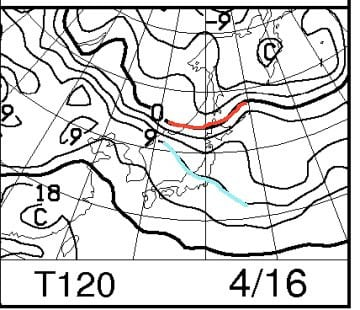
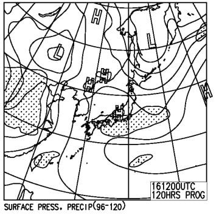

# 4月15，16日の週末の志賀高原スキー場の天気は…謎な天気図．きわどいところ降らずに済むか？

📅 投稿日時: 2017-04-13 06:31:03

🏷️ カテゴリ: [スキー天気予想](c6554f5c3c106093b511a8daae23757e8.md)

そろそろ，週末のスキー場の天気を気にする人が

ほとんどいなくなっているのでは…

と思っている今日この頃ですが．

この時期に，スキー場の天気を気にするのは．

かなりの終わっている人のような気がするのですが．

そのような，終わった人のために．

週末のスキー場天気予想，まだまだ続けますよ～！

えー．

まず．

15日土曜の850hpa気温図ですが…

まぁ．

この時期ですから．

やはり，0℃線は北海道近辺．

志賀高原には，水色で示した+6℃線が近づいているので．

昼間の気温は+10℃近くまで上がる，

春っぽい感じの気温になりそうです…

地上天気図を見ると．

朝9時の段階では，高気圧に覆われて

晴れそうな感じですが…

夜9時の天気図を見ると…

あれれれれ？

なんで？

長野上空に高気圧がいるのに．

なぜか水色で塗った降水域が本州を覆って．

志賀高原が水色のエリアに入ってにいる気が…？？

これは，もしかすると．

午後～夜にかけて，志賀高原もパラパラ降るのかも？？

＃しかし，なぜこの天気図で降水があるのか，

＃私には良く分からない…

で．

日曜ですが．

850hpa図は…

ふむ．

この日は，+9℃線が志賀高原に近づいているので．

…昼間は+10℃を超えますね（涙）．

春だなぁ…

そして，地上天気図ですが，

あれれれれ？？

この日も高気圧に覆われているのに．

高気圧の周りに降水域が予想されているという…

なぜだかよくわからない謎な天気図．

…でも，この日は降水域がぎりぎり志賀に

かかってなさそうにも見えるので…

降らないでいてくれると嬉しいなぁ．

とりあえず．

土日とも，なぜか高気圧に覆われているのに

降水がありそう…

という，これまで私も見たことがない謎な天気図なので．

ちと予想精度は低いですが．

15日土曜：朝は晴れ．

　朝イチは放射冷却でゲレンデは硬く締まっているか．

　昼に向かって雲が増えていき，気温もぐんぐん上がる．

　昼間は+10℃近くと，この時期らしい暖かさになり．

　雪はこの時期らしい，重い春雪になっていきます…

　午後になると…

　まだわからないけど．

　運が悪いとパラパラと降るかも…

　この時期だから，降れば当然液体です（涙）

　降ってもそれほどひどくならないはず．

16日日曜：朝から曇り空？

　曇っていれば放射冷却が期待できないので，

　朝からちょっと緩めの雪でスタート．

　気温がぐんぐん上がり，+10℃を超える暖かい日に．

　時折日が射すかもしれないので，日が射すと

　暑く感じるほど…

　当然，雪質は期待しない方がいいでしょう（涙）．

　この日は，今のところ終日曇りベースの天気で，

　雨は降らずに済みそう．

という感じで．

今週末も，典型的な暖かい春スキーの緩い雪になりそうです…

雨が降るかどうかは，まだ微妙なので．

今後も予想のアップデートをしていきます…

しかし．

やっぱり．

冬が終わってしまいましたねぇ．

春ですねぇ…（涙）．

## 💬 コメント一覧

### 💬 コメント by (かず)
**タイトル**: Unknown
**投稿日**: 2017-04-14 01:47:34

土日行きますよ　タイミングが合えばよろしくお願いします

### 💬 コメント by (Skier_S)
**タイトル**: かずさま
**投稿日**: 2017-04-14 02:15:03

私も今週は土日に行きます～．

今のところ，土曜は奥志賀，日曜は一の瀬かな…

天気や状況によって変わるかもしれません．

