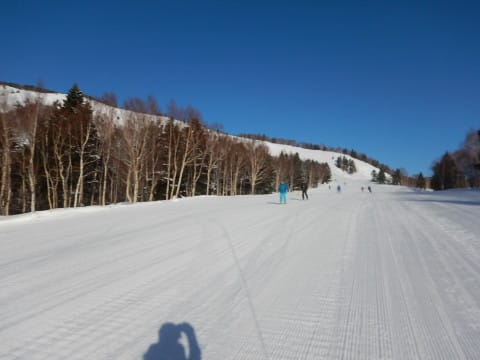
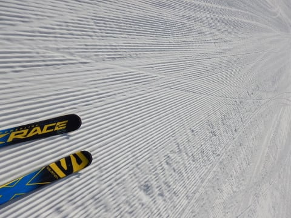

# 1月20日(土)の志賀高原・焼額スキー場は…ちょっと雪は硬めだけど，ガラガラ晴天！結構良かった一日

📅 投稿日時: 2018-01-20 22:33:02

🏷️ カテゴリ: [2018スキー滑走日記](c11b88dc181f34079ab41db74a3587646.md)

ということで．

本日も一日志賀高原を滑り倒してきたので．

本日の志賀高原レポートです～！

まず．

朝ですが．

志賀高原への道を登っていると…

いや．

減ったわ，雪…（涙）

スキー場があるところまで登ってきても．

道路に雪がないんですが（泣）．

これ，1月ではほとんどありえないこと

なんですけど？

そして．

雪も少ないけど．

車の数も少な目で．

今日も混まなさそうな予感…

ってことで．

いつも通り，朝イチで焼額第1ゴンドラオープン待ちに

並ぶわけですが．

並んでる人も20人いない程度で．

晴天の日にしては少なめですね．

で，

8:30営業開始のゴンドラで山頂に登ると．

ふむ．

山頂の気温は…-7℃ですか．

-5度程度って予想だったけど．

晴天で放射冷却が入ったせいで冷え込んで．

2度ほど外しました…（ちょっと残念）．

そして．

山頂は…

そうです！

ピカピカ晴天っ！！

…てか．

晴れなくていいから，ちょっと雪が降って

ほしいんですが…（ちょい涙）

正月3，4日にドサドサ降って以来．

8～9日に雨，そして今週17日も雨が降ったけど．

雪はほとんど降ってない状況で．

そろそろ雪が欲しいところ…

でも．

朝イチのバーンはシマシマ！！

ちょいと硬めで，表面がボソボソの荒れ気味だけど．

でも，シマシマっ！！！

エッジが食い込まないで，流される感じの

ところがあるのがつらいけど…

でも，晴天シマシマっ！！！

ってことで．

1時間近く，シマシマバーンを堪能したけど…

だんだん人が増えていくわけで．

硬いシマシマバーンは人が多く滑ると…

そうです．

殺人コロコロ登場です（涙）

幸い，全面殺人コロコロ畑にはならなかったけど．

ところどころコロコロスポットが発生して．

そして，10時ごろには…

ちょいと人口密度も高くなり．

そして，第1ゴンドラの待ちも長くなって

来ました（泣）

とはいえ．

輸送力の高い第1ゴンドラは，

せいぜいこの程度の待ちが最大で．

ゲートの外ぎりぎりまで人がはみ出すかどうか…

という程度．

相乗りレーンを使えば搬器数台待ちで乗れるレベル．

さらに，

そんな待ちがあったのも，10時から11時の

1時間ほど．

11時を過ぎて，昼休みタイムになると…

めっちゃガラガラなんですけど！？？

そして，コースも人がいなくなっちゃったんですけど！？？？

こんな晴天ぴかぴかの気持ちいい天気なのに…

こんなにコース上に人がいなくていいの？？

もう，昼からは午後の間ずっとガラガラ！

1月の週末でこれって…

焼額の経営，大丈夫か～！？？

で．

結構日差しは強く，

この時期としては暖かかったものの．

昼間も最高気温は山頂で-2度と，プラスには

ならず．

雪はそんなに悪くなりませんでしたね～．

とはいえ．

やはり雨が降ったあと，しばらく積雪がなかったので．

人が多く滑ったバーンには硬いところが顔を出したり…

日が当たる南東斜面側はごく僅かだけ，雪が

緩んだところもあったりしたけど．

昼頃にはコロコロは姿を消してくれたし．

アイスバーンではなかったけど．

全体的にしっかりパックされたような，

硬めのバーン状況だったので．

夕方になるまで，ほとんど荒れず，

日が暮れかけるゴンドラストップまで，

フラットなバーンをひたすら滑り

つづけられたのでした…

…

…

…はい．

そうです．

まだ終わらないことは皆さんわかってますよね．

今日も行きます，ダイヤモンドナイター！！！

6時半のナイタースタートから，

いざリフトへ！

…って，

あれ？

なにかがおかしい…

…そうです．

今日のダイヤモンドナイター．

圧雪されてませんでした！！（激烈な涙）

オーマイガっ！！！

なんてこった！！

どうしたこった！！！（あふれる涙）

ナイターの楽しみの半分は，圧雪かけたての

シマシマ攻略にあるのに

シマシマを滑れないなんて…っ！！！

ナイターリフト券代，半分返して～（涙の訴え）

一の瀬ファミリー側は圧雪されてましたが．

遅くて緩いファミリーのペアリフトに乗ってシマシマを堪能するか？

圧雪されてないけどリフトが速いダイヤモンドを滑るか？？

という究極の選択で．

今回はダイヤモンドを取りました…（泣）．

でも．

ダイヤモンドのナイターコース上をキツネさんがうろうろ

してたりして，癒されたので．

まぁ，ダイヤモンドで良かったということにして

おこう…←自分を騙そうとしてみる

次から，ダイヤナイターが圧雪されてないようなら

高速リフトで距離が長い，焼額かサンバレーのナイターに

車で移動しよう（涙）

ってことで．

そろそろ積雪が欲しくなってきた

志賀高原ですが．

今，ちらちらと雪が待ってます．

でも，積もるような感じではないですね…（残念）

明日の朝も硬めのバーンになりそうですが．

また焼額滑ってます～！

## 💬 コメント一覧

### 💬 コメント by (しんちゃん)
**タイトル**: キツネ？
**投稿日**: 2018-01-20 23:06:06

キツネがいるんですね!!

癒される～♡

### 💬 コメント by (ほっぽ)
**タイトル**: キツネ
**投稿日**: 2018-01-21 06:50:07

ゲレンデにキツネ、昨シーズンイエティで見ました。(^^;

志賀高原にもいるんですね。

私は昼間だけでヘロヘロ、とてもナイター滑る余力は残っていませんでした。

### 💬 コメント by (はなげ親分)
**タイトル**: ダイヤナイター
**投稿日**: 2018-01-21 08:04:07

圧雪無しですか～

常態化しなければ良いのですが…

ところで私、風邪引きました!!

だもんで、今朝のミーティングに参加出来ません(泣)

### 💬 コメント by (まいる)
**タイトル**: 昨日は
**投稿日**: 2018-01-21 11:34:40

Sさん、昨日は二年ぶりにご一緒できて良かったです。

来月末に、また来ますのでよろしくです。

### 💬 コメント by (かず)
**タイトル**: Unknown
**投稿日**: 2018-01-21 16:01:27

今週は自宅待機です笑　もちろん来週は行きますよ

できれば平日パウダーしたいですが仕事が....

大変いいことがあったのですがゴンドラでお会いした時に

### 💬 コメント by (egu)
**タイトル**: ステッカー
**投稿日**: 2018-01-21 21:26:49

朝一のゴンドラで息子にステッカーいただき、

ありがとうございました。

息子はSさんと話できて大満足で、あれからは超ーご機嫌でした。

スキー子供の日で遠征した寺子屋、東館山、高天原はガリガリでイマイチ楽しめませんでしたが景色は良かったです。

これからも天気予想頼りにしてまーす。

追伸. やはり休日３０００円は取られました。

### 💬 コメント by (Skier_S)
**タイトル**: 雨が続いた後ドカ雪って，最近の天気，極端すぎる…
**投稿日**: 2018-01-22 02:53:26

＞しんちゃんさま

ダイヤナイターはなぜかキツネ遭遇率が

高く，昨シーズンも1回見てます…

なぜかこのキツネは，目立たない林の中

とかじゃなく，ゲレンデの中を

闊歩してました（笑）

＞ほっぽさま

イエティにキツネ出るんですね！

あそこは鹿ばっかりかと思ってました…

土曜の昼間はカリカリバーンだったので，

ナイターなら圧雪かけたてで人も少なく，

気持ちいいコンディションで滑れるかと

思ったら…圧雪が無くて残念です（涙）．

＞はなげ親分さま

あらーーー！

風邪ですか！

焼額ナイター滑って冷えたんでしょうか…

お大事に…

しかし．

ダイヤナイターの圧雪なし，常態化

しないことを祈るばかりです…

＞まいるさま

ボードじゃなく，スキーは楽しめましたか？？

土曜は天気が良くて良かったですね…

また2月にお会いしましょう～！

＞かずさま

24，25日はパウダー最高だと思うのですが…

27，28日の週末はそれほど積雪が

なさそうなので，土日はディープパウダーは

難しそうです…

まだ天気図が変わる可能性がありますが…．

今週末，いい話を聞かせてください！

＞eguさま

ゴンドラではお話しできて楽しかったです．

息子さんはあまりおしゃべりしてなかったですが，

喜んでいたのですね！

良かったです…

しかし，寺子屋もガリガリでしたか…

この週末，ちょっと残念な雪質でしたね．

今週末からはアイスバーンが隠れてくれそうです．

また焼額でお会いしましょう！

