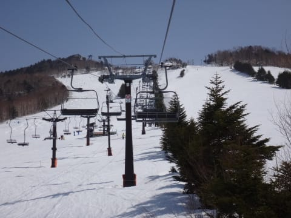
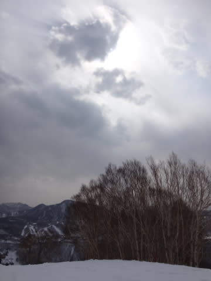

# 3月22日の志賀高原詳細モード…重い．雪が，重いよ…（涙）

📅 投稿日時: 2015-03-24 01:29:20

えー．

週末は高温ドボドボだったのに．

週明けに無駄に冷えて雪が降り．

全く意味もなく，明日も冷えて，雪になりそうということで．

…グレようかな…

と思う今日この頃．いかがお過ごしでしょうか．

ってことで．

昨日，速報した志賀高原の詳細レポートをば…

日曜は，朝から快晴っ！！

そして，山頂に上がってみると．

うーーーーむ．

うっすら春霞がかかった感じで．

すっきり透明な冬の空気と違う感じで．

なんだか…春ですねぇ…

で．

気温は-2℃ですか…

昨日と同じくらいか…

これは．

おそらく．

かなり早いうちに雪が緩みそうな予感（涙）．

ってことで．

朝イチはちょいと固めのバーンだったけど，

適度なシマシマで．

うむ．

朝イチは楽しめるぞ！

…と，思ったところ．

固かったコースの表面が崩れて，氷のコロコロが大量に

ゲレンデに現れ…

そして．

午前10時前には．

容赦ない晴天の太陽からの日差しを浴びせられたゲレンデは…

ああ．

ダメだ．

ダメな感じの雪質に…（涙）．

そして．

人も結構増えてきて…

ゴンドラも，最大5分程度の待ち時間が…

で．

当然，ゲレンデの人が多くて，雪が柔らかいということは…

…そうです．

ゲレンデは，あっという間に荒れていきます（涙）．

昼間の気温は，もう暑いくらいで．

…あれです．

雪は．

しっとりとクリーミーな感じに…（泣）．

柔らかい雪に，スキーが埋もれる感じの．

何だかこう．

ちょっと残念な感じの雪ですな…

まぁ．

ポカポカした日差しの中．

のんびり滑る春スキーと思えば．

いい感じで天気が良く，暖かく．

マッタリした，のどかな感じではあるのですが…

で．

焼額の雪があまりにも緩んで荒れすぎたので，

一の瀬方面へさすらってみたところ．

一の瀬正面バーンの上部は…

をを！緩んでなさそう！

と，思ったら．

これは…アイスバーンなんですが…

まぁ，荒れた春雪より，ましかな？

高天ヶ原方面は…

うむ．

ここも，普通に春雪の荒れ荒れ斜面ですな．

こーゆー雪は，モーグルバーンがいいかも…

と，思ったら．

ちょっと下地が固めで．

うーん．

もう少し下地まで柔らかいと滑りやすいのだが…

って感じで，

志賀高原をいろいろさすらっていたわけですが．

午後2時ごろからは，天気予想通り，空に雲が

ちょっと増えていき…

だけども，しばらくは気温は高いままで．

こんな重い雪が…

こんな風に荒れ荒れになっているバーン状況のままだなぁ…

と，思ったところ．

日が陰る3時過ぎになると．

あらららら？？

やっぱり，固まりだすの？

ゲレンデ，固まっちゃうの？？

うぎゃーー！

午後4時ごろには，完全カリカリバーンになっちゃった！

重い雪も辛いけど（からいけど，と読んではいけない）．

カリカリバーンも楽しくないんですけど…っ！！！

って感じで．

太陽が雲に隠れてしまい．

夕日が拝めなかった本日でしたが．

文句を言いながらも．

お約束通り，リフトストップまで滑り続けた

Skier_Sだったのでした…

…あれですね．

なんだか，もう．

トップシーズンの雪が，遠い過去のように

思えてきました…

もう一回でいいから，冷え冷え雪で滑りたいなぁ…

…どうして，週末が終わってから冷え冷え雪が降るのかな（涙）．

## 💬 コメント一覧

### 💬 コメント by (Goku)
**タイトル**: 春でしたね
**投稿日**: 2015-03-24 21:00:20

珍しく、焼額山から脱出してたんですね。

それにしても、たった一週間であれほどの春雪になってしまうなんて・・・悲しすぎますね。

今週の長野は本当に、無駄に冷え込んでいます。

### 💬 コメント by (Skier_S)
**タイトル**: Gokuさま
**投稿日**: 2015-03-24 23:24:07

そうなんですよ…

あまりにも焼額の雪が荒れ荒れで面白く

無くなってしまったので…

西館フーディーの大回転コースが意外とよくて，

4時近くまで西館滑ってました～

しかし．

長野も寒いですか…

この寒いのも，水曜までです（涙）．

この週末はまた気温がかなり上がります…（泣）．

ああ．

ホントに今日の冷え込みは，無駄に冷え込んでる

感じですね…（残念）

