# 今年もいっぱい試乗してきたよ…2018シーズンモデルスキー板，試乗レポート連載開始！

📅 投稿日時: 2017-04-05 01:46:50

🏷️ カテゴリ: [スキー板試乗](c0bd8048615710cee890e403a36cc9a2b.md)

なんだか．

ヘタすると金曜の7日から雨になりかねない

天気図になりつつある今日この頃…

うーむ．

今のところ．

7，8，9，10日の金曜～月曜の4日間．

いつ雨が降ってもおかしくないです…（涙）．

ヘタすると，4日連続で雨になる可能性も

否定できない天気図（泣）．

とりあえず，明日詳細予想しますので，

土日の天気がどうなるかは，しばしお待ちを…

＃ただ，明日の段階でもいつ雨になるかの

＃予想は難しそう

ってことで．

本題ですが．

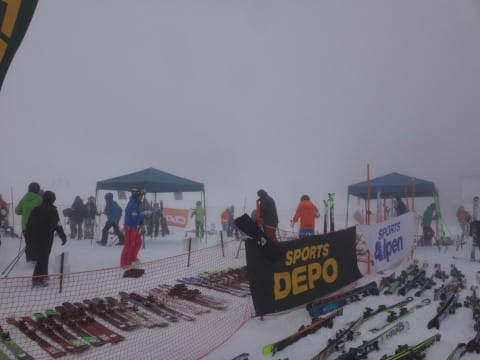

…はい．

そうなんです．

この土日の2日間．

4月第1週の恒例になりつつある．

志賀高原ダイヤモンドスキー場での，来シーズンモデル

スキー板の試乗会に参加してきました～！

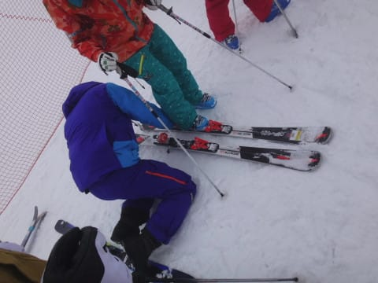

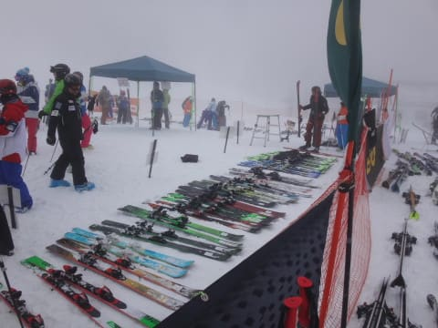

土曜日は残念ながら，かなり天気の悪い中での

試乗となり…

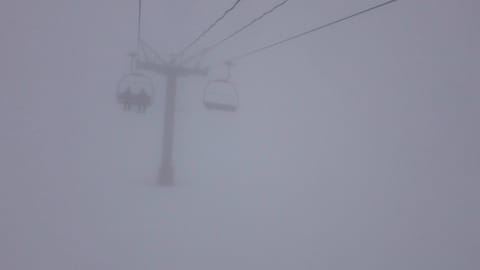

こんな感じで前が見えず（涙）．

…雪は固い下地の上に5cmほど乗った，まぁまぁ

いい雪質の新雪が蹴散らされた状況で．

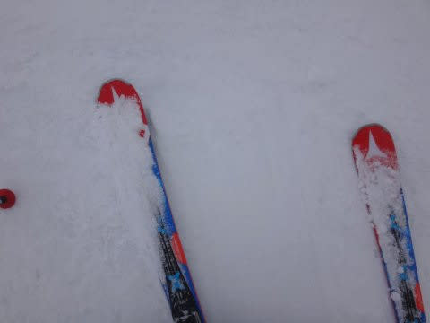

雪質としては悪くないけど．

新雪がモソモソしてたので，

しっかり板をグリップさせて高速性能を見るには

ちょっとふさわしくないコンディション…

でも．

2日目は晴天！！！

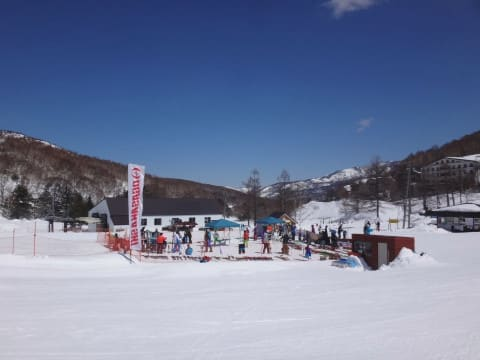

ゲレンデの雪質も結構よく．

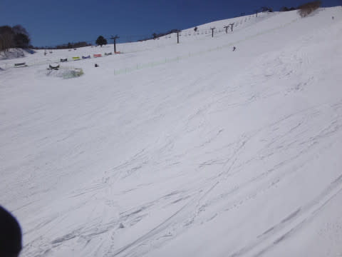

この日は最高の試乗日和でした～！

4月でこんないいコンディションはそうそうないので．

この日はかなり板の特性をつかむことができました…

…ってことで．

今回も．

乗りに乗ったり，22機種！

板の名前の前に○があるのが，日曜の

いいコンディションで乗った板．

○が無いのが，コンディションの悪い土曜に

乗った板です…

○ATOMIC Redster S9i 165cm

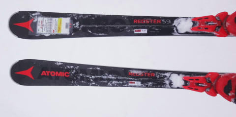

○ATOMIC Redster G9i 171cm

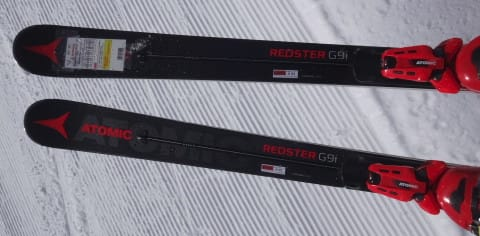

VOLKL Platinum SD 170cm

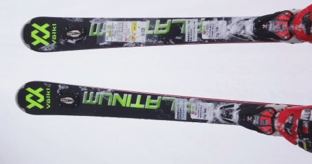

○VOLKL Platinum SD 165cm

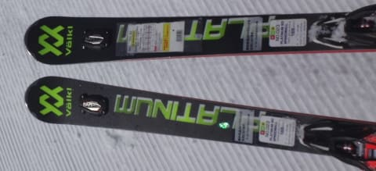

VOLKL Platinum SW 166cm

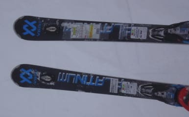

SALOMON X-RACE SW＋P69プレート　170cm

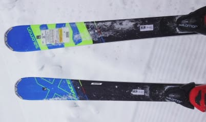

○SALOMON X-RACE SW+P69プレート　165cm

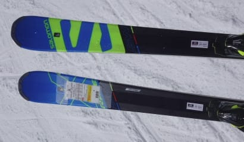

○SALOMON X-RACE SW 165cm

○SALOMON X-MAX X12 170cm

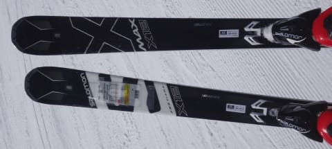

○SALOMON XDR88 Ti 172cm

OGASAKA TC-SC+FL585プレート　165cm

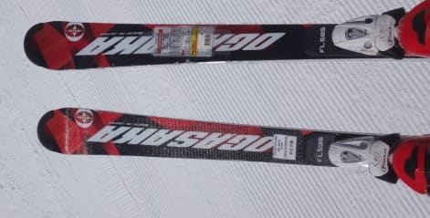

○OGASAKA TC-SC+GR585プレート　165cm

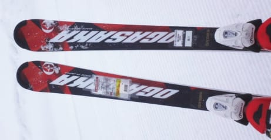

OGASAKA Triun SL+GR585プレート　165cm

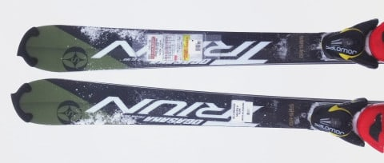

○OGASAKA KEO'S KS-RX+FM600プレート　165cm

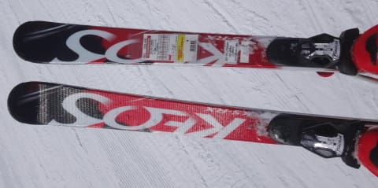

HEAD i.Supershape Speed 170cm

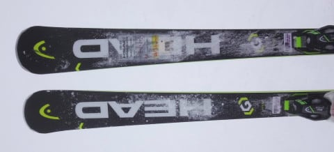

HEAD i.SL 160cm

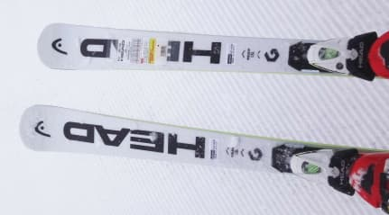

FISCHER RC4 WC SC Yellow Base 165cm

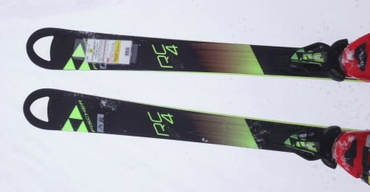

NORDICA Dobermann SPITFIRE RB EVO 168cm

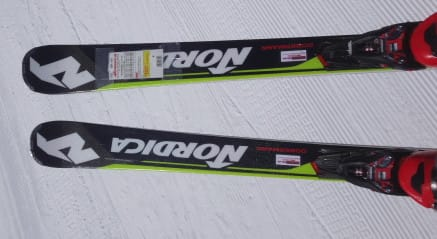

○ROSSIGNOL DEMO Alpha R21 167cm

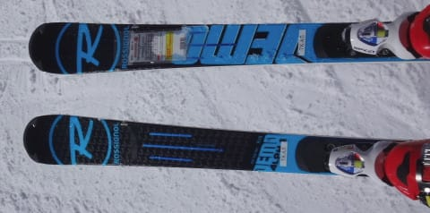

○ROSSIGNOL DEMO Alpha SOFT 167cm

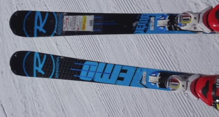

○ROSSIGNOL DEMO Beta 167cm

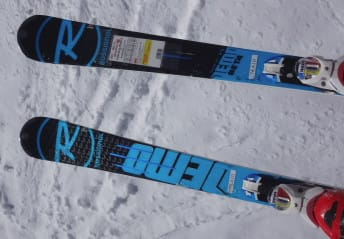

ということで．

テク・クラのプライズ検定を受けたこともなければ．

指導員資格も一切持っていない．

純粋なレジャースキーヤーによる試乗インプレッション．

いつもながら，こんなどシロートの試乗レポートが

役に立ってんのだか，ちょっと気になるところでは

ありますが．

明後日から連載を始めますので．

お楽しみに～！

## 💬 コメント一覧

### 💬 コメント by (かず)
**タイトル**: Unknown
**投稿日**: 2017-04-05 16:04:52

これから雨予報ばかりですね～今までが良すぎですが　ガラガラ1等　来シーズンのプリンス宿泊し放題のシーズン券です　　シーズン券じゃない笑　1泊でしょう笑

### 💬 コメント by (Goku)
**タイトル**: 完売
**投稿日**: 2017-04-05 19:05:41

一の瀬ファミリーの試乗会に予約の電話をしたら『予約いっぱいです』だって(>_<)

ポチらなくていい理由が出来たので、来シーズンも現行の板で頑張ります！

### 💬 コメント by (しんちゃん)
**タイトル**: 楽しみ
**投稿日**: 2017-04-05 20:27:54

試乗レポート、今後楽しませていただきます。

現行ROSSIGNOL DEMO Alphaの後継機がどんな感じだったのか注目しています。

大回り用も気になっています・・・

### 💬 コメント by (Skier_S)
**タイトル**: 明日は雨？？
**投稿日**: 2017-04-06 02:13:44

＞かずさま

この一週間は，雨に耐える我慢の一週間です．

ガラガラ一等は，プリンス1泊宿泊券ですか．

では，来シーズン一回くらいプリンスに泊まってみて

ください～！

＞Gokuさま

一の瀬ファミリー試乗会は，例年人気のようです…

＃昨年は雪がすごかったけど．

…で．

試乗しなくても，ポチることは可能ですよ～！！

＞しんちゃんさま

楽しみにしていてください．

…でも，私が履く板って，いつも

同じような感じのモデルで…

偏ってますね（笑）

