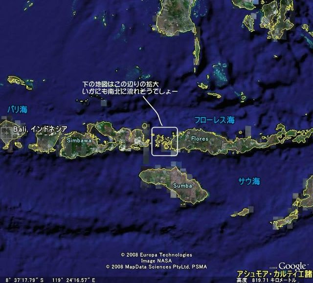
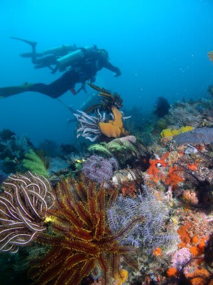
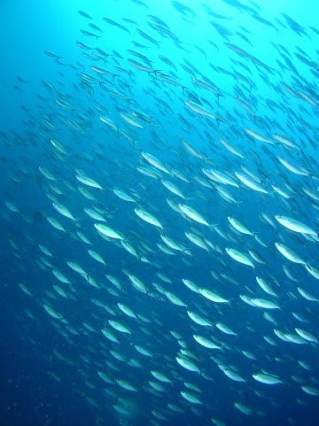
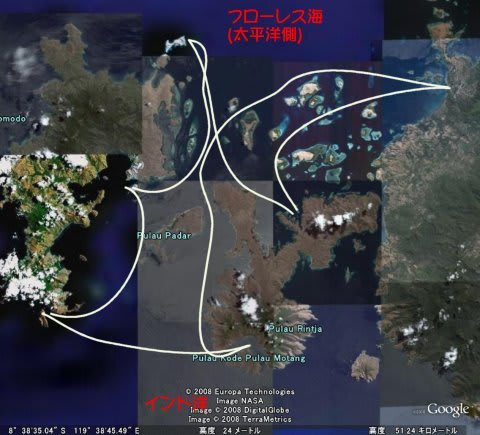
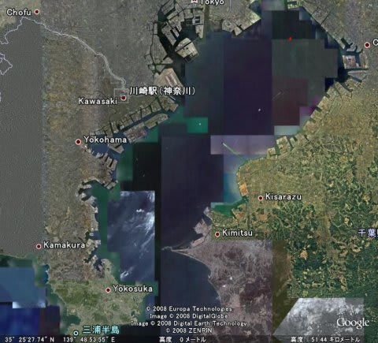

# ダイビング旅行記の前に…コモドってどんなところ？

📅 投稿日時: 2011-07-02 01:11:41

で．

ダイビング旅行記の本編に入る前に．

まずはコモドのインフォメーションをば．

最近，ダイバーの間で多少は有名になってきた，インドネシア・コモド．

場所は，バリ島から飛行機で1時間半東へ．

ジャワ島からニューギニア島まで，東西に点々と連なる島々の，

中間地点くらいでしょうか．

南側はインド洋を介してオーストラリアに，北側はフローレス海を

介してスラウェシ島に面するあたり．

地図を見てもらうと分かると思いますが，インド洋と太平洋の間ををせき止める

ように，細長い島々が長さ数1000km以上にわたってつながっています．

これがどういうことを意味するか．その島々の間が，インド洋と太平洋をつなぐ，

非常に細い水路のようになっているということです．

つまり．インド洋と太平洋の間の海の干満のための水が，全てこの狭い水路を

通る，ということ．

すなわち…

すさまじい流れです．

（四角で囲ってある部分が，下のほうにあるコース拡大地図のエリア）

モルジブのグライドゥーなど，アトゥールの外周部のチャネルも流れがすごい

ですが，これはシンプルに環礁に水が出入りするだけの流れ．

それに対して，コモドの海は，インド洋側からの流れと，太平洋側からの流れ．

それぞれが，違う性質を持っています．

コモドのインド洋側．南側は，かなり深い海です．

インド洋からの流れは，これらの島々にぶつかる際，深いところの水が

一気に浅瀬に湧き上がり，これが豊富なプランクトンを発生させる

源となります．

透明度が悪いけど，プランクトンが豊富で，魚が集まる食物連鎖の海．

水温は低めで，ハードコーラルは少ないけど，見たことも無いカラフルな

ソフトコーラルびっしりの，花畑のような海です．

しかし，水温は25度以下．

これに対して，北側は，比較的浅い太平洋側．

こちらは，青い，きれいな水が入ってきます．

水温も，一気に30度近くまで上がります．

透明度が高いと魚が少なそうに感じますが…

やはり強い流れが根にぶち当たるようなところでは，

パラオのブルーコーナーを髣髴とさせる，ロウニンやグレイリーフが

ぐるぐる回る根待ちパターンのダイビングが楽しめます．

これで，透明度は25m以上，「今回，透視度20mしかなかったなぁ…」

といってしまうような，クリアーだけど魚ごっちゃりという，

世界でまれに見る海．

われわれの乗るサザンスター号（またの名を，「しまじ」号）は，

インド洋と太平洋をつなぐこの狭い水路の一つである，リンチャ島と

コモド島にはさまれた水路がダイビングエリアです．

この水路，もっとも狭いところで幅6km，長さは40km程度．

ここを南端から北端までを5日間かけて，1往復するようなコースで

移動します．

わずか40kmほどのチャネルなのに，先ほど述べたように，

南側と北側は全く景色が異なります．

あー．40kmって，どのくらいか分かりますか？

横須賀から川崎くらいです．

参考までに，さっきのルートマップと同じ縮尺で東京湾を

見るとこうなります

要するに，横須賀から船を出して川崎を越えたあたりで，

水温が5度以上変わってしまって，生態系も全く違うという．

コモドの海がいかにバラエティに富んでいるか分かろうと

いうもの．

逆に言えば，コモドクルーズは船の移動範囲はそれほど広くありません．

意外と行程はコンパクト．

船の移動時間は短いです．

でも，それを全く感じさせない，ポイントバリエーションの豊富さ．

さらに，ダイビングだけではない，コモドドラゴンウォッチングや

ピンクビーチ上陸などのお楽しみもあり，飽きさせない5日間が

過ごせます． 

という感じで．

子供を連れて行ってきた8泊9日．

明日から，詳細レポートのはじまりはじまり…

＃こ，ここまでが前フリかっ！長っ！
