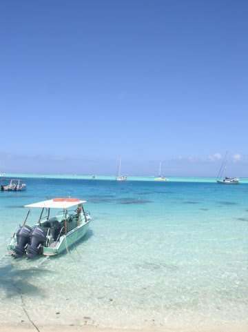
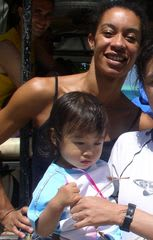
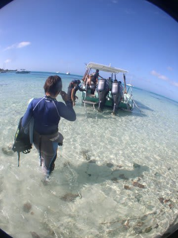

# 2009年　初の海外子連れダイビング旅行記　6　Trials and tribulations

📅 投稿日時: 2012-09-01 00:38:42

「今回，子供を預かることもできますが…」

……

ううう．

スタッフの好意により．

なんと．タダでダイビング中子供の面倒を見てくれるとのこと．

ううううう．

魅力的．．．．．

でも…うちの娘．

いまだに，両親＆祖父母以外の人に面倒を見てもらったことが

無いんですよね．

おそらく，泣く．

母親に置いてかれるときに．

…それも，激しく泣く．

最悪，預けられている間，ずっと泣きっぱなしかも．

今回，午前中続けて2本潜る予定なので．

…2本潜ってる3時間半の間．ずっと泣いてるかも…

で．

さらに．

預かってくれるのは，日本人じゃないです．

生まれて初めて，両親＆祖父母以外に預けられる人が

いきなり外国人で大丈夫か？？

…しかし．

今回ボラボラで潜るのはこの2本のみ．

明日はランギロアへ移動．

つまり，ここで子供を預けないと，妻はこのきれいなボラボラの海で1本も潜れないことに．

…今後，おそらく．数年間にわたって

「ボラボラでもぐりたかった…」

というツブヤキを聞くことになりかねない…

…いずれは，子供も両親から離れて，保育園とか幼稚園とかに行くはず．

そのとき，母親から離れなくて泣いた…という話は良く聞く．

今後いつまでも，ずっと母親と一緒にいつづけるというのは無理．

ということで，母親から離れるというのはいずれは超えなきゃいけない試練．

今回，その試練にチャレンジさせてみてもいいんでは？？

…っていう，「行っちゃえ」という悪魔のささやきと．

でも，機嫌よく遊んでいてくれるならまだしも，ずーっと

泣きっぱなしだったら，ボランティアで面倒を見てくれる人に

悪いではないか？？？

…っていう，良心(？)のせめぎあい．

夫婦で相談の挙句…

「子供をシッター役の人に会わせてみて，おお泣きしないようなら

預ける．泣いてどうしようもないなら母親は潜らず面倒を見ようか．．．？」

という，妥協案に落ち着き．

ダイブショップでシッター役の人に会わせてみると…

（写真の上がシッターをしてくださった方）

うーーん．娘は微妙に固まっているが，泣き出すことは無い．

あと，シッター役の人の子供もいるので，この子供たちと

遊んで過ごせるか？？？

ということで，その場をそーっとあとにして，子供の視界から

消え去る我々夫婦．

建物から出たあたりで

「ママーっ！」

という叫び声が聞こえた気がしたけど，心を鬼にしてボートに

乗り込んだのだった… 

