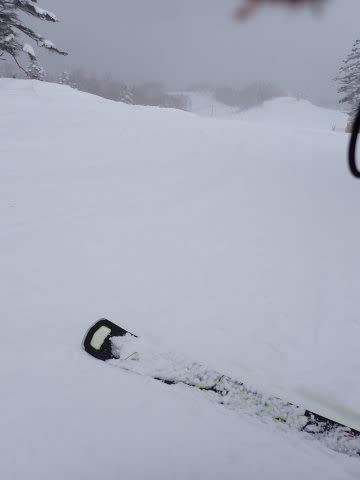
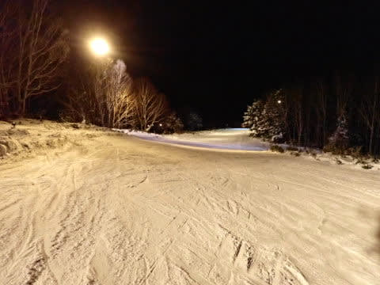

# 2023/1/8(日)，3連休中日の志賀高原スキー場は…曇り時々晴れ．3連休にしては混まず．雪質はいいけどもう少し量が欲しい

📅 投稿日時: 2023-01-09 00:01:51

ってなことで．

土曜に何とか仕事を終えたことにして．

睡眠時間3時間で，3連休中日から志賀に

参戦しました～！！

そして．

3連休中日にして．

やっと私の2023年の初滑りです…！！！

普通なら正月3が日はスキー三昧なのに，

こんな時期にやっと初滑りとは…（涙）

大学入学して以来，正月3が日に志賀で

過ごさなかったことはないので，

実に何年振りか…

仕事が憎い…

で．

本日も，焼額第1ゴンドラの8:30営業開始を

狙ってやってきたのですが．

本日は第1ゴンドラ故障で7:50からの

ファーストトラックの営業ができなかった

みたいで…

朝8:20過ぎに到着すると，第1ゴンドラは

すでに早めの一般営業を開始してました～！

しまった…出遅れた～！！！（涙）

慌ててゴンドラに乗って，山頂に行くと…

山頂の気温は-7℃．

うーん

　あさイチの気温は-8から9℃．

という予想，

わずか1～2℃だけど外れたか…

天気は曇り空ですが…

ゴンドラ山頂，朝イチはうっすら

日が射してました！！

そして．

コース脇を見ると…

うーん．

昨晩からの積雪は，

　朝までに5cmほど積もるか

予想通り5cm程度，

ってところですかね…

バーンは予想通り，いい感じに締まった

気持ちいいシマシマ圧雪バーン！！！

うはーー！

これは気持ちいい！！

1月のトップシーズンに入ったんだから，

やっぱりこうじゃなきゃ！！

…と，気持ちよく滑ってたら…

ゲレンデがガスって見にくくなり．

飛ばせなくなりました…（涙）

ただ，ガスっていたのは朝9時半くらい

の1時間だけだったのですが…

あさイチの一番気持ちいい時間にガスって

しまったのが，かなり残念…（泣）

で．

さすが3連休中日だけあって．

午前中はちょっと混みました（涙）

朝9:30過ぎの第2高速に行くと…

うげげげ！！

すごい列…！

第1ゴンドラは，ピーク時の9:30～11:00で

最大この程度の待ち．

混んでくるとすべての搬器に相乗りで

6人くらい乗せるので，相乗りレーン

なら最大でも3分程度の待ちですみ，

昨年までの相乗りさせない状況に

比べれば，かなり待ち時間は短くなりました！

そして．

さすがの3連休．

普段は混まない第3高速まで，

ゲートの外に列が伸びてました…

ゲレンデもちょっと人が多かったけど．

でも，12月30日の激混みに比べれば

全然マシ！！！

ある程度気持ちよく滑れましたよ～！

そして．

混雑していたゴンドラも，11:30ごろには

ガラガラになり…

昼前には，リフト・ゴンドラともほぼ

飛び乗り状態になりました！！

…午前中はダメかと思ったけど，3連休の

中日にしては，人が少ないよ…！

ゲレンデも，タイミングを選べば

3連休中日と思えないガラガラ具合！！

…ただ．

昼間の気温はマイナスキープしてくれた

ので，雪質は良かったけど…

やっぱり，昨晩の積雪が5cmしかなく．

まだ雪が薄いところもあり…

GSコースの一部と，イーストコースの

一部に，ちょっと浮石エリアが（涙）

まぁ，浮石エリアはごく一部なので，

コースのどのあたりに石が浮いてるか

分かっていれば回避可能です．

そして．

今日も雪が積もることはなく．

それどころか，むしろ天気は良くなって

いって…

午後は太陽が顔を出してきました！！

うーん．

雪は積もってほしいけど…

やっぱり太陽の下のスキーは

気持ちいいよね！！

で．

新雪用に夕方圧雪（朝圧雪無し）のオリンピック

コースを見に行ってみますが…

やっぱり昨晩からの積雪はわずか

5cm程度くらいかな…（泣）

コースも，新雪が溜まったところと

かなり硬めにパックされた硬めの

下地が入り混じって，ちょいと滑り

にくかったかな…

そして．

午後になると，人が多かったのもあり．

さすがにいろんなコースでところどころ

バーンが荒れ始めて来ました（涙）

GSコースは結構荒れてきて，ちょっと

厳しかったけど．

サウスや唐松は一部を除いてそれほど

荒れておらず．

日が暮れる16:15（年始から営業終了時間が

15分延長）の営業終了まで．

一部の荒れたバーンを除いて，気持ちよく

大回りを決められるコンディションを

キープしてくれたのでした…

…いやーー．

実に8日ぶりのスキーでしたが．

無理してでも滑りに来てよかった…

3連休中日で激混みで楽しめないかと

思ったけど．

思ったよりガラガラで，結構楽しめた

一日でした～！！

…

…

で．

当然．

終わりません．

ここでは終わりませんよ．

まだ続きますよ～！！

はい．

今日も焼額ナイターに参戦です！！！

営業開始の18時にゲレンデに飛び出すと…

見よ！！！

このシマシマを！！！

ぐはーーーー！！

今日の朝はガスでそんなにシマシマを

堪能できなかったので．

ナイターシマシマ最高！！！

いや．

ホントに．

昼間混んでたり，バーンが荒れてコンディション

悪かったりしたら，昼間は昼寝して，

圧雪かけたて＆人がいないガラガラナイターを

楽しんだ方が100倍楽しいよ！！！

ってなことで．

ひたすら人のいないシマシマフラット

バーンを，ひたすらグルグル営業終了の

20時まで堪能しつづけたのでした…

いやーーー．

正月休み後半と3連休初日を我慢しての

スキーだったので．

禁断症状から解放されて，楽しさMAXの

一日でした…

睡眠時間を削ってでも来たかいがあった…

明日は朝のうちは晴れ，午後は雪降りになるかな…

明日も焼額滑ってます！！！

## 💬 コメント一覧

### 💬 コメント by (ねも)
**タイトル**: Unknown
**投稿日**: 2023-08-06 15:12:36

阿弥陀岳にご返信ありがとうございます(^^)v

この３連休、妙高で滑ってました⛷️　杉ノ原のゴンドラは朝、ウソーっというくらいの行列でした(@_@)　過去２年間の空いていたスキー場は完全に終わり。まあスキー場の経営を考えたら仕方ないですね。

焼額山は、ナイター前に圧雪してくれるんですね。覚えておきます。

仰るようにぐちゃぐちゃになったバーンより、シマシマのゲレンデで滑りたい👍

### 💬 コメント by (Skier_S)
**タイトル**: ＞ねもさま
**投稿日**: 2023-08-07 06:03:57

1月3連休，妙高は混んだんですね…

志賀高原は広いからか，人が少ないところを狙えばそこまで混まないのでいいですよ～！！

焼額や一ノ瀬，熊の湯など，志賀高原はナイター前はすべて圧雪しなおしてくれます．

昼間バーンが荒れそうなら，昼間寝てナイターに滑りに行った方がすいててピカピカシマシマでいいですよ～！！

