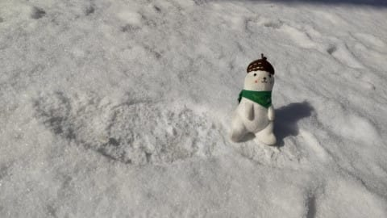
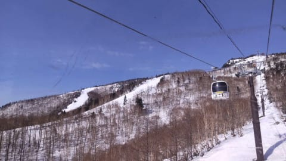
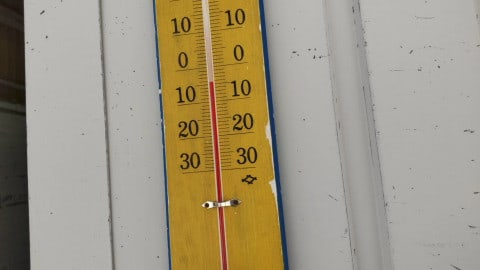
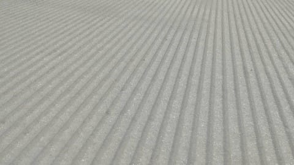
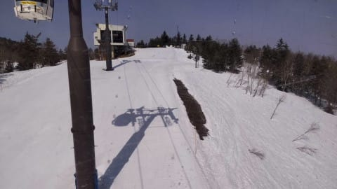
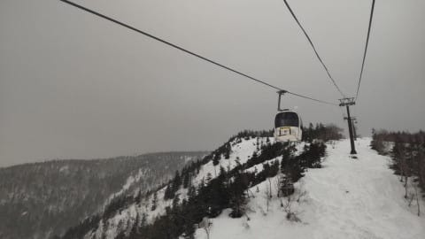
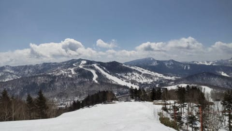
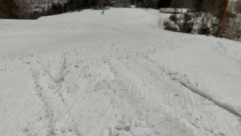
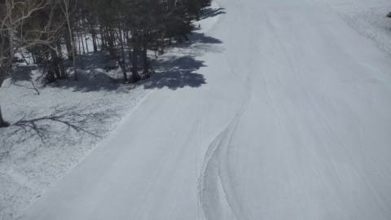
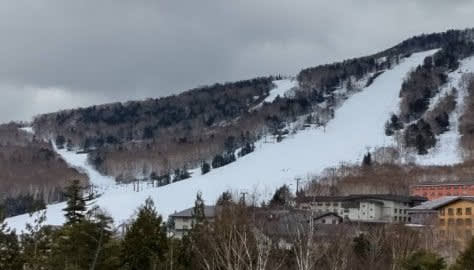

# 2021/4/9(金)の志賀高原特派員情報…そして私は明日から志賀高原へ！朝の積雪はなさそう(涙）

📅 投稿日時: 2021-04-10 00:13:28

🏷️ カテゴリ: [日記](cc4b5682fb7b8b144980957a978653fb0.md)

えー．

今日も，いつもの特派員から

おこみん写真が来ましたが…

早朝まで雪がぱらついていたようで．

あさイチは1cmの積雪があったようです！！

わずかとはいえ，久しぶりの積雪ですね…！

奥志賀は，朝イチは晴れていて…

山頂の気温は-5℃と．

久しぶりの冷え込みです！

晴天，冷え冷え，すごいきれいな

シマシマバーンと，久しぶりに

いい感じの朝じゃないですか…！

…でも．朝イチはかなり硬めの，

スピードが乗るガチガチバーンだった

ようで…

で．

奥志賀は

時折雲が流れてきて，晴れたり

曇ったりだったみたいですが…

なぜか，焼額は雲がかからず，

晴れ渡っていたようで…

晴天の太陽に照らされて，

昨晩から積もった柔らかい雪が緩んで，

硬い下地と新雪が緩んだ引っかかる雪とが

入り乱れた，ちょっと滑りにくい

状況だったみたいです．

昼間は気温は低かったものの，強い

日差しで硬い下地も緩み始めたみたいですが．

逆に溶けた新雪と下地が緩んだ

シャーベット状の雪が混ざって，

板の引っ掛かりが無くなって滑り良くなったとか…

日当たりのよくない一の瀬は，昼近くまで

かなりガチガチに硬かったようです…！

ってな感じで．

今日はそこそこ冷え込んでくれたようですが．

明日からの週末も，久しぶりの

晴天＆まぁまぁの冷え込みに

恵まれそうです…！

予想した，土曜朝の積雪はなさそうですが．

最新情報による週末予想は，こんな感じかな．

土曜：朝から晴れ！終日晴れ！

　あさイチの気温は-7~8℃．

　冷えるよ！！

　あさイチバーンはガチガチ，

　日差しの強いバーンは午前中に

　緩み始めるかもしれないけど，

　昼間も気温は0℃に行くかどうか

　なので，一の瀬方面は昼まで

　硬いバーンをキープ．

　さすがに午後は緩むかな？

日曜：朝から晴れ！この日も終日晴れ！

　あさイチは-3℃以下，

　早朝はかなりのガチガチバーン．

　この日は昼間はプラス2-3℃くらいまで

　上がりそう．

　でも，日差しの悪い一の瀬，奥志賀

　エキスパート方面は昼まで硬めの

　下地が残ってくれそう．

　午後はさすがに日当たりのいいバーンは

　ザクザクに荒れそう．

って感じで，久しぶりの．

実に6週間ぶりの，土日とも晴れの週末に

なりそうです～！

ってことで．

あと3時間後に出発です…(涙）

また，睡眠時間が…

では，志賀高原でお会いしましょう！

## 💬 コメント一覧

### 💬 コメント by (ikkun)
**タイトル**: Unknown
**投稿日**: 2021-04-10 07:28:33

おはようございます❗志賀ですね(笑)昨日野沢温泉でした❗とトイレついでに一本と…受付長い列か(泣)150番でした  

8本霧と雪の中でした  ガリガリガリクソンでした古  ブルーモーリス青プレート付き168が一番ですた( *´艸｀)あフィッシャーRC4WCSCpro フォルクルDEACON72173がお気に入りでしたステキな青空滑走を長い(笑)

### 💬 コメント by (レインボー73)
**タイトル**: Unknown
**投稿日**: 2021-04-10 16:37:12

土曜日の志賀高原情報

朝の上林1℃　蓮池ー４℃　2ゴン上ー４℃。6時30分からの早朝ファーストはもちろん敬遠して、8時30分スタート。明け方にー10℃まで冷え込んだということで、最近では最も硬い。ファースト組が削ってくれてるのに、１時間以上キープ。

その後は一本毎に緩み化が急。11時過ぎに『もういいか』。

なのに、早朝ファーストかららラストまで、しかも昼休憩もなしで、延々と滑り続ける偉人（異人？偉神？）も、おられる。すごすぎでしょ！

### 💬 コメント by (Skier_S)
**タイトル**: 今日は良かった！！
**投稿日**: 2021-04-11 03:12:35

＞ikkunさま

試乗会行ってきたんですね．

FISCHER　SC Proいいですよ！！！

ぜひ物欲に負けてください…

＞レインボーさま

今日はお世話になりました～

途中飲みつぶれちゃってすみません…

### 💬 コメント by (ikkun)
**タイトル**: Unknown
**投稿日**: 2021-04-11 20:47:29

お疲れ様でした😌💓かな？実はスキー関係の軽い飲み会がありまして結構な先輩にストックリーとかブロッサムとか履いておいた方がと意見頂いたので今日行って来ましたが……駐車場は一番上ゴンドラも待ち沢山でした500人を軽く越えてました(・・;)  意外と言えば怒られそうですがロシニョールスーパーヴィルージュⅣなかなかでした❗まデザインが好みでないのは残念でしたが しかし皆さん我慢していましたね？ ちなみにやはりGSから中turn系が好きですね🎵

### 💬 コメント by (Skier_S)
**タイトル**: ＞ikkunさま
**投稿日**: 2021-04-12 01:53:43

試乗会お疲れ様でした．

結構混んでたみたいですね…

ストックリとか，高すぎて自分では絶対買えない板ですね(笑)．

