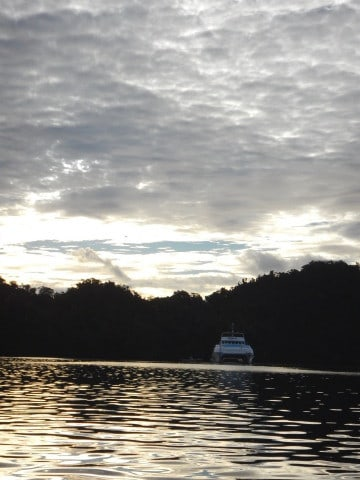

# 2017年8月，小学生の子連れでパラオ再訪！その22…ラストデーは早朝ダイブ！

📅 投稿日時: 2018-10-19 00:48:58

はいはいはいはい．

まだ，ノートパソコンSSD化記事は終わってませんが．

今日は（不人気の）ダイビング記事ですよ～！！

…いや．

この旅行記．

はっきり言って，昨年8月に行った旅行で．

すでに旅行から1年と2か月経ってるというのに．

まだ旅行記が書きあがっていないという，

かなり致命的な状況．

で．

この週末にスキーシーズンインとなると…

このままでは，来年まで連載が続くという，

2年遅れの記事になってしまいそうな予感（涙）．

だもんで．

急いで旅行記を仕上げるために．

今日もダイビング日記へ，Go!

---

ってなわけで．

ついにやってきてしまいました．

ラストデー（涙）．

で．

明日の早朝…

というより，この日の深夜に帰国の飛行機に乗るわけで．

潜水病予防のための，ダイビング後の飛行機搭乗禁止時間を

考えると．

今日潜れるのは早朝のみ…

だもんで．

最終日の今日は，

オプションの早朝ダイブへ行くことにしました～！

昨日も夜遅くまで飲んでいたというのに．

まだ夜が明け切らぬうちに起き出して…

朝6時という，かなり早い時間に．

ダイビングショップのピックアップがやってきます…

眠いよ…

こんな時間に起きて潜りに行こうってのは，

私一人で．

娘と妻はホテルでゆっくりお休みです…

で．

ダイビングショップに着いたころ．

やっと朝日が昇ってきました…

ってなわけで．

朝日が射す中，ボートに乗り込んで…

いざ，早朝ダイブへ！

…でも．

今日はちょっと雲が多いかな…

ポイントまでは，ショップからボートでわずか

10分ほど．

前回来たときは，朝4時半ごろ出発で，

ブルーコーナーやらジャーマンチャネル方面

まで行きましたが…

今回は2人しかいないので，潜るのは近いポイントです．

ポイント名は，「セントカーディナル」．

ここで1本のみの早朝ダイビングです．

比較的浅めのところに，きれいなエダサンゴが

いっぱい群生している，マクロ＆癒しポイントです…

ってなことで．

いざ，エントリー！

しばらくは，カニハゼちゃんやら…

セグメンテッドブレニーやら…

エビちゃんやら…

こんな感じのマクロものを見た後は．

浅瀬に移動してきますが…

ぉぉ！

なんて立派なサンゴの群生…っ！！

朝，日が昇ったばかりなので．

斜光線が差し込み．

…美しぃっ！！！！！

浅いサンゴに，朝日が差し込んで…

美しい…

美しいよっ！！！

なんという，夢のような景色！！

これは…たぶん．

昼間に潜っても，ここまできれいに感じないかも！

この，早朝の太陽が低い位置だからこそ．

こんな写真にも太陽を入れることができて…

見事な写真になるよ！

ってな感じで．

ラストは，美しいサンゴの上を，ひたすら

漂い続けること，30分…

シアワセ…

あぁ．シアワセだよ…

いつまでも漂っていたかったけど．

ダイビング終了時間です…（涙）

あぁ…

終わりたくない…

いつまでも潜っていたい…

けど．

そんなわけにもいかず．

ダイブタイム1時間と，長めのダイブタイムで

エグジット！

…これで．

ついに，パラオの全ダイビングが終わって

しまったのでした…

でも．

最後は超満足のダイブで，良かった！！

## 💬 コメント一覧

### 💬 コメント by (カンタロス)
**タイトル**: イエティ、行って来ました。
**投稿日**: 2018-10-19 21:22:37

ダイビング関係のコメではないのてすが。(笑)

本日、イエティオープン行って来ました。

例年よりも人が少ない印象でした。

去年のようにリフト乗り場手前のカーブで午後になって、底が見えてしまうような事もなく。午後にはリフト待ちほぼゼロ、とういかゲート無ければ滑り込みできるんじゃ⁉️という状況でした。

ゲレンデ幅や厚みは例年並みですね。

初滑り、楽しんで来て下さい！

### 💬 コメント by (yama)
**タイトル**: シーズンイン
**投稿日**: 2018-10-19 23:21:47

イエティオープンしました。ナイター7時から10時までで22本滑りました。朝方の雨のリフトの待ちはほとんどありません。明日は午後からになりま、？、よろしくお願いいたします。

### 💬 コメント by (Skier_S)
**タイトル**: 明日は初滑り！
**投稿日**: 2018-10-20 00:07:25

＞カンタロスさま

ああああ～

いいなぁ～！！

もう行ってこられたんですね…

それで，ガラガラだったんですね…

うらやましい…

雪の状況も悪くなさそうですね．

明日，楽しんできます～！！！

＞yamaさま

ナイター参戦お疲れ様でした．

明日は私は午後6時か7時くらいまで滑ってるでしょうか…

またゲレンデで見かけたらよろしくお願いします！

