# なんだかツイてない今日この頃…と思ったけど，運が良かったのかも？？

📅 投稿日時: 2016-05-20 02:28:43

🏷️ カテゴリ: [日記](cc4b5682fb7b8b144980957a978653fb0.md)

なんだか，このGWの前後．

いろいろ不運に襲われたんですよ．

…立て続けに．

まず，ある日．

車がぎりぎり行き違いできるかどうかという，

狭～い道を車で走っていた時．

対向車が来たので，電柱ぎりぎりをすり抜けようとしたとき…

…っ！！？？？

え？なんだ，この「ガリガリ」っていう，非情な音はっ！？？？？

…ま，まさか…

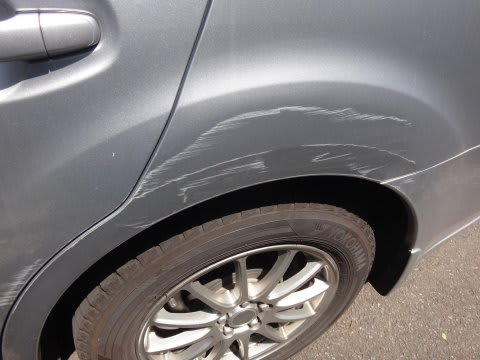

がががががががーーーん！！（激涙）

年間3.5万km，ここ10年だけでも軽く30万kmを超える

距離を運転している自分にとって，車両感覚には

絶対の自信を持っていたのに…っ！！！！！

なんてこった…っ！！！（涙）

ってことで．

生まれて初めて，車の横を擦ってしまうという，

失態に落ち込んでいた，数日後．

スキーで滑ったあと，ポケットに入れていたスマホを見ると…

えぇえっっっ！？？？

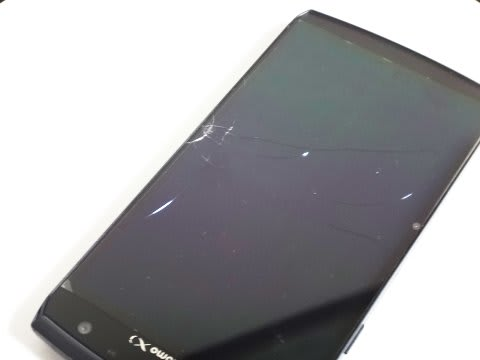

なんじゃこりゃぁ…っ！！！！

ウェアのポケットに入れていただけなのにっ！！

ぶつけたわけでも転んだわけでもないのにっ！！

なぜか，画面に見事なヒビがっ！！！（涙）

な，なぜ，立て続けにこんな目に…（泣）．

おそらく．

車修理で○万円，スマホ買い替えで○万円…

…引っ越したばかりで，貧乏なのに…（涙）．

…

…

…

貧乏だから．

まず，車は自分で何とかしよう．

とりあえず，タイヤ交換のついでに．

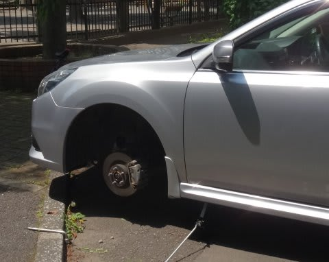

手持ちの自動車用コンパウンドで…

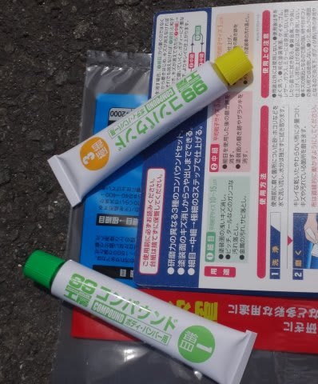

ちょっと試しに磨いてみようかな．

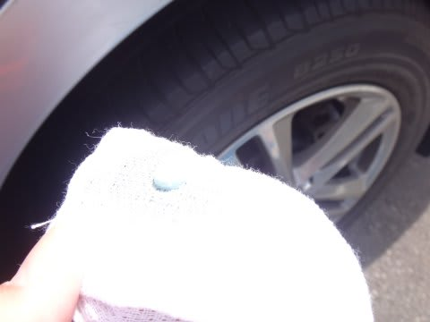

この傷が少しでも目立たなくなれば，ラッキー．

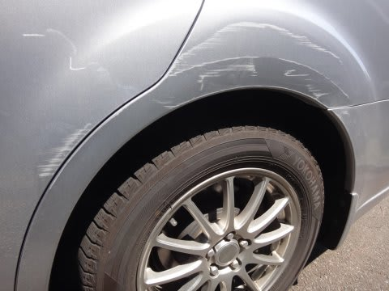

ゴシゴシゴシ…

と，擦ってみたところ．

…ありゃ？

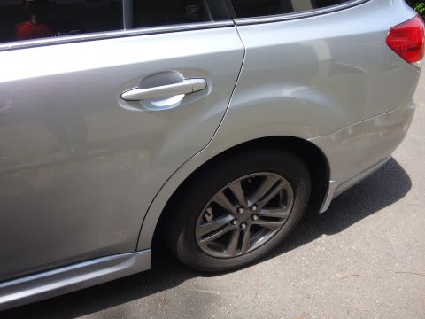

ほとんど傷が消えたよっ！！

思いのほか，傷は浅かったか！？

ら，らっきー！！！

じーーーっと見れば，このくらいの薄い線が残ったものの…

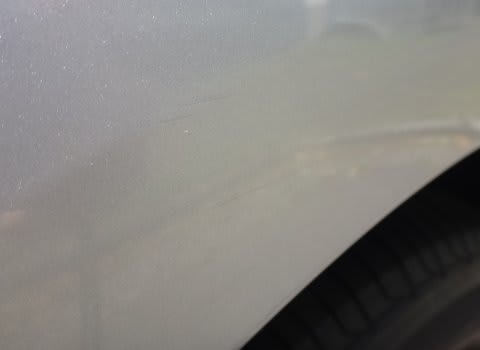

パッと見で全く分からんレベルにまで消えてくれたよ！

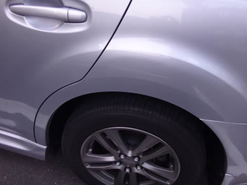

…とりあえず．

車は手持ちのコンパウンドだけで，1円もかからず直せたか…

良かった～っ！！

で．

今度は，スマホだ．

画面が割れただけじゃなく，ついでにタッチパネルまで

完全死んでしまったので．

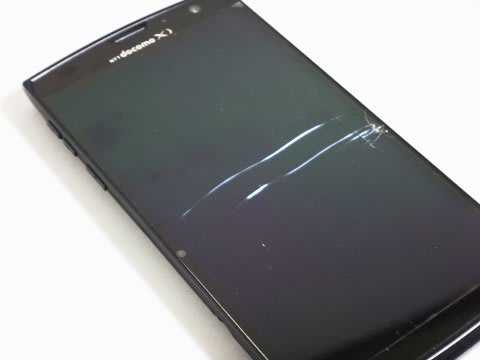

このまま使うわけにもいかず，

自分で修理も無理．

携帯保証サービスにも入ってないし…

…とりあえず，修理費がいくらかかりそうか，

ドコモショップで確認してみるか…

ドコモ店員「画面割れですか…普通に直すと，

　2～3万くらいかかっちゃいますね…」

私「そうですか…（落胆）」

店員「契約を確認しますので，お待ちください」

私（3年使ったスマホで外装もボロボロになってきたし，

　防水性能も弱まってるだろうし，買い替えなくちゃならないかな…）

店員「この年までのモデルの携帯は，携帯保証

　サービスに入っていなくても，購入後3年以内なら

　上限5000円で修理可能ですね」

私「え？そうなんですか？」

店員「次の年のモデルからは，3年以内でも

　破損修理は実費をいただくのですが…」

私「でも…もう3年超えてた気がしますが」

店員「大丈夫です！3年まで，あとぎりぎり2週間あります．

　修理費は5000円です！きわどかったですね～！」

えええ？やったー！

超ラッキー！

たまたま型落ちで買ったこのモデルまでがぎりぎり対象で，

さらに期限まであと2週間という，ぎりぎりセーフだったとは…っ！！

新型を買っていたらアウトだったし，

壊れるのがあと2週間遅くてもアウトだった…

なんというギリギリx2の命拾いっ！

で．

修理が終わったスマホを受け取ると…

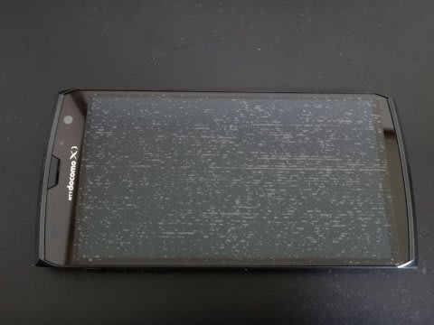

をを！

画面だけじゃなく，外装がすべて新品になってる！

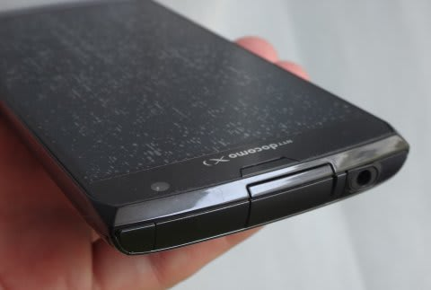

防水キャップも当然新品だし．

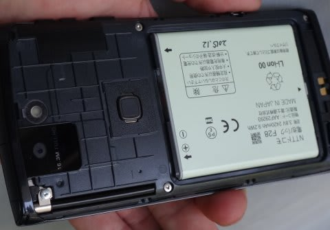

内部もすべて新品っ！！

3年使ったスマホが，5000円で完全にキズ一つない

新品になって帰ってきたよっ！

…これって．

壊れないでこのまま使ってるよりも良かったかも…

ってことで．

車もスマホも，大した出費をすることなく，

むしろ元よりきれいになってくれたので．

運が強いんだか弱いんだか，よく分からんなぁ…

と思った，Skier_Sなのでした…
