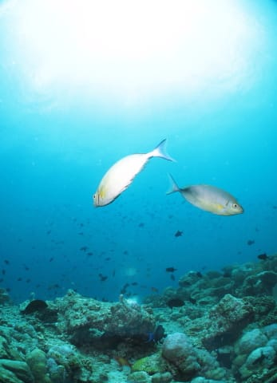

# 2012年　子連れモルジブ　ダイビング旅行記　その8

📅 投稿日時: 2012-10-17 00:28:37

って感じで．

マンタ様大集合の1本目を終えると．

午前中は2本続けてダイビングなので．

2本目のポイントへ移動です．

…モルジブのリゾートでのダイビング．

1本ごとにリゾートに戻ってくるところが普通で．

ロイヤルアイランドのように，午前2本続けて潜る…ってのは

珍しいですね～．

ボートの上では，ジュースなど飲み放題なので．

海を眺めてジュースなど飲みつつ，しばし休憩していると…

2本目開始の時間になるので，2本目のブリーフィングです．

今度のポイントは…「ディグ・ティラ」って名前ですか．

ボトム30mくらいのところにそそり立つ，長さ数10m程度の隠れ根のポイント．

…さっきのマンタポイントでもうお腹いっぱい，って感じだったので．

今度はデザートでも…という感じののんびりダイビング．

まずは，モルジブ固有種のモルジブアネモネフィッシュがお出迎え．

腹ビレが黒いのが特徴なので．

私は「腹黒クマノミ」って呼んでるんですが．

…これだと，なんだか悪人みたいな感じですね(笑）．

で．

こんな感じの．

キンギョハナダイ畑を抜けていきますが…

…

やっぱり．

珊瑚がもう少し元気だとうれしいかなぁ～．

でも，魚影が濃いのはモルジブだなぁ～．

まぁ，基本的にのんびりダイビングですので．

こんな感じで，キンギョハナダイに囲まれつつ…

いろいろ癒される魚たちを眺めて…

このナポレオンは結構でかかった…

そして，1時間ほどのダイビングでエグジット．

まぁ，1本目のメインディッシュのあとのデザートダイビングとしては満足かな～．

って感じで．

午前2本のモルジブダイビングを満喫したら，もうお昼になってますので．

娘が待つ，リゾートへ戻ります…

