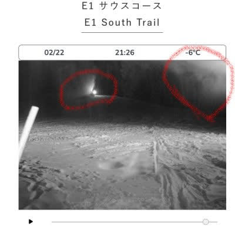

# 2月22日(木)の志賀高原スキー場特派員情報…そして私は明日からまた志賀高原へ行くとお思いでしょうが

📅 投稿日時: 2024-02-23 00:30:16

えー．

昨晩の水曜日の夜も高温で雨が

降り続いた志賀高原．

木曜の未明には雪に変わり，

朝までに5－10cmの積雪がある

だろうなぁ…

と思っていたところ．

特派員レポートによると，

なんと．雨が雪に変わったのは

朝のリフト営業開始のころで．

今朝の営業開始時は積雪ゼロ（涙）

でも，あさイチの山頂の気温はやっと

マイナスとなり，－3℃．

うーん．もう少し冷えると思ったけど…

この雨のおかげで，かなり融雪が進み．

リフト下の笹が顔を出し始めてきて…

…今まで2月に第2高速リフト下の笹が

見えてきたなんてことがあったろうか！？？

ただ，朝9時前後からそこそこの

雪が降ってきたみたいで…

10時過ぎには硬くなったバーンの上に

ちょっと雪が積もり，午前中はまだ

気持ちよく滑れたみたいです…

が．

雪が積もったのはわずかで．

昼になるとほぼ雪がやんでしまい…

コース全面，午後には雨で融けた雪が

固まった，強烈ガチガチバーンに

なったようです…(涙)

午後の一ノ瀬は，

アイスバーンが3度の食事より

大好きな某大御所が，

「手ごわい」というほどの

ガチガチバーンだったみたいで…

ガチガチになっただけではなく，

かなり雪が融けたので，焼額は

ヤケビバレー，ヤケビウォールがクローズに

なっただけじゃなく．

オリンピックコースが圧雪できないほど

雪が薄くなったみたいです（激泣）

（[焼額山スキー場ホームページ](https://www.princehotels.co.jp/ski/shiga/winter/)より）

今日，オリンピックコースを滑った人

によると．

ところどころ雪に穴が開いて，

結構石ころが出ていたという話

だったので…

かなり厳しそうな感じ（涙）

オリンピックコースやブナコースは

ちょっと厳しくなり，白樺コースも

ところどころ雪が茶色くなったところが

あるようですが…

パノラマコース，さらに

人工雪を打っているGSコース（一部を除く），

唐松コース，サウスコースはまだ

全然大丈夫という報告が入ってますし．

さらに今，焼額のライブカメラを見ると…

え？？

これ，人工雪を打ってる！？？？

（[焼額山スキー場ホームページ，ライブカメラページ](https://www.princehotels.co.jp/ski/shiga/livecamera/)より）

この右上の部分に人工雪が舞っている

雲のような白いのが見えるし…

さらに向こうのほうには，ライトをつけた

人工降雪機が稼働してます…！！！

2月末にも近いこの時期に人工雪を

打つとは…！！

他のスキー場で，この時期に人工雪を

打っているスキー場はないんじゃない

かなぁ…

さすが焼額，コース維持の努力が

すごすぎる…

そして．

22日深夜0時現在．

志賀高原は雪が降って，ちょっとだけ

積もってるようですね…

（[北信建設事務所道路気象状況カメラ](http://hokushin.pref-nagano-roadcamera.jp/)より）

ただ．

明日までの積雪量はそんなになさそうで．

多くて5cm．ヘタすりゃ2－3cm．

バーン状況の改善は望み薄（泣）

それどころか，明日はさらに気温が冷える

ので…明日は，朝はうっすら乗った雪で

まだましかもしれませんが．

じきに，

志賀高原 春の全面アイスバーン祭り

（まだ冬だけど…）

が開催される可能性高いです．

かなり盛大なお祭りになりそうな感じ…（泣）

で．

今後ですが…

おおむね昨日の予想通りで．

23日も積雪はほとんど期待できず．

24，25日も曇り時々晴れ間が見える

ほどで，積雪は期待薄．積もっても

せいぜい1－2cmって感じ（涙）

うーん．

3連休はアイスバーン祭りが続くか…（激泣）

次に雪が積もりそうなのは27日の火曜

から28日にかけてかなぁ…

でも，10cm程度．

ドサドサ降るのは期待薄（泣）

その後は，来週末まであんまり

降りそうな気配はないです（激泣）

あぁ…まだ2月というのに…

で．

明日からは3連休なわけですが．

このBlogを読んでいる2億8000万人の

読者の方は，私がまた3連休で志賀高原に

行くとお思いでしょうが．

残念ながら，仕事をやっつけねばならず，

金曜のスキーはあきらることになりました（泣）

とりあえず，土日の1泊2日でスキーに

行けるよう，明日は仕事を終わらせるべく

必死に頑張ります…

まぁ，冷え冷え最高雪の激烈最高バーン

じゃないだけ，スキーに行けなくても

あきらめがついてよかった，

とポジティブに捉えよう…

## 💬 コメント一覧

### 💬 コメント by (GTO)
**タイトル**: Unknown
**投稿日**: 2024-02-23 00:47:23

初めて投稿いたしますGTOと申します。いつもブログ楽しく拝見しております。仕事の合間で無理無理来てしまいました。年に数回の1泊0.5日+0.5日、国道1号影取の交差点から始めて4時間で到着しました。こんな早く着いたのはじめてのような。そして降ってます！小雨みたいな雪だけど、状況悪いと聞いていたので喜びの声をあげてしまいました。焼額で-6度、明日朝に期待です。ガリガリかもしれませんが。志賀高原に来られただけで幸せ気分になってます。

### 💬 コメント by (地元民)
**タイトル**: Unknown
**投稿日**: 2024-02-23 08:28:00

こんな異常暖冬初めてです。氷点下にならない日が続出なんて、記憶にないです。

信毎に、志賀高原でさえも３月半ばに雪がなくなるのではないかという記事が出ました。

### 💬 コメント by (真美子)
**タイトル**: Unknown
**投稿日**: 2024-02-23 09:34:22

いつもいつも、blogお疲れ様です。

私も24日土曜日から26月曜日のお昼まで、志賀高原焼額山で、滑っています。

以前もお話したとおり、人工股関節なので、アイスバーンなら、チンタラ、ズルズルと横滑りで滑ります。

見掛けたら、声をかけてくださいませ、

### 💬 コメント by (Skier_S)
**タイトル**: 明日から志賀高原！
**投稿日**: 2024-02-24 00:10:22

＞GTOさま

コメントありがとうございます~！

そちらも仕事の合間に無理無理滑ってらっしゃるんですね（笑）．

あさイチはちょっと良かったんじゃないでしょうか．

でも，午後はガリガリくんだったようで…

私は明日から志賀ですので，もし見かけたら声かけてください！

＞地元民さま

いや…私も2月でここまで雪が少ないのは初めてです．

ヤバいです．

このペースだと，4月までもつイメージが私も持てません…

現時点では，史上最悪のシーズンです…

＞真美子さま

明日から志賀復活です~！

私は上下オレンジの服を着てます．

見つけてください～！

