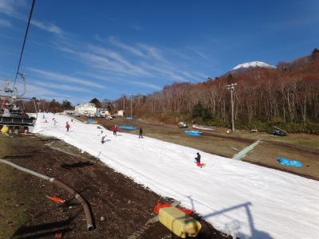

# 11月13日，日曜のYeti　混雑の状況は…

📅 投稿日時: 2011-11-14 02:08:59

ということで．

やっぱり軽井沢はリフト待ち20分ということなので．

そろそろ飽きてきたかなぁ…

と思いながらも．

今シーズン5日目になるYetiへ行ったわけですが．

気温もウェアを着ていると暑いほど，予想よりぽかぽかと

あったかく．

雪もちょっと柔らかい感じで．

ところどころ，雪が薄いところもあったけど．

コース幅は広がってますね～．

先週よりは．

しかし…．

リフト待ち20分ってわけでは無いですけど．

そこそこ混みましたよ．

まー，とは言っても．

クワッドリフトは昼過ぎに待ち最大5分強くらい，

ペアリフトも今回，午後には待ちが出ました…

といっても，最大で1-2分程度ですけど．

リフト待ち20分よりはずーーーーっとましですね．

…でも．

コース上の人は，これまでになく多かった…

あ，とは言っても．

午前10時くらいまでは人も少なく．リフト待ちもほとんどなく

快適だったんですよ．

こんな感じで．

しかし．10時ごろからは人が増えて．

昼過ぎには，かなりの人口密度に．

普通のスキー場なら，昼を過ぎると人が減っていくんですが．

Yetiは昼を過ぎてから人が増えていくという．

かなり不思議なスキー場ですね～．

首都圏に近く，朝イチにこだわらないボーダーが多いので，

昼ごろにのんびり出てこよう，って人が多いんですかねー．

という感じで．

リフト待ちがないのはいいです．

が．

午後からは，ちょっと衝突危険性を感じる人口密度でした…

まぁ，低速のトレーニングをするには問題ないんですけど．

段差を飛んできたボーダーによこから突っ込まれたのは勘弁…

まぁ，なによりかにより．

リフト待ち20分という状況に比べれば，

一日30本近くリフトに乗れたので，

コース上の混雑も，許せると思う…

