# Amazfit GTRスマートウォッチを買ってみた，その7…GPS精度，ちょっと良くなった？でも，すごい高精度になったわけじゃないけど

📅 投稿日時: 2019-10-23 00:45:20

🏷️ カテゴリ: [PC,カメラ&小物](c0d8caed13e597efe97b661a8ae56bed0.md)

これまで，Amazfit GTRのレポート

その1．[購入レポート，](e07b216ec3b426f7a5a1462a3b6fd1c02.md)

その2．[開封＆試してみた感じ，](edd1205f6bd9cd6dadb50e4fc6316b747.md)

その3．[アクティビティーログ](ecd7317c7980728b41dae1a21fe835803.md)

その4．[スマホアプリのインストール＆設定](eb88e9293dae421d12f27fe8b5b363344.md)

その5．[スマホアプリを使ってみた](e031a6cc94592b655560de20fc58cacf1.md)

番外．[常時点灯機能追加！](ec221351f854b20de445e565d66acdf55.md)

その6．[GPS精度が低いのが欠点](eef49f5206ed798087941af71eebf0dee.md)

と，記事を書いてきたわけですが．

まさか，まだ続くとは思わなかった

このシリーズ．

今回は何のネタかというと．

この休みに，また山登りを

してきたわけですが，

その際に，またAmazfit GTRで

アクティビティーログをとってみて．

…なんだか，蓼科山に登った時より，

GPS精度が少し上がった気がしたので，

ちょっとそのネタを書いてみます…

まず．

[前回の蓼科山に登った時](eef49f5206ed798087941af71eebf0dee.md)．

ほぼ真っすぐな登山道を

歩いた時でも，こんな軌跡に

なっていて．

一体どうなっとるんじゃい？？

と思いましたが…

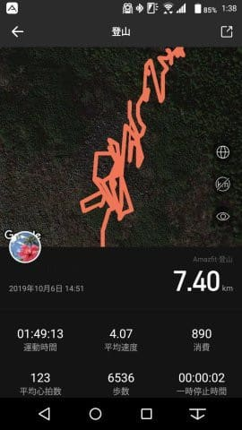

今回，浅間山の外輪の山々を登った

記録を見ると…

距離は多少長く出ているものの．

ルートは前回よりまともに

なってる気が…？？？

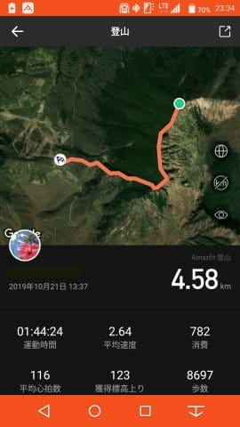

とりあえず，ルートを拡大してみてみましょう．

大体，車や建物がこのくらいのスケールに

見える程度に拡大してみます．

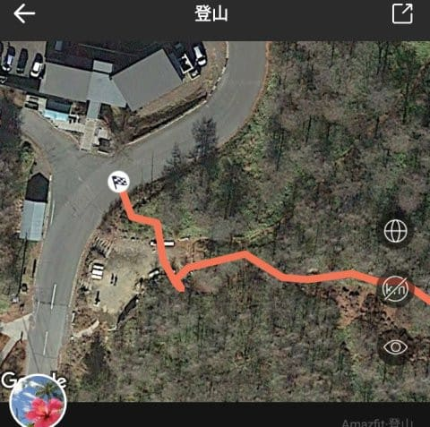

んで，登山道のあたりを見てみると…

このあたりは，大体登山道に沿って

軌跡が残ってますね．

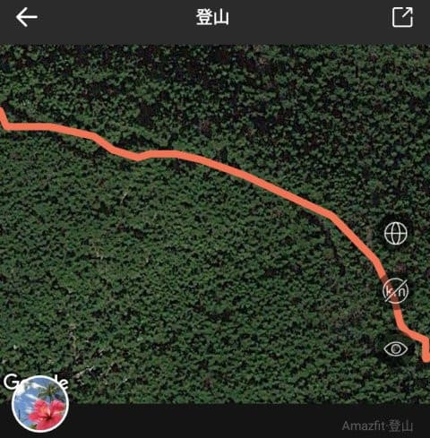

そして，このあたりは

景色がいいところで，ちょっと

脇にそれたのが分かるほどの

精度で記録されてます…！

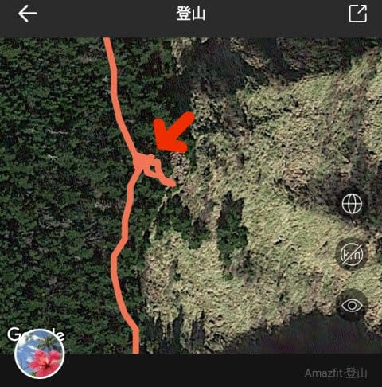

[蓼科の記録](eef49f5206ed798087941af71eebf0dee.md)に比べると，

ずっとマシですね…！

以下の数枚は，今回の浅間山

外輪山の時の記録では無いのですが．

周りにGPS信号を遮る何物もない，

見晴らしのいい平原を歩いた時の

記録を見てみると．

概ねルートからそれほど外れてない

ところに記録が残ってます…

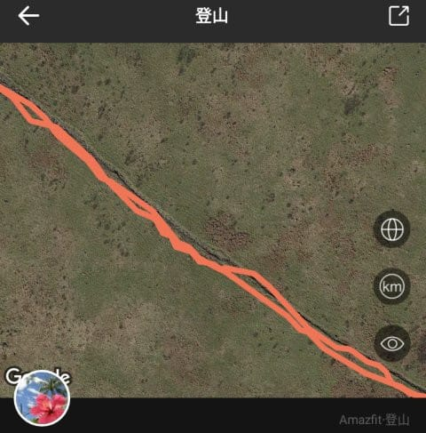

これなんかも，ちゃんと道の上に

軌跡が残っているので，

車のサイズから考えてみても，

5m程度の誤差で記録が残ってると

思います…

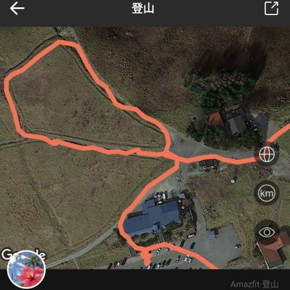

これなんか，建物を避けた

ところや，看板を見に行った

ところがきれいに記録されて

ますね．

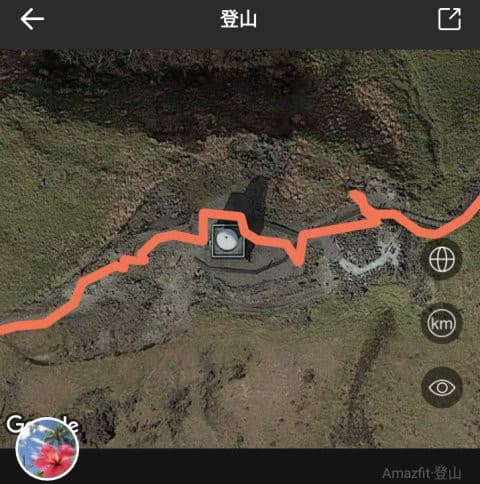

うーむ．

Amazfit GTR．

ファームアップでGPS精度が上がったのかな？

とはいえ，こんな感じでずれたところも

あって…

これは誤差10m以上ありますね．

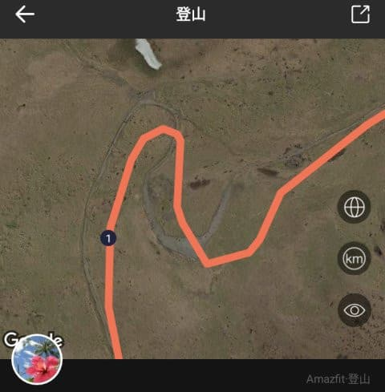

…そして．

また，浅間山の外輪山の記録に戻ると．

高い木々で周りがさえぎられるような

ところでは…

赤線が登山道なんですが．

GPS記録は，10mほど登山道から

ずれてる感じですね…

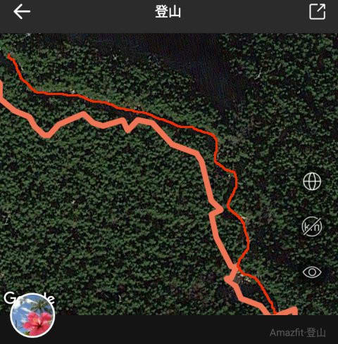

これなんかも，登山道から

10m以上外れちゃってるところが

あります．

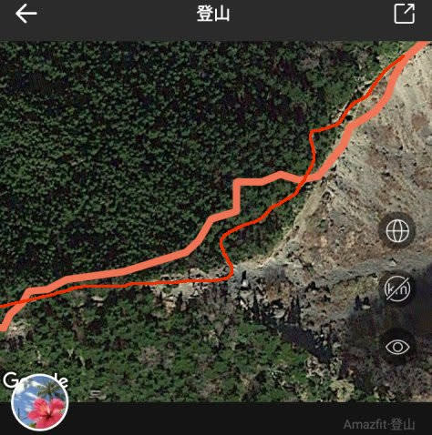

そして，ごく一部．

GPSの信号が受信しにくいのか，

片側が崖にさえぎられているような

所を歩くと…

やっぱりちょっとGPS記録が

残念な感じになっちゃってます．

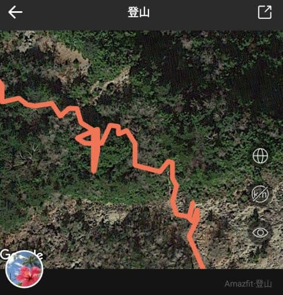

しかし，今回，こんな軌跡が

ぐちゃぐちゃになっていたのは

ここだけでした…

あとはおおむね，山の中の

見通しが悪いところでも，

10m強くらいの誤差で記録が

残ってた感じで．

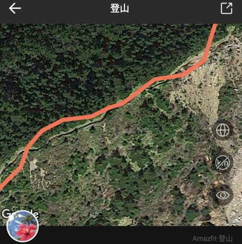

前回の蓼科山の

「なんじゃこりゃ？？」

ってのに比べれば．

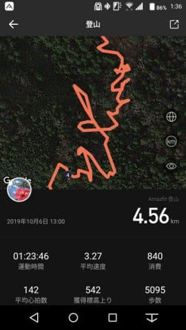

（前回の蓼科山の記録）

かなりマシな感じでした…

うーむ．

本体のファームアップで，多少GPS精度が

上がったのかな？？

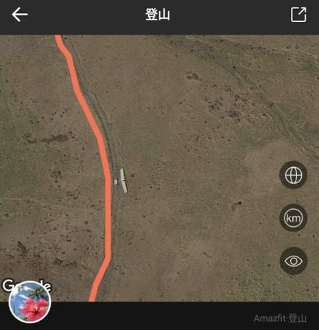

…とはいえ．

2-3m以下の精度でGPS記録が取れるらしい，

Amazfit paceやBipといった従来モデルと

比べると，10m近くずれがあるAmazfit GTRは，

まだ精度が低いですね（涙）

ファームアップでもう少しよくなって

欲しいなぁ…

Amazfit GTR，電池もちを重視するあまり，

GPSの受信頻度や計算精度を落としすぎ

てるのかなぁ…

GPS信号精度が低かったら，加速度

センサーでなんとか補完するような

ファーム，作れないかなぁ…

でも．

今回．

一度GPS信号を補足してから

アクティビティーログ取得を

再スタートする方法で，

高度もかなり正確だったし．

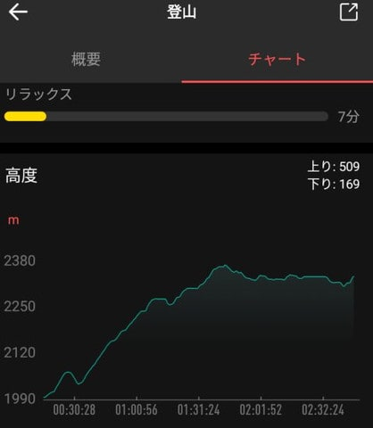

スキー前のトレーニングの目的で，

心拍数を一定エリアに入れながら

歩くという負荷調整もできたし．

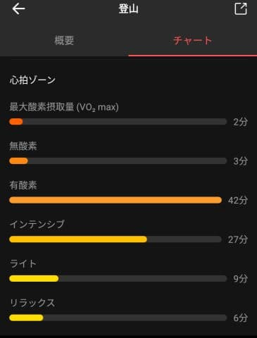

いろいろ便利に遊べて面白いん

だけどなぁ～

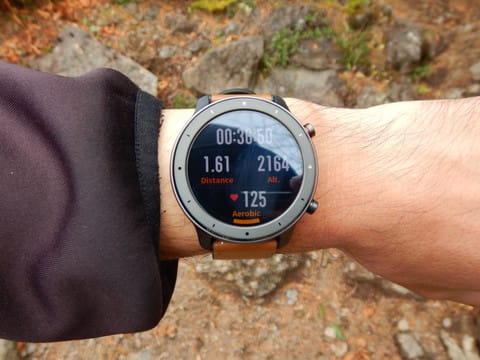

でも．

蓼科に登った時の

「これは使い物にならん…（激涙）」

というレベルのGPS精度に比べれば．

今回の結果を見ると，目安程度には

使えるレベルに達したので，

まぁ良かったことにしておこう…

PS.

このBlogを書くにあたって，

Amazfit GTRのもう一つの欠点に

気づいてしまいました（泣）．

このAmazfit GTRのGPS記録．

GPX形式とかで，外部ファイルに

書き出すことができない…（涙）
