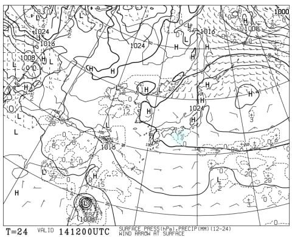
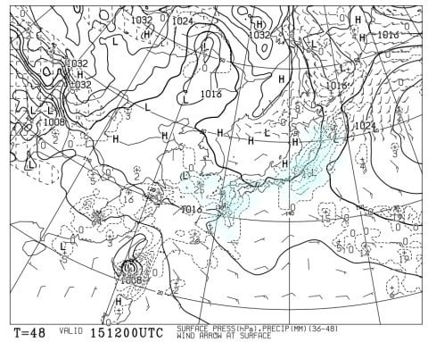
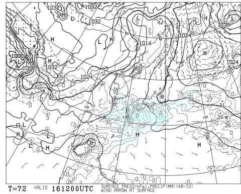
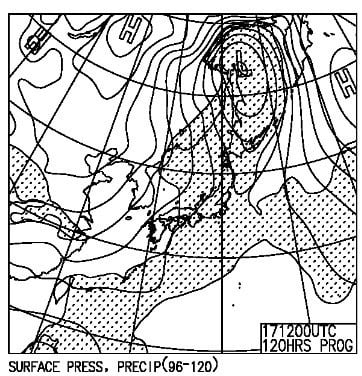
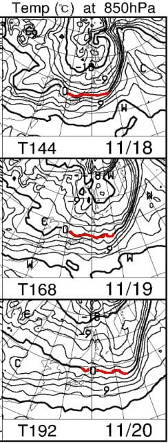

# 11月16，17日の週末のイエティと軽井沢スキー場の天気は…土曜は晴れのち曇り，日曜は曇りでイエティは午後雨かも？

📅 投稿日時: 2024-11-14 03:13:55

🏷️ カテゴリ: [スキー天気予想](c6554f5c3c106093b511a8daae23757e8.md)

ということで．

今日もあまりのんびり記事を書いている

時間がないのですが…

とりあえず，水曜深夜恒例の，週末の

スキー場の天気予想を，ちょっと手短に…

えー．

まず．

14日木曜日の地上天気図を見ると．

この日は本州は高気圧に覆われるので，

おおむね晴れそうですね～！

ただ，気温が上がるので，日差しで

雪は緩みそう…

そして15日金曜日の地上天気図ですが．

こちらは…太平洋側に水色の降水域が

かかってますね…

軽井沢もぎりぎり降水域がかかってるので．

イエティは終日雨がぱらついたり止んだり．

軽井沢はわずかに霧雨みたいなのが降る

感じかな…

この日も気温は高いです．

で，週末の16日の土曜の地上天気図は．

うーん．西から降水域が近づいてくるけど…

おそらく昼間の営業の間は高気圧に

覆われて晴れて，夜になって降るパターン．

イエティのナイターは，雨がぱらぱら

降る可能性が…

そして．

日曜17日の地上天気図は．

うーん．網掛けの降水域が日本を覆って

いるので．

おそらくイエティも軽井沢も雨になりそうですが…

雨の降りはじめタイミングがまだ正確に

分からず．

運が良ければ昼間は晴れて，降りはじめは

夜になるかも…

ってなことで．

まとめると．

14日(木)：軽井沢・イエティとも晴れ．

　気温が上がるので，昼間の雪は緩みそう．

15日(金)：イエティは朝から曇り時折雨．

　そこまで強い雨にはならない．

　軽井沢は曇り．軽井沢でも運が悪いと

　ポツポツ雨か霧雨っぽくなるかも．

　気温は高め．

16日(土)：軽井沢・イエティとも朝から

　晴れ！

　午後になって雲が増えていく．

　気温は平年より高く，日が射すと

　暖かい．

　午後になって雲が増えていき，

　イエティはナイターで雨がぱらつく

　可能性も…

17日(日)：軽井沢・イエティとも朝は

　晴れてるかも？でも，天気は曇りのち雨．

　雨の降りはじめタイミングが

　わからないけど，運が良ければリフト

　営業中は降らずに済む．

　でも，イエティナイターの時間は

　雨にやられるかも…

という感じでしょうか．

今週末までは気温が高い日が続きます…（泣）

ただ．

週末が終わった18，19日は850hPaの

赤い0℃線が，志賀高原近辺まで下がって

くれるのだ！！

20日には北上しちゃうけど…

でも，久しぶりに冷えるのだ！

そこに期待するのだ！！

…ただ，これでもほぼ平年並みで，

これまでが暖かすぎなんだけど…

23日の週末には，横手や熊の湯が動くと

いいなぁ…

（期待薄だけど）
