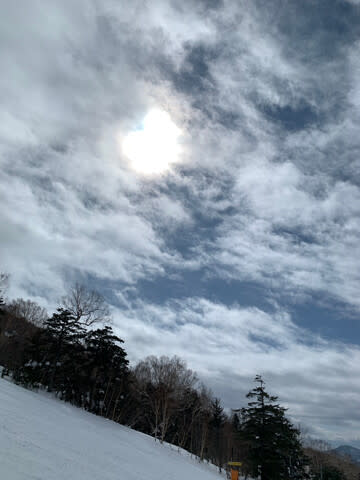
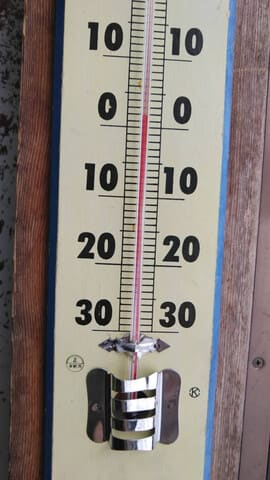

# 3月2日(日)の志賀高原スキー場は，特派員によると朝のうち雨だったけど意外と楽しかったとのこと…そして2日深夜の志賀高原も雨(泣)，3日は朝から雪になるよ

📅 投稿日時: 2025-03-03 02:30:12

🏷️ カテゴリ: [日記](cc4b5682fb7b8b144980957a978653fb0.md)

ということで．

本日も一日，週末なのにスキーができない

悲しみに暮れ，泣きながら家で過ごしたわけ

ですが…

この，スキーができない怨念を送り続けていた，

日曜の朝の志賀高原．

みそ汁やコーラは降らなかったけど，

怨念が届いたのか，雨でのスタートだった

ようです…！

とても3月になったばかりと思えない，

朝の山頂でも0℃と異常なほど高めの

気温だったものの…

夜中にしっかり冷え込んだ雪は，

朝の小雨程度ではそんなに悪く

なっていなくて，あさイチシマシマを

楽しめたようです…！！

うーーーーん．

怨念の送り方が足りなかったのか…

午前中は，かなりガスって視界が

悪いタイミングもあったみたいだけど．

山頂はみぞれ，山麓は小雨という

感じの天気で，山頂まで雨にならず，

そこまで土砂降りでもなかったので，

雪はそこまでザブザブにならず，

重さがあるものの，しまったエッジが効く

いい雪だったようで…

そして，天気が悪かったこともあり．

土日にしてはそこまで混んでおらず．

そのうえ，第2高速リフトが故障で

動いてない本日も，第2高速乗り場から

第1，第2ゴンドラ方面への連絡バス

（ワゴン車も含んで複数台体制)

でピストン輸送されていたこともあり．

バスを使えば第2高速リフト沿いの

白樺コースや唐松コースも滑れて．

リフトが動いてないこのコース，

さすがに滑る人が少なく，

ガラガラで夕方までずっとシマシマが

残っているレベルの，快適フラットバーン

だったようです…！！

心配だった雨も，午前には止んで，

昼間は青空がのぞくタイミングもあったよう

です…！！

あぁ…

これは怨念の送り方が足りなかったのか…

とはいえ，日が射したのはわずかな時間．

その後はまた曇り空になったようですが，

午後は雨は完全にやんでいて．

そして，昼間の気温も+5℃を越えるかと

思っていたら，それほど上がらなかった

みたいで…

雪はさすがにしっとりと重めの感じに

なったようですが．

ザブザブに板が潜ったり張り付いたり

するような雪ではなく，

人が少なかったこともあり，それほど

荒れなかったようで…

午後も山頂付近にちょっとガスが出る

タイミングがあったものの．

夕方ラストのころは，眼下に見事な

雲海も見られたようで…

なんだか．

朝イチは雨でイマイチだったり，

第3高速リフトが故障でしばらく

止まったりしたものの．

そんなに混まなかったし，山頂付近は

雨にならず，雪も思ったほどひどく

ならなかったし．

リフトが動いてなくて無人の貸し切り

唐松コースを滑れたり．

…意外と楽しめた一日だったようです…

…やはり，怨念の送り方が足りなかったか…

…そして．

昨日の記事で予想した，

朝は一瞬晴れそう

という晴れ間は昼間にズレて．

リフト営業中は降らなさそう

というのが，朝に1時間ほど降ったりと．

今日の予想も，ちょっと外してしまった感…（泣）

ってなことで．

意外と楽しかったらしい，今日の焼額山ですが．

長らく故障運休だった第2高速リフト，

明日，3日(月)から復活です～！！！

（[焼額山スキー場ホームページ](https://www.princehotels.co.jp/file.jsp?id=474467)より）

…ただ．

深夜2時現在の志賀高原．

やはり予想通り，雨が降ってるようです…（泣）

（[北信建設事務道路気象状況カメラ](http://hokushin.pref-nagano-roadcamera.jp/)より）

この雨は，3日(月)の朝には雪に

変わりそうですが…

3日の850hPa図を見ると，こんな感じで

塔温度線の間隔がかなり詰まっていて…

拡大すると，北陸から東海までの

わずかの間で，気温が-6℃から+9℃まで

15℃以上変わるという恐ろしい天気図．

…これ，予想よりわずかに空気が北や

南にずれただけで，気温が大きく変わる，

天気予想泣かせの天気図です…(涙)

だもんで．

正確な予想は難しいけど．

3日(月)：明け方まで雨，朝から冷え込んで

　雪に変わる．

　夜からの雨で緩んだ雪が朝は凍りだし，

　ガチガチの下地の上に雪が積もっていく感じ．

　朝から気温がぐんぐん冷えていき，　

　昼頃までに積雪20cmほど積もりそう．

　朝の雨から雪への切り替わりのタイミングが

　早ければ，30cmは積もるかも？

　午後は雪がやんでいく

4日(火)：朝までの積雪は無し．

　気温は平年並みかそこそこ冷えそう

　だけど，雪は降らず．

　朝は晴れてるか？昼頃か夕方くらい

　から曇りだす．

　夜から雪が降り始める

　

5日(水)：朝までに重めの雪が30cm以上

　積もってるかも？？

　朝は雪降りだけど，気温がぐんぐん　

　上がっていき，どこかのタイミングで

　標高が低いところからだんだん雨になり，

　最後は山頂まで雨になる．

　午後は雨がやんだり時々強く降ったり．

　この日は夜までひたすら雨が降り続ける．

　雪がかなりダメダメにやられそう．

6-7日(木-金)：一気に冷える．

　この2日間，雪が降り続ける．

　運が良ければ結構降ってくれて，雨に

　やられてアイスバーンになった下地は

　隠れる．

という感じでしょうか…

うん．

今晩と5日の夜の雨はヤバそうだけど，

どちらも翌朝には雪になって，くれそう

なので…

新雪がたっぷり積もって，アイスバーンの

下地が隠れて，バーンコンディションが

リセットされるのを期待…！！

## 💬 コメント一覧

### 💬 コメント by (レインボー77)
**タイトル**: Unknown
**投稿日**: 2025-03-03 20:18:00

月曜日の志賀高原情報

湯田中は明け方から重ーい雪。蓮池は-2℃。

8時17分ダイヤスタート。かなりのみぞれ。新雪10だけど、どんどん補充されるのでずっと快適。３人で思い思いのコースを美味しく頂戴して10時終了。ダイヤで大正解でした。

ヤケビの白樺は、雪が重くて楽しくなかったそうな。

### 💬 コメント by (べー)
**タイトル**: Unknown
**投稿日**: 2025-03-03 22:45:14

Ｓさん

Ｓさんのいない志賀高原を土日と堪能してきました

日曜は怨念の洗礼を受けましたが（笑）

月曜は滑らずに長岡聖地巡礼経由で帰宅となりました

私はブーツ調整とリキッド注入、同行者は秘孔を突かれてブーツ購入となりました（笑）

やはり長岡は危険です…

### 💬 コメント by (Skier_S)
**タイトル**: 滑れなかったのに週末睡眠不足
**投稿日**: 2025-03-04 02:59:12

＞レインボー77さま

今日はそれほどひどい雨じゃなかったようで良かったです．

雪は重かったようですが，雨よりは100倍マシですから…

＞べーさま

あら…同行者さん，物欲の秘孔を突かれましたか…

長岡のあのお店はヤバいですから(笑)．

でも，いいブーツを履くとスキーが上手くなってもっと楽しくなるからOKです！！

### 💬 コメント by (富山県民)
**タイトル**: Unknown
**投稿日**: 2025-03-06 11:56:22

こんにちは。

3月2日は当初は妙高杉ノ原スキー場に行く予定でしたが雨予報に変わったために結局断念しました。

3月1日に長野市で泊まり3月2日に帰りに妙高高原を通りましたが小雨でした。

今週末は天気に恵まれそうです。

### 💬 コメント by (Skier_S)
**タイトル**: ＞富山県民さま
**投稿日**: 2025-03-07 02:10:38

妙高は小雨だったんですね…とりあえず今週末の妙高は重い雪かもしれませんが，

雪が積もったゲレンデのはず…！！

