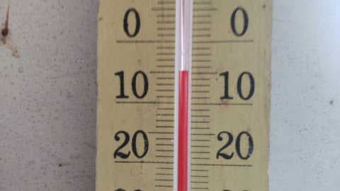
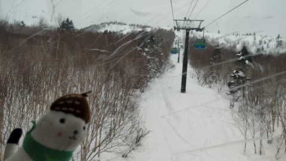
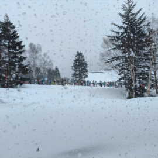
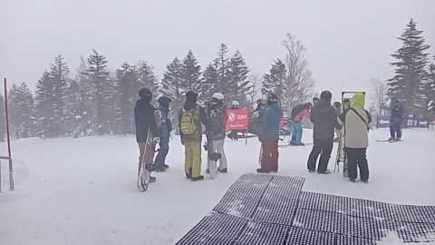
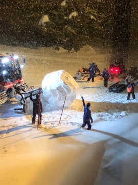

# Skier_Sは今週末も志賀高原に行くとお思いでしょうが…無理です．ダメです．行けません（涙）

📅 投稿日時: 2023-02-11 03:26:23

えー．

本日金曜日．

首都圏はそれほど雪は積もらないだろう…

と，昨日の天気図を見て予想していたのに．

予想より雪が積もってしまい．

志賀高原の天気は予想できるけど，

自分が住んでいるところの天気が

正しく予想できないことを知った，

Skier_Sです．

うーん．

自分が住んでいるところより，志賀高原の

天気の方が正しく当てられるというのは．

役に立つんだか立たないんだか…

ってなことで．

どうやら志賀高原も，今日は雪降りだった

ようですが．

雪降りだけじゃなく，風も強かったようで…

本日の特派員情報によれば．

朝の気温は-5℃と，ほぼ予想通り．

朝から雪だったみたいですが…

強風で奥志賀ゴンドラ，焼額第2ゴンドラは

運休．

第1ゴンドラだけ，ギリギリ動いたみたい

です…

動いているゴンドラは第1ゴンドラのみ

なので，人が集中して平日というのに

すごい列になったようで…

そして．

午後1時には強風で第1ゴンドラも

運休になったようです…

で．

気温は高めながらも，

結局一日中雪が降る．風の強い

荒れ気味の天気で．

今日はスキーするにはちょっと

厳しい天気だったようです…

しかし．

こんな悪天候の中．

焼額はなんだかテレビの撮影を

やっていたようで…

なんか巨大な雪玉を作ってた

みたいですね．

これ…

何に使ったんだろう？？

とりあえず．

明日の志賀高原は，朝まで雪が降って，

硬い下地は雪に隠れてくれて．

さらに午前中に天気が回復して

いきそうなので．

明日の土曜はいいと思いますよ～！！

…でも．

私は滑りに行けないけど（激涙）

いや．

先週，[かなり無理な幽体離脱](e207f38b31c55134b6c874a80d37b6d99.md)をした

反動が…

というか．

先週末の日曜に，

「うがーー！！滑りに行きたい！

　ダメだ！！！

　今週の仕事，来週末に回して滑りに行く！！」

と．

次の週末に仕事を回すという禁じ手で

スキーに行ってしまったので…

今週は泣く泣く家で過ごします…

いや．

また幽体離脱するのかもしれませんが．

多分，今週末は幽体離脱はできないだろうなぁ…

今週末も，天気良さそうなのに…

そしてもう午前3時（泣）

## 💬 コメント一覧

### 💬 コメント by (副院長)
**タイトル**: Unknown
**投稿日**: 2023-02-11 13:33:09

S様、今週はお仕事なのでしょうか？土曜日休日なので、金曜日仕事おわってから、湯田中まで、中央道通行止め。関西人はくじけず、北陸道まわりです。80キロほど伸びます。混雑さけて、サンバレーから、始めてます。あ、風もなく、青空で、ポカポカです。

### 💬 コメント by (Skier_S)
**タイトル**: ＞副院長さま
**投稿日**: 2023-02-12 05:48:51

今週はお仕事です（涙）

北陸道回り志賀高原，お疲れ様です．

私のいない志賀高原，楽しんできてください（泣）

明日も気温が上がりますが，いい天気ですよ～！！

