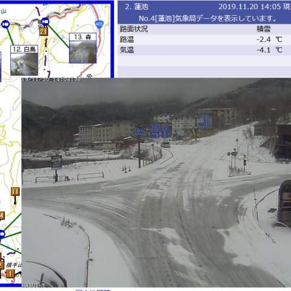
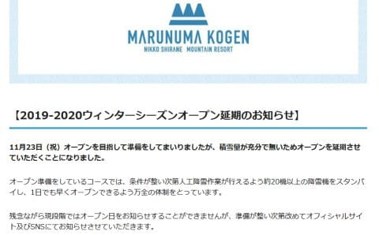
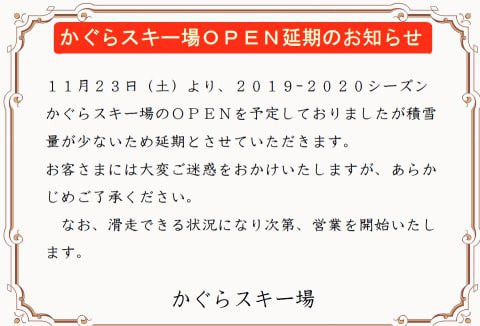

# 今週末，かぐら，丸沼オープン延期決定（涙）．そして，志賀高原の天気を簡易バージョンにて

📅 投稿日時: 2019-11-21 01:32:10

えー．

引き続き某国に滞在中ですが．

一応，うまくいけば今週末に

志賀高原がオープンする予定ですので．

今週末の志賀高原の天気予想をば…

ただ．

いつものように天気図を張り付ける時間が

ないので，本日は簡易版にてお送りします．

…で．

天気予想の前に．

現在の志賀高原の状況ですが…

昨日は予想通り，午前中はそこそこの

吹雪になり，志賀高原は10cmほどの

積雪があったようですね…

で．

さらに予想通り．

今は冷えてますが，20日の午後からは

それほど雪が積もってないようで．

残念ながら，今週末までの天然雪は

この10cmで打ち止めです(涙）

これから21日夜までは冷えるので．

その間にどれだけ人工降雪機ががんばって

くれるかにかかってます．

…そして．22日朝からは気温が上がり，

雪が解け始めます（涙）

ということで．

肝心な週末の志賀高原の天気ですが．

23日の土曜日は，高温の雨になりそう（激涙）．

志賀はザーザーぶりにはならなさそうですが，

早朝から終日雨がぱらつき，

昼間には+10度近くまで気温が上がりそう…

24日の日曜も，気温+10度を超えそうで．

とても11月下旬と思えない高温になり．

さらにこの日も，時折雨がぱらつきそうな感じ…（泣）

…残念ですが．

今週末は，過大な期待を抱かないほうが

よさそうです…（涙）

というより，

仮に22日までにそこそこ雪が積もっても．

23，24日の2日間で，壊滅的に雪が

やられてしまいそうな感じです（泣）

丸沼はすでに23日オープンを延期する

アナウンスが出てます．

（[丸沼高原スキー場HP](https://www.marunuma.jp/winter/news/8168/)より）

かぐらもオープン延期決定です．

（[かぐらスキー場HP](https://www.princehotels.co.jp/file.jsp?id=303866)より）

鹿沢，熊の湯はまだ延期のアナウンスは

ありませんが．

おそらく，かなり厳しいでしょう…

あぁ…

なんということか…

この次に冷えるのは，26，27日です．

でも，そこの冷え込みもそんなに強烈じゃ

なさそう…

うーーむ．

もしかすると，11月30日もオープン

やばいかも！？？

## 💬 コメント一覧

### 💬 コメント by (Goku)
**タイトル**: Unknown
**投稿日**: 2019-11-21 20:33:26

熊の湯、思ったほどは降らなかったようです(T_T)

２３日オープンはかなり厳しいですね・・・

### 💬 コメント by (naoちゃんねる)
**タイトル**: Unknown
**投稿日**: 2019-11-21 21:59:25

遠い国から予想ありがとうございます😅

野沢温泉も、湯の丸も23日のオープンを延期したようですね😢

熊の湯は粘っていますが…厳しそうです😩💨

２年連続で志賀高原のシーズン出だしがこうなるとは…

凹みますねぇ(涙)

### 💬 コメント by (炎の北海道民)
**タイトル**: Unknown
**投稿日**: 2019-11-21 22:35:35

北海道は大丈夫そうですよ。富良野、札幌国際、手稲は明日オープンです。しかも一番下まで滑走可能です。

### 💬 コメント by (Skier_S)
**タイトル**: 今週末オープンはやっぱり無理か…
**投稿日**: 2019-11-22 00:43:40

＞Gokuさま

23日オープンはかなり厳しいと思います．

おそらく，オープンぎりぎりの積雪だと，

23日は気温が上がり，人も多いので

夕方にはコースが途切れて穴が開きそうな感じ．

そこも含め，オープンはあきらめるのではないかと．

＞naoちゃんねるさま

たぶん，23日オープンできるスキー場は一か所もないと思います(涙）

熊の湯も，これから26日までひたすら雪が解け続け，

積雪ほぼ0まで減るかも…

30日オープンできるよう祈らなくてはならないレベルです（涙）

27日からの冷え込みに期待…

＞炎の北海道眠さま

北海道，いいですね…

うらやましいです．

ちょっと雪を本州に分けてくれませんか？？（懇願）

