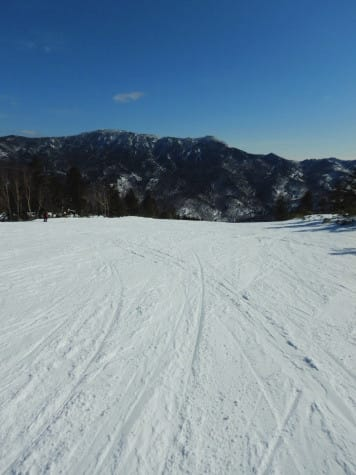

# 2020/1/26(日)の志賀高原スキー場，詳細レポート！…昼間にちょっと気温が上がったけど，晴天ピカピカで，志賀は楽しめるコンディション！

📅 投稿日時: 2020-01-28 01:19:10

🏷️ カテゴリ: [2020スキー滑走日記](c282e9230de179e245c7334eabeb0a3b3.md)

えー．

つい先ほど，職場から帰宅する時．

雪が降ってました…

…いいんだよ．

K奈川県に雪が降らなくていいんだよ．

K奈川県じゃなく，志賀高原に降ってよね…

と，心の中で天気の神様に全力でツッコミ

ながら帰宅したわけで．

志賀高原でも，今は雪になってるようですね…

([北信建設事務所道路気象状況ページ](http://hokushin-camera.org/)より）

志賀は，このまま明日一日中

降り続くわけなんですが．

…明日一日，降るのが雪だといいんですけど…

もしかすると．

午後は液体になる可能性も…

28日夜9時の850hpa気温図を見ると．

こんな感じで，志賀高原は0℃線より

高温側にあります（涙）

ただ…

この図を拡大すると，こんな感じで，

志賀高原は水色の+3℃線が

ポコッと凹んだ中に入り込んでいて．

赤い0℃線と水色の+3℃線

の間くらいにいます…

これだと．

焼額や奥志賀の山頂，2000m付近は

雪のままでいてくれそうな気温ですね…

西館より下はヤバそうだけど．

もしかしたら，焼額はほとんど雨に

降られずに済むかも…？？

麓はみぞれっぽい感じになるかもしれないけど．

そんなにひどく降らないので．

雪質はそれほど影響を受けずに

済みそう…！！

もし．

28日，焼額山スキー場が終日雨にならずに済んだら．

それは，ほぼ間違いなく私の祈りのおかげですっ！！！←ほぼ間違い，だと思う

その後，30日から週末にかけては，

結構冷えてくれそうなので，

確実に降れば雪．

この期間に降ってくれれば，

週末のゲレンデ状況はかなり改善…

というか，トップシーズンのゲレンデに

なってくれると思うのですが．

雪が降るのかどうかは，

また明日以降，予想します…

ってなことで．

これだけで普通のBlogなら，

十分に1本の記事になりうる

かなり長い前フリだったのですが．

異常に1本の記事が長いこのBlog．

ここから本題．

日曜の志賀高原のゲレンデ状況，

詳細レポートです！！

まず．

曇り空で始まったこの朝．

予想通り，昨晩からの積雪は全く無し（涙）

いつも通り，焼額第1ゴンドラの営業前に

並んで．

営業開始とともに山頂に登ると…

山頂の気温は-7℃と，予想の-5～6℃より

1度低い，予想以上の冷え！

（というか，1度しか外してないのはすごいと思ってるんだけど…）

山頂は，うっすら太陽が見える，

うす曇りの天気で．

曇り空だけど，バーンの凸凹がちゃんと見える，

明るめの曇り空．

そして，ゲレンデは…

今日も焼額クオリティの，

最高シマシマバーンですよっ！！

　前日にいい感じで冷えてるので，バーンは

　前日より砕けて柔らかくなっており，

　硬めながらもエッジが効く，

　いい感じのハイスピードバーン．

と予想した通りの，水分が抜けたサラサラ雪が

しっかり押し固められたような，

スピードが出て，かつガッツリエッジが

効くバーンで．

柔らかいふわふわ圧雪とまた違った

快感っ！！！

いやーー．

ホントに，木曜に雨が降った時は．

この週末，コース全面ガリガリ君状態の，

アイスバーン祭りを覚悟してたけど．

土日とも，こんなにおいしい朝イチ

シマシマを堪能できるとは…っ！！

…と．

ゴンドラ3本ほど，ピカピカシマシマを

美味しくいただいていると．

なんだか…

北アルプスが，すっきり見えるように

なってきましたよ…？

…そして．

青空が広がってきましたよ？

さらに…

ゲレンデに，日が射して来ましたよっ！！！

ってな感じで．

営業開始から1時間後，9時半には．

なんとも見事な晴天の，絶好の

スキー日和になりましたよ！！！

いや．

ゲレンデの雪の状況も．

この土日，雪は降ってないのに．

気温がかなり冷えたので，硬いバーンの

表面が細かく崩れていき．

崩れた雪がまるで新雪のように，

うっすらバーン全面を覆って．

ふわふわ新雪ほどではないけど，

意外と滑りやすいよ！

午前中は，ゲレンデはちょいと

人口密度が上がるタイミングも

あったけど…

混んだのはGSコースと，パノラマの

一部．

そのほかの，イーストコース，

白樺コース，唐松コース，オリンピックコースは

全然ガラガラ！！

焼額第1ゴンドラは，この程度の待ちが

1回発生したものの．

これ以外は，ゲートの外まで人が

並ぶことはなく．

リフトもほぼ飛び乗り！！

あぁ…

こんな晴天で．

ほとんど人も滑ってないこんなバーンを

好き放題滑れるなんて…

シアワセ…！！

ただ．

　昼間は0℃近くまで気温が上がるが，

　マイナス気温キープ．

という予想を微妙にわずかに外して．

気温が0℃まで上がってしまったので…

日が射す南斜面の唐松コース．

ちょっと雪が重くなってきました…（涙）

残念ながら，このコースは3月の

雪になっちゃいましたね…（泣）

でも．

南斜面の唐松コース以外は．

昼になっても，結構いい雪をキープ

してくれて．

特に，オリンピックコースは．

なぜか午後になっても，結構締まった

カリカリした感じの硬いバーン！

…エッジはちゃんと効くのに，

ピシッと締まったハイスピードバーンを

夕方までキープしてくれたので．

狂ったようにオリンピックコースを

繰り返し滑ってしまいました…

あぁ…

オリンピックコース，良かったよ…

で．

午後になると，いつも通りコース上の人は，

ぐっと減っていき…

ゴンドラも飛び乗り！

こんないいコンディションを，

他人を気にせず，ゴンドラ飛び乗りで

グルグルできるなんて…

素晴らしい．

素晴らしいぞ，志賀高原っ！！

（ガラガラすぎて，経営大丈夫か心配になるけど…）

さすがに，夕方になると．

急斜面部分はちょっと凸凹が増え始め…

削られたコブの溝は，エッジで磨かれて

ちょいとツルツルした感じになった

部分も出てきました…

でも．

全面的にバーンは締まり気味なので．

急斜面以外は夕方までそれほどひどく

荒れることは無く．

今日も，日が暮れるラストリフトまで，

ひたすら滑り倒したのでした…

いやーーー．

この時期．

トップシーズンらしい柔らかい雪も

いいけど．

雪が柔らかいと，昼ごろには全面ボコボコに

なっちゃって，かなり滑りづらくなるので．

ガリガリじゃなく，ちゃんとエッジが効くなら，

締まり気味のこんな雪も悪くないなぁ…

と思ったSkier_Sだったのでした…

…

…でも．

このままだと．

今シーズンは，太板の出番がないまま

終わっちゃいそう（涙）

## 💬 コメント一覧

### 💬 コメント by (せっちゃん)
**タイトル**: Unknown
**投稿日**: 2020-01-28 06:30:00

>Skier_S 様

わーい、是非ともご一緒できれば❗

すごい楽しみです。

ゴンドラ始動前に間に合うか分かりませんが、一本め、焼額第一Ｇに向かいます❗

1年ぶりの志賀高原のため、ウキウキしすぎて仕事前倒しや動画撮影のカメラとかせっせと準備しております。

### 💬 コメント by (レインボー)
**タイトル**: Unknown
**投稿日**: 2020-01-28 18:31:29

今日は風速23mの予報。冷静沈着なレインボー隊員は湯田中から上るという無謀な行為をやめました。しかし、かの有名なゆみりんは、ヤケビの全面運休を確認するやいなや、風に強い熊の湯へ直行。さらに熊の湯が駄目と確認するや、我らとのケンタッキーパーティーを断って、一路八方へ。

八方で想いを遂げたゆみりん！あまりに凄すぎる！毎日スキーができるのに！

### 💬 コメント by (Skier_S)
**タイトル**: 明日朝は雨になりませんように…
**投稿日**: 2020-01-29 02:48:05

＞せっちゃんさま

おそらく，朝のうちは15分ペースで1本滑ってるので，

最悪でも15分待てば，確実に1ゴン乗り場に現れると思います…

志賀高原，楽しんでください！

＞レインボーさま

今日は滑らなかったのですね…

でも，Yumiさん．

朝志賀高原に上がったというレポートがあったのに．

なぜか八方にいると連絡がきて驚きました…

志賀が強風でダメな日は，八方もダメなことが多いのですが．

しかし，私も朝に志賀がNGで，すぐにかぐらに移動したことがありますが．

まさか，志賀から八方に行くとは…！！

### 💬 コメント by (大阪のS)
**タイトル**: Unknown
**投稿日**: 2020-01-31 22:06:57

先日はお会いできて嬉しかったです！この日はあれから朝のゴンドラ運行開始から16:15のリフトストップまで休憩なしで滑り切り、スキーウェアのまま家までノンストップで500km走り切り、ヤケビのリフトストップからから５時間で帰宅しました‼️

今シーズンは雪不足に加えて仕事や家庭の都合でなかなか滑りに行けず、この日がようやくの今季初志賀でした。

全然滑ってない今季、滑り方も思い出せないようではとてもとてもSさま達についていけるはずもないのでついていくのは諦めましたが、また今度お会いするときまでには滑り方を思い出しておきます‼️

### 💬 コメント by (Skier_S)
**タイトル**: ＞大阪のSさま
**投稿日**: 2020-01-31 23:45:31

先日は久しぶりでしたね～！！

しかし，ヤケビから5時間で帰宅ですか…

高速道路はかなりの増量キャンペーンで走ったのでしょうか（笑）．

これからもまた志賀でガンガントレーニングしてやってください！

### 💬 コメント by (大阪のS)
**タイトル**: Unknown
**投稿日**: 2020-02-03 07:14:13

あ、間違えました。５時間半です。

信州中野ICまで1時間、そこからの450kmを４時間半ですので、そんなに増量ではないです。基本足は使わずアイサイト任せですので。

### 💬 コメント by (Skier_S)
**タイトル**: ＞大阪のSさま
**投稿日**: 2020-02-04 00:40:15

5時間半ですか…

うちから志賀まで300kmですが，4時間越えるので，

500kmを5時間半は，どちらにしろいいペースですね．

でも，やっぱりアイサイト任せですか…

偉大ですよね．アイサイト．

