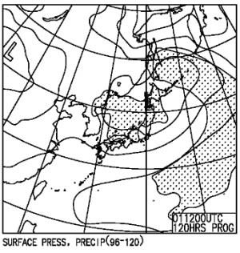
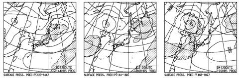

# このGWの志賀高原の天気は？…29，30は雨．1，2日も時々雨？3，4は晴れるけど高温．GW最後まで雪がもつか微妙(涙)

📅 投稿日時: 2021-04-28 02:58:25

ということで．

そろそろGWですが…

我が家は緊急事態宣言対象では

無い地域とはいえ．

いろいろ微妙な感じになってきたなぁ(涙）

早くコロナウイルス，収まってくれないか…

ってな感地の本日も．

特派員から志賀高原の状況が

送られてきました～！

今日の志賀高原は…

朝から晴天だったようです！

そして，朝イチの山頂の気温は…

+4℃(涙）

朝からプラス気温ですか…

だもんで．

朝イチはシマシマだったものの，

朝から雪は緩めで…

すぐに雪はしっとりしてきて

しまったようです(泣)

そして，雲一つない晴天の，

強烈な日差しのおかげで雪が解け．

朝10時ごろにはパノラマコースの

廊下部分は，かなりのストップ雪に

なってしまったようです(涙）

でも，ゲレンデの人が少なく．

今日の焼額のお客さん20人いなかった

という話も…

そのせいで，雪はかなりシャバシャバした

状態に緩んだっぽいですが．

昼近くまでシマシマが残ってるほど

だったので．

バーンがフラットで荒れなかったのが

救いだったみたいですね…

…ってな感じで，GW直前の本日．

また高温に見舞われた一日だったよう

ですが．

29日からGWに突入するわけなので．

GWの天気予想，行ってみましょうか…！

まず，29日(木・祝)の850hpa図を見ると．

うーむ．赤い0℃線派北海道の北．

志賀には水色の+9℃線がかかっているので…

志賀も昼間は+10℃を余裕で超えそう(泣）

これは，降れば絶対液体ですね．

で，地上天気図を見ると…

…

…

…ダメじゃん（激泣）

はい．

諦めてください．

29日，終日雨です．

朝から雨です…ってか，28日夜から雨です．

そして，30日の明け方くらいまで降り続け

そう…

さらに拡大すると．

29日，そこそこ強い南風になりそう

なので．

29日，焼額のゴンドラは止まるかも…

雨が降った中，ゴンドラ無しはきつい…

さらにこの日．

高温＆風＆雨の，雪が解ける3拍子が

揃ってますね…(遠くを見る目)

で．

翌30日(金），連休の谷間の平日は．

うーん．

この日も赤い0℃線は，志賀高原には

全く近づかず．

志賀高原に，水色の+9℃ラインが近づく

レベルなので…

これは，30日も昼間は+10℃を余裕で

超えそうで．

そして，この日の地上天気図も，

本州をしっかり降水域が覆っているので．

うーん．少なくとも午前中は雨，

午後は…雨が降らなければいいな…

続いて５/1．

この日の850hpa図を見ても．

水色の+6℃線が志賀に近づいているので．

うーん．昼間は＋８～9℃まで上がるかな？

そして…

この日も降水域がギリギリ志賀に

かかるかどうか．

…これは，ヘタすると5月1日も，時折

にわか雨が降るタイミングが

あるかも…

で．

その後の2，3，4日ですが．

850hpa図では，一度も志賀の南まで

赤い0℃線がかかることは無く．

そして，地上天気図は…

2日は1日と同様，雨がギリギリ

降るかどうかといった天気．

3，4日は晴れそうかな…

ってなわけで．

ざっくりまとめると．

29日：終日雨．高温の雨．

　昼ごろには強風でゴンドラ

　止まる可能性も…

　ダメダメな一日．あきらめましょう．

30日：午前中は雨．昼ごろに止むかな？

　気温は高めで，朝から雪は重い．

1日：曇り．時折雨がぱらつくかも．

　朝から雪は緩め．

　午後はザクザク荒れ荒れかも…

2日：曇り．時折雨がぱらつくかも．

　朝は，もしかしたらゲレンデはちょっと

　締まっているかも…

3日：午前は曇り，午後は晴れかな…

　気温は+10℃を超える！

　ストップ雪になりそう…

4日：晴れそう．気温はこの日も+10℃を

　超える．絶賛妖怪板掴み大量発生．

ってな感じでしょうか…

…

GW中，冷える日もなさそうだし．

29，30は雨確定．

1，2日もぽつぽつと雨がぱらつく可能性も

ありそうなので…

今年のGWはダメな感じですね(涙）

まぁ，Stay Homeをやってもあきらめが

つく天気なので．

いろんな意味で，いいのかも…

## 💬 コメント一覧

### 💬 コメント by (ikkun)
**タイトル**: Unknown
**投稿日**: 2021-04-28 19:31:22

やはり………明日はダメですね(泣) 12月の熊の湯で終わりかなと(泣)

### 💬 コメント by (葛飾のS)
**タイトル**: Unknown
**投稿日**: 2021-04-28 22:15:27

本日横手山、渋峠に行ってまいりました。

雪良いですねー。4時間券じゃあ物足りなかった。

しかも帰りに草津志賀道路を初めて使ったら

なんと100キロもショートカット(^^)

色々楽しんできました〜。

### 💬 コメント by (Skier_S)
**タイトル**: 明日はダメだ…終日雨
**投稿日**: 2021-04-28 22:54:26

＞ikkunさま

ダメです…明日は終日雨．

というか，水曜夜から雨です．

＞葛飾のSさま

横手山，良かったんですね！

草津越えルートは，距離は近くてガソリン代＆高速代が結構浮きますよね．

横手に行くにはいいですが，焼額に行くときは信州中野経由と

時間はあんまり変わらなかったりします…

